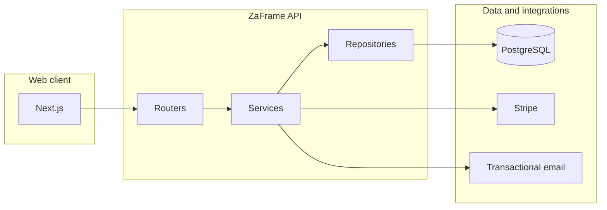

# ZaFrame

**A full-stack booking and payments platform for movement studios** — classes, courses, time slots, capacity rules, and Stripe-powered checkout, exposed through a versioned HTTP API and a modern web client.

ZaFrame is built as a production-minded monorepo: clear layering on the server, strict typing end to end, and operational basics (structured logging, request tracing, rate limiting, and consistent error responses) treated as first-class concerns.

---

## Why this project exists

Small and mid-size studios often juggle calendars, payments, and waitlists in separate tools. ZaFrame models the domain **studios → services → scheduled slots → bookings → orders** in one place, so owners can sell drop-ins and multi-session courses while clients discover offerings, reserve seats, and pay without leaving the product flow.

---

## What it does

- **Studio directory & discovery** — public-facing studio profiles, categorised services (e.g. yoga, HIIT, dance), and search-oriented API endpoints.
- **Scheduling** — services define duration, capacity, and pricing; concrete occurrences live as **slots** tied to a studio schedule.
- **Bookings** — reserve slots with domain rules (including capacity and overbooking-oriented behaviour at the service level).
- **Authentication** — **magic-link** email sign-in, **JWT access tokens**, and **refresh-token** sessions stored for rotation-aware auth.
- **Payments** — **Stripe Checkout** sessions for bookings and orders, with **webhooks** to reconcile payment state on the server.
- **Operational API** — versioned surface under `/api/v1`, health checks, and webhook routes kept explicit in the app composition.

---

## Tech stack

| Layer | Choices |
|--------|---------|
| **API** | Python 3.13+, **FastAPI**, **Pydantic v2**, **uv** |
| **Data** | **PostgreSQL**, **SQLAlchemy 2** (async), **Alembic** migrations |
| **Auth & security** | **python-jose** (JWT), **passlib** (bcrypt), refresh-token persistence |
| **Payments & email** | **Stripe**, **Resend** |
| **Resilience** | **slowapi** rate limiting, **structlog** |
| **Web** | **Next.js 16**, **React 19**, **TypeScript** (strict) |
| **UI & data on client** | **Tailwind CSS v4**, **TanStack Query**, **Zustand**, **Zod** |
| **Quality** | **Ruff**, **pytest** + **pytest-asyncio**, **Vitest**, **Playwright** |

---

## Architecture

The backend follows a **router → service → repository** split: HTTP adapters stay thin, business rules live in services, and all database access is concentrated in repositories. A **unit-of-work** style boundary keeps transactions cohesive and testable.

The API returns **RFC 7807–style problem JSON** for errors, maps domain exceptions to HTTP statuses in one place, and adds **request IDs**, **security headers**, and **config-driven CORS** at the middleware layer.



*Routers orchestrate HTTP; services encode rules; repositories talk to the database; external providers are invoked from documented boundaries (payments, transactional email, webhooks).*

---

## Frontend structure

The web app is organised by **feature modules** (navigation, home, studios, bookings, dashboard) with shared layout and providers. Server/client boundaries follow Next.js conventions: interactive flows use client components where needed; data fetching and caching lean on **TanStack Query**; forms and API-shaped input are validated with **Zod** so the client mirrors server expectations.

---

## Engineering practices demonstrated

- **Strict typing** — Pydantic at API boundaries; TypeScript without loosening to `any`.
- **Migrations as code** — schema changes tracked with Alembic.
- **Automated tests** — async API tests, auth, webhooks, and payment service scenarios on the backend; Vitest and Playwright wired on the frontend.
- **Linting & formatting** — Ruff on Python; ESLint and Prettier (with Tailwind class sorting) on the frontend.
- **Security-minded defaults** — rate limits, secure headers, password hashing, token handling, and webhook-oriented payment state updates rather than trusting the client alone.

---

## Repository layout

```
zaframe/
├── backend/          # FastAPI application, domain models, migrations, tests
└── frontend/         # Next.js application, features, E2E and unit tests
```

---

## Author

This repository is intended as a **portfolio-quality** example of how I design APIs, model a real business domain, and ship a cohesive client without sacrificing maintainability. If you are reviewing my work for a role: I am comfortable owning features across the stack, collaborating on contracts, and keeping production operability in mind from day one.

---

## License

This project is provided for demonstration purposes. Specify a license if you intend open redistribution.
