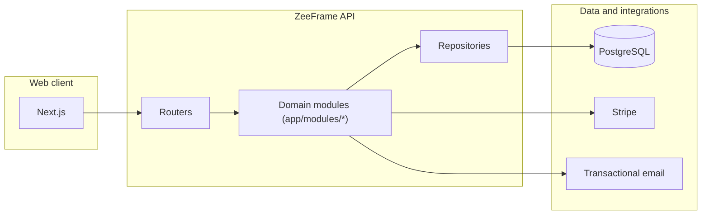

# ZeeFrame

**A full-stack booking and payments platform for movement studios** — classes, courses, scheduled occurrences, capacity rules, and Stripe-powered checkout, exposed through a versioned HTTP API and a modern web client.

ZeeFrame is built as a production-minded monorepo: clear layering on the server, strict typing end to end, and operational basics (structured logging, request tracing, rate limiting, and consistent error responses) treated as first-class concerns.

---

## Why this project exists

Small and mid-size studios often juggle calendars, payments, and waitlists in separate tools. ZeeFrame models the domain **studios → services → occurrences → bookings → orders** in one place, so owners can sell drop-ins and multi-session courses while clients discover offerings, reserve seats, and pay without leaving the product flow.

---

## What it does

- **Studio directory & discovery** — public-facing studio profiles, categorised services (e.g. yoga, HIIT, dance), and search-oriented API endpoints.
- **Scheduling** — services define duration, capacity, and pricing; concrete **occurrences** are generated from **ScheduleTemplate** rules or created manually.
- **Bookings** — reserve occurrences with domain rules (including capacity and overbooking-oriented behaviour at the service level).
- **Authentication** — **email OTP** sign-in, **JWT access tokens**, and **refresh-token** sessions stored for rotation-aware auth.
- **Payments** — **Stripe Checkout** sessions for bookings and orders, with **webhooks** to reconcile payment state on the server.
- **Operational API** — versioned surface under `/api/v1`, health checks, and webhook routes kept explicit in the app composition.

---

## Tech stack

| Layer                   | Choices                                                                |
| ----------------------- | ---------------------------------------------------------------------- |
| **API**                 | Python 3.13+, **FastAPI**, **Pydantic v2**, **uv**                     |
| **Data**                | **PostgreSQL**, **SQLAlchemy 2** (async), **Alembic** migrations       |
| **Auth & security**     | **email OTP** (HMAC-hashed), **PyJWT** (access + refresh), httpOnly refresh cookies + CSRF |
| **Payments & email**    | **Stripe** (Connect + Checkout), **Resend**                            |
| **Resilience**          | **slowapi** (+ optional **Redis**), **structlog**, Prometheus metrics  |
| **Web**                 | **Next.js 16**, **React 19**, **TypeScript** (strict)                  |
| **UI & data on client** | **Tailwind CSS v4**, **TanStack Query**, **Zustand**, **Zod**          |
| **Quality**             | **Ruff**, **Pyright**, **pytest** + **pytest-asyncio**, **Vitest**, **Playwright** |

---

## Architecture

See [Architecture](docs/ARCHITECTURE.md) and [ADR-003 modular monolith](docs/adr/003-modular-monolith.md) for the current backend layout.

The backend is a **modular monolith**: domain code lives in `app/modules/*`, each following a **router → service → repository** split. HTTP adapters stay thin, business rules live in services, and all database access is concentrated in repositories. A **unit-of-work** style boundary keeps transactions cohesive and testable.

The API returns **RFC 7807–style problem JSON** for errors, maps domain exceptions to HTTP statuses in one place, and adds **request IDs**, **security headers**, and **config-driven CORS** at the middleware layer.


```mermaid
flowchart LR
  subgraph client [Web client]
    Next[Next.js]
  end
  subgraph api [ZeeFrame API]
    R[Routers]
    MOD["Domain modules (app/modules/*)"]
    Rep[Repositories]
  end
  subgraph data [Data and integrations]
    DB[(PostgreSQL)]
    Stripe[Stripe]
    Mail[Transactional email]
  end
  Next --> R
  R --> MOD
  MOD --> Rep
  Rep --> DB
  MOD --> Stripe
  MOD --> Mail
```

_Routers orchestrate HTTP; domain modules encode rules; repositories talk to the database; external providers are invoked from documented boundaries (payments, transactional email, webhooks)._

---

## Frontend structure

The web app is organised by **feature modules** (navigation, home, studios, bookings, dashboard) with shared layout and providers. Server/client boundaries follow Next.js conventions: interactive flows use client components where needed; data fetching and caching lean on **TanStack Query**; forms and API-shaped input are validated with **Zod** so the client mirrors server expectations.

---

## Engineering practices demonstrated

- **Modular monolith** — domain code in `app/modules/*`; import boundaries enforced with `uv run lint-imports`.
- **Strict typing** — Pydantic at API boundaries; TypeScript without loosening to `any`.
- **Migrations as code** — schema changes tracked with Alembic.
- **Automated tests** — async API tests, auth, webhooks, and payment service scenarios on the backend; Vitest and Playwright wired on the frontend.
- **Linting & formatting** — Ruff on Python; ESLint and Prettier (with Tailwind class sorting) on the frontend.
- **Security-minded defaults** — rate limits, secure headers, passwordless OTP (no stored passwords), JWT/refresh rotation with reuse detection, and Stripe webhook verification rather than trusting the client alone.

---

## Environment variables (backend)

Copy `backend/.env.example` to `backend/.env` and fill in required values (`DATABASE_URL`, `SECRET_KEY`).
The default `DATABASE_URL` in code is local-development only; production must always override it
with the managed Postgres URL from the deployment environment.

| Variable | Required | Description |
| -------- | -------- | ----------- |
| `DATABASE_URL` | Yes | Async PostgreSQL URL. Production must provide a managed database URL; the local `postgres:postgres` default is never acceptable for deployed environments. |
| `SECRET_KEY` | Yes | JWT signing secret. Generate a strong environment-specific value and never commit it. |
| `EMAIL_FROM` | Production email | Verified sender identity for transactional OTP email, for example `ZeeFrame <login@your-domain.com>`. |
| `REDIS_URL` | No | Redis URL for **distributed rate limiting** when running multiple API instances (e.g. `redis://localhost:6379/0`). When unset, slowapi uses in-memory storage — fine for local single-instance dev, but counters are not shared across replicas. The `redis` package is a declared project dependency. |

### Rate limiting and Redis

Sensitive endpoints (OTP, token refresh, checkout) are protected with **slowapi** limits keyed by client IP. In development with a single process, limits are stored in memory. For production with horizontal scaling, `REDIS_URL` is required so all instances share the same counters.

---

## Repository layout

```
Zeeframe/
├── backend/          # FastAPI application, domain models, migrations, tests
└── frontend/         # Next.js application, features, E2E and unit tests
```

---

## Author

This repository is intended as a **portfolio-quality** example of how I design APIs, model a real business domain, and ship a cohesive client without sacrificing maintainability. If you are reviewing my work for a role: I am comfortable owning features across the stack, collaborating on contracts, and keeping production operability in mind from day one.

---

## License

This project is provided for demonstration purposes. Specify a license if you intend open redistribution.
