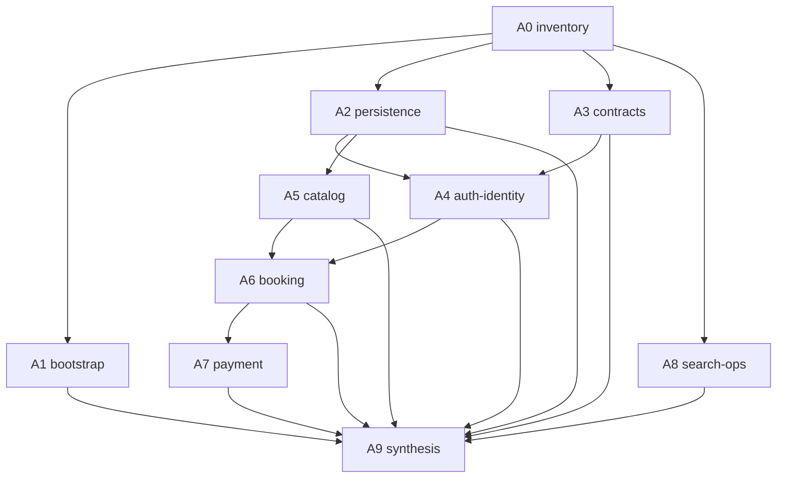

# 00 — Orchestration: раздача задания агентам

> Этот файл — инструкция для человека, который запускает агентов.
> Цель: получить качественные гайды в `guides/` с минимальными галлюцинациями.

## Роли

| Роль | Кто | Делает |
|------|-----|--------|
| Orchestrator | ты | копирует промпт, проверяет DoD, мержит порядок |
| Author-agent | Cursor agent | пишет один гайд в `guides/` по своему `agents/A*.md` |
| Learner | новый бэкендер | читает `guides/` + отвечает на checkpoints |

Author-agent **не** обучает ученика в чате — он пишет артефакт. Обучение идёт через артефакты.

---

## Антигаллюцинационные правила (вшить в каждый запуск)

Каждый агент обязан соблюдать:

1. **Read-only по смыслу продукта.** Можно создавать/править только файлы внутри `backend/docs/onboarding/guides/`. Код приложения не менять.
2. **Whitelist путей.** Работать только с путями из своего промпта. Вне whitelist — не утверждать фактов.
3. **Якорь обязателен.** Каждое утверждение о поведении = `path` + `symbol` (функция/класс/эндпоинт). Пример: `backend/app/modules/booking/lifecycle.py` → `expire_stale_pending_bookings`.
4. **Запрет угадывать.** Нет в коде/ADR → секция `## Open questions` с `UNKNOWN: ...`.
5. **Не цитировать «общие знания FastAPI»** как решения проекта. WHY только из комментариев `WHY:`, docstring, ADR, тестов, имён.
6. **Legacy папки.** `app/services/`, `app/schemas/`, `app/repositories/` могут существовать как хвосты рефакторинга — явно помечать `LEGACY / thin re-export / empty?` после проверки, не рассказывать как активную архитектуру без проверки.
7. **Язык:** пояснения в гайде — на **русском**; имена файлов, символов, статус-кодов, enum — на **английском** как в коде.
8. **Объём:** один гайд = один срез. Не расползаться в чужие домены (ссылаться: «см. guides/0N-…»).

---

## Порядок запуска

```text
Wave 0 (обязательно первым):
  A0-inventory

Wave 1 (параллельно после A0):
  A1-bootstrap  ||  A2-persistence  ||  A3-contracts

Wave 2 (параллельно после A2; A4 желательно после A3):
  A4-auth-identity  ||  A5-catalog

Wave 3 (строго последовательно):
  A6-booking  →  A7-payment

Wave 2.5 (параллельно с Wave 2–3, после A0):
  A8-search-ops

Wave 4 (после всех выше):
  A9-synthesis
```



### Как копировать агенту

В новый чат агента вставь:

```text
Выполни задание строго по файлу ниже. Не изменяй код приложения.
Работай только в backend/docs/onboarding/.
Сначала прочитай свой agents/A*.md целиком, затем исследуй код, затем напиши guides/...

---
<полная копия содержимого agents/A*.md>
---
```

Для Wave 1–2 можно открыть **три параллельных чата** с разными `A*.md`.

---

## DoD приёмки гайда (чекбокс Orchestrator)

Гайд принимается только если:

- [ ] Файл лежит в `guides/` с ожидаемым именем из промпта
- [ ] Есть секции: `Цель`, `Карта файлов`, `Слои и зависимости`, `Walkthrough функций`, `Сквозной флоу` (mermaid), `Почему так (решения)`, `Как читать самому`, `What to watch out for`, `Checkpoint questions`, `Open questions`
- [ ] В `Карта файлов` ≥ 80% путей реально существуют (spot-check 5 файлов)
- [ ] В `Walkthrough` у каждой **публичной** функции: вход → шаги → выход/ошибки → кто вызывает
- [ ] Нет утверждений без якоря `path` + `symbol`
- [ ] Есть минимум **5** checkpoint-вопросов (без ответов в том же файле — ответы только для Orchestrator опционально в конце под `<details>`)
- [ ] Секция `Open questions` присутствует (может быть пустой список `нет`)
- [ ] Нет правок вне `backend/docs/onboarding/`

Если DoD не выполнен — вернуть агенту с конкретным списком дыр, не «перепиши всё».

---

## Шаблон выходного гайда (все агенты)

Агент обязан использовать этот каркас:

```markdown
# 0N — <Title>

## Цель
Чему научится ученик за этот гайд (3–5 буллетов).

## Предусловия
Какие гайды уже прочитаны.

## Карта файлов
| Путь | Роль |
|------|------|

## Слои и зависимости
router → service → repository → models/core …
Кто кого вызывает. Что запрещено import-linter.

## Walkthrough функций
### `symbol_name` (`path`)
- **Зачем:** …
- **Вход:** …
- **Шаги:** 1…2…3
- **Выход / ошибки:** …
- **Кто вызывает:** …

## Сквозной флоу
```mermaid
sequenceDiagram
  ...
```

## Почему так (решения)
Только из ADR / WHY-комментариев / тестов / границ модулей.

## Как читать самому
Чеклист: открой X → найди Y → проследи Z.

## What to watch out for
Типичные ловушки при чтении этого среза.

## Checkpoint questions
1. …
2. …

## Open questions
- UNKNOWN: … / нет
```

---

## Маппинг агент → выходной файл

| Агент | Промпт | Пишет |
|-------|--------|-------|
| A0 | `agents/A0-inventory.md` | `guides/00-inventory.md` |
| A1 | `agents/A1-bootstrap.md` | `guides/01-bootstrap.md` |
| A2 | `agents/A2-persistence.md` | `guides/02-persistence.md` |
| A3 | `agents/A3-contracts.md` | `guides/03-contracts.md` |
| A4 | `agents/A4-auth-identity.md` | `guides/04-auth-identity.md` |
| A5 | `agents/A5-catalog.md` | `guides/05-catalog.md` |
| A6 | `agents/A6-booking.md` | `guides/06-booking.md` |
| A7 | `agents/A7-payment.md` | `guides/07-payment.md` |
| A8 | `agents/A8-search-ops.md` | `guides/08-search-ops.md` |
| A9 | `agents/A9-synthesis.md` | `guides/09-synthesis.md` + обновляет `CHECKPOINTS.md` ответами-ключами в `<details>` если нужно |

---

## Эскалация конфликтов

Если два гайда противоречат друг другу:

1. Побеждает **код** (и тест, который это фиксирует).
2. Затем ADR / `docs/ARCHITECTURE.md`.
3. Затем более узкий доменный гайд (A6 важнее A0 для деталей booking).
4. A9 обязан явно перечислить разрешённые противоречия в `Open questions`.

---

## Definition of Done всего онбординг-пакета

- [ ] Все `guides/00`…`09` существуют и прошли DoD
- [ ] `CHECKPOINTS.md` покрывает все шаги curriculum
- [ ] Ученик может объяснить вслух: создание booking hold → checkout → webhook confirm → lifecycle expire
- [ ] Ученик может назвать слой для любого нового файла (`router/service/repository/model/schema/integration/core`)
