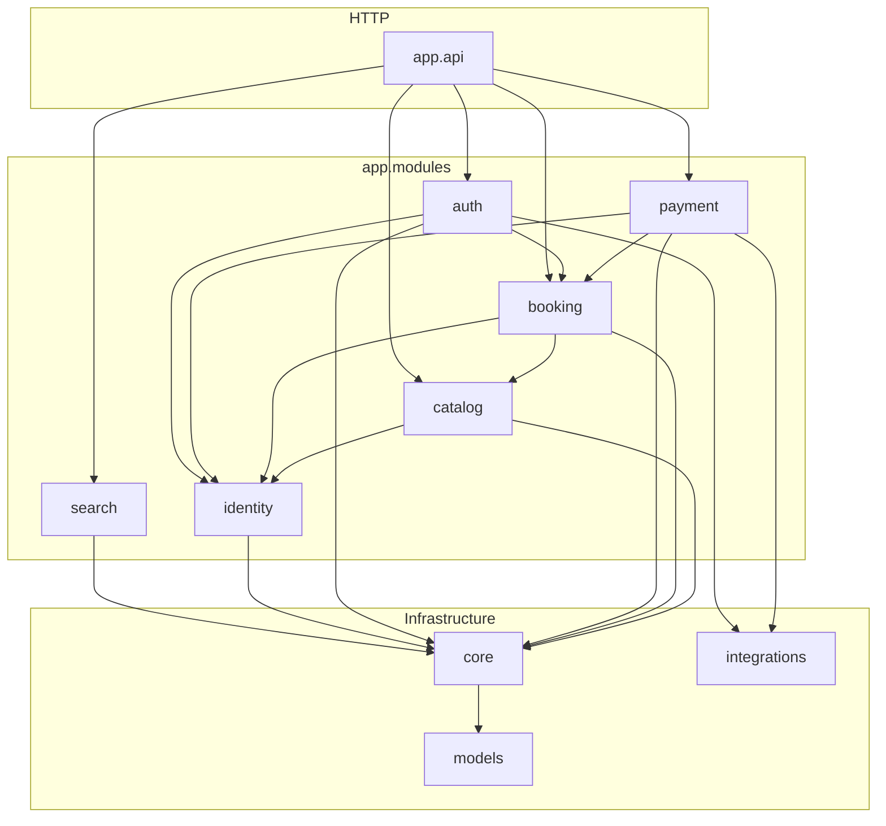
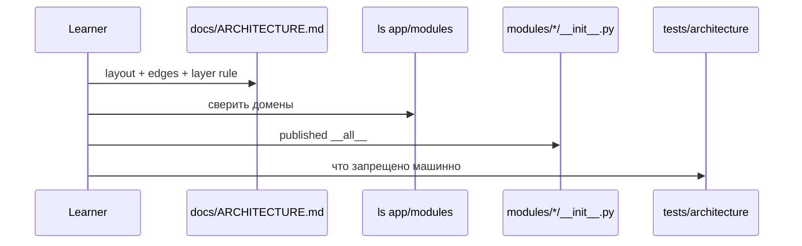

# 00 — Inventory (карта бэкенда)

## Цель

- Ориентироваться в дереве `backend/app/` без «брожения» по legacy-папкам.
- Понимать modular monolith: домены, слои, published API, leaf-модули.
- Читать границы так же, как их проверяет CI: `import-linter` + `tests/architecture/`.
- Знать порядок чтения внутри домена: router → schemas → service → repository → policies.
- Отличать **карту** от **флоу** (оплата/бронирование — в следующих гайдах).

## Предусловия

Нет. Это шаг 0 curriculum (`01-CURRICULUM.md`).

## Карта файлов

| Путь | Роль |
|------|------|
| `docs/ARCHITECTURE.md` | Навигатор: layout, layer rule, allowed edges, dependency graph, команды проверок |
| `docs/adr/003-modular-monolith.md` | WHY: package-by-domain, центральные `models/`, flat UoW, published vs `_` private |
| `docs/adr/domain-vocabulary.md` | Словарь сущностей (Occurrence, ScheduleTemplate, перспективы Public/Owner/Self) — без флоу |
| `backend/pyproject.toml` → `[tool.importlinter]` | Машинные контракты границ модулей |
| `backend/app/main.py` | Тонкая точка входа FastAPI; роутеры через `register_routers` |
| `backend/app/api/router.py` | HTTP-агрегатор: `include_router` доменов + `model_rebuild` |
| `backend/app/api/health.py` | Health endpoints (не доменная логика) |
| `backend/app/api/metrics.py` | Metrics endpoint |
| `backend/app/core/` | Инфра: config, security, deps, UoW, database, middleware |
| `backend/app/core/uow.py` | Тип `UnitOfWork` (flat repos) |
| `backend/app/core/uow_factory.py` | Wiring всех repository-классов в один UoW |
| `backend/app/core/deps.py` | Shared FastAPI deps (`get_uow`, auth helpers) |
| `backend/app/models/` | Центральный ORM-граф (shared persistence) |
| `backend/app/integrations/` | Внешние адаптеры (`stripe/`, `email/`) |
| `backend/app/modules/auth/` | Домен auth |
| `backend/app/modules/identity/` | Домен identity (leaf) |
| `backend/app/modules/catalog/` | Домен catalog (+ sub: `studio`, `service`, `occurrence`, `schedule`, `public`) |
| `backend/app/modules/booking/` | Домен booking (+ `order/`) |
| `backend/app/modules/payment/` | Домен payment |
| `backend/app/modules/search/` | Домен search (leaf, read-only) |
| `backend/tests/architecture/test_module_boundaries.py` | AST-гейты: repos ≠ upper layers; нет `_` cross-domain |
| `backend/tests/architecture/test_import_contracts.py` | Конфиг import-linter содержит обязательные имена контрактов |
| `backend/app/services/` | **LEGACY / empty** — нет `.py`, только `__pycache__` |
| `backend/app/schemas/` | **LEGACY / empty** — нет `.py`, только `__pycache__` |
| `backend/app/repositories/` | **LEGACY / empty** — нет `.py`, только `__pycache__` |
| `backend/app/api/v1/` | **LEGACY / empty shell** — только `__pycache__`; роуты живут в `modules/*/router.py` |
| `backend/app/api/mappers/` | **LEGACY / empty shell** — только `__pycache__` |
| `backend/app/core/repositories/` | **LEGACY / empty shell** — только `__pycache__` |
| `backend/app/scripts/` | **empty shell** под `app/` (операционные скрипты — вне этого среза; см. `ARCHITECTURE.md` → `backend/scripts/`) |

### Top-level `backend/app/` — роль папок

| Папка | Роль сегодня |
|-------|----------------|
| `api/` | Верхний HTTP-слой: агрегация роутеров, health/metrics |
| `core/` | Инфраструктура и shared deps; не бизнес-домен |
| `integrations/` | Адаптеры к внешним системам |
| `models/` | Shared SQLAlchemy ORM |
| `modules/` | Доменная логика (источник истины после ADR-003) |
| `services/`, `schemas/`, `repositories/` | Хвосты pre-modular layout — **не** активная архитектура |

### Карта доменов

| Domain | Ответственность (одним предложением) | leaf? | Может импортировать (public API) |
|--------|--------------------------------------|-------|----------------------------------|
| `identity` | Пользователи: lookup/create/update/soft-delete и ownership-политики | да | `core`, `models` |
| `search` | Read-only поиск по каталогу | да | `core`, `models` |
| `catalog` | Студии, услуги, шаблоны расписания, occurrences, публичная витрина | нет | `identity`, `core`, `models` (не `booking` / `payment` / `auth`) |
| `booking` | Бронирования и (в `order/`) course orders | нет | `catalog`, `identity`, `core`, `models`, `integrations` |
| `payment` | Checkout / webhooks / ledger / Connect (детали — `guides/07-payment.md`) | нет | `booking`, `identity`, `core`, `models`, `integrations` |
| `auth` | OTP/JWT-сессия и account-роуты; оркестрация через published API | нет | `booking`, `identity`, `core`, `models`, `integrations` |
| любой модуль | — | — | также `integrations`, `core`, `models` |
| `core.uow_factory` | Wiring repos | — | все repository-классы (исключение ADR-003 §3) |

Источник таблицы edges: `docs/ARCHITECTURE.md` → «Allowed cross-domain edges».

### Published interface по `__init__.py`

| Пакет | Экспорт (`__all__` / факт файла) |
|-------|----------------------------------|
| `app.modules.auth` | `OTPCodeRepository`, `RefreshTokenRepository`, `get_current_user_from_token` (lazy `__getattr__`) |
| `app.modules.identity` | `UserRepository`, `UserCreate`, `UserUpdate`, `UserResponse`, `UserPublic`, `get_or_create_user`, `get_user_by_email`, `get_user_by_id`, `soft_delete_current_user_account` |
| `app.modules.catalog` | только repos: `OccurrenceRepository`, `ScheduleTemplateRepository`, `ServiceRepository`, `StudioRepository` |
| `app.modules.catalog.studio` | repos + schemas + studio service API (`create_studio`, `require_studio_permission`, …) |
| `app.modules.catalog.service` | service CRUD / availability published surface (см. `__init__.py`) |
| `app.modules.catalog.occurrence` | occurrence CRUD published surface |
| `app.modules.catalog.schedule` | schedule-template CRUD + `occurrence_generator` |
| `app.modules.catalog.public` | `get_studio_public` + Public schemas/DTOs |
| `app.modules.booking` | schemas, `BookingRepository`, policies (`is_own_booking`, `can_access_booking`), service/query/lifecycle/mapping symbols (часть — lazy) |
| `app.modules.booking.order` | `OrderRepository`, course/order schemas + `create_course_booking`, `get_my_orders`, `get_owner_orders` |
| `app.modules.payment` | **только** `ProcessedWebhookEventRepository` |
| `app.modules.search` | `SearchRepository`, `SearchQueryParams`, `SearchResult` |

Флоу создания hold / checkout / webhook **не** разбираем здесь — см. `guides/06-booking.md`, `guides/07-payment.md`.

## Слои и зависимости

### Layer rule (внутри модуля)

```text
router → service → repository → core / models
```

Якорь: `docs/ARCHITECTURE.md` + `docs/adr/003-modular-monolith.md`.

- **Routers** — HTTP: parsing, status codes, `Depends`.
- **Services** — бизнес-логика; получают `UnitOfWork`, не открывают сессии сами.
- **Repositories** — только SQLAlchemy; не импортируют `service` / `router` / `policies`.
- **Models** — ORM; без импортов из `app.modules` / `app.api`.
- **Policies** — чистые правила доступа; часто часть published surface для cross-domain.

### Как читать модуль (порядок файлов)

1. `router.py` — какие эндпоинты и какие deps.
2. `schemas.py` — контракт входа/выхода.
3. `service.py` (и соседние orchestration-файлы, если есть) — правила.
4. `repository.py` (или пакет `repository/`) — запросы.
5. `policies.py` — кто имеет право (если файл есть).

Для `catalog` читай **подпакет** (`studio/`, `occurrence/`, …), не только корневой `catalog/__init__.py`.

### Правило `_` private и published API

- Имена с префиксом `_` — **внутренние** для домена; cross-domain import запрещён (тест + ADR-003 §4).
- Другой домен должен импортировать **published** символы с корня пакета (`from app.modules.booking import …`), а не из `.service` / `.repository`.

**Реальный пример экспорта:** `app.modules.booking.policies.is_own_booking` и `can_access_booking` входят в `app.modules.booking.__all__`.

**Реальный пример использования published API:**

- `app.modules.auth.service` → `from app.modules.booking import attach_guest_resources`
- `app.modules.auth.service` → `from app.modules.identity import get_or_create_user, get_user_by_id`

### import-linter (`backend/pyproject.toml`)

| Contract name | Суть запрета |
|---------------|--------------|
| `Core infra does not import modules` | Перечисленные модули `app.core.*` не тянут `app.modules` (с ignore на `uow → modules`) |
| `Models import nothing but core` | `app.models` не импортирует `app.modules` / `app.api` |
| `catalog does not depend on booking/payment/auth` | catalog ↛ booking, payment, auth |
| `identity is a leaf` | identity ↛ auth, booking, catalog, payment, search |
| `search is read-only leaf` | search ↛ booking, catalog, payment, auth |
| `payment only reaches booking and identity (not catalog/auth)` | payment ↛ catalog, auth |
| `Nothing imports the API layer` | `modules` / `core` / `models` ↛ `app.api` |

Транзитивные импорты через `core.deps` → `core.uow_factory` для leaf-модулей **игнорируются** контрактами (монолитный UoW) — `docs/ARCHITECTURE.md` «Boundary enforcement».

### AST-тесты (`test_module_boundaries.py`)

| Тест | Что проверяет |
|------|----------------|
| `test_repository_files_have_no_service_or_router_imports` | любой `repository.py` под `modules/` не импортирует чужие `service`/`router`/`policies` |
| `test_no_private_cross_domain_imports` | `from app.modules.X import _foo` между разными доменами запрещён |
| `test_booking_order_does_not_import_booking_service_private_names` | `booking/order` не тянет `_` из `booking.service` (должен идти через persistence) |

## Walkthrough функций

### Документ-навигатор `docs/ARCHITECTURE.md`

- **Зачем:** единая карта layout + edges + graph + команды lint; не заменяет код.
- **Вход:** открыть файл в корне `docs/`.
- **Шаги:** 1) Package layout → сверить с `ls backend/app/modules`. 2) Layer rule. 3) Allowed cross-domain edges. 4) Mermaid graph. 5) Boundary enforcement / Running checks.
- **Выход / ошибки:** документ не исполняется; расхождение с кодом → приоритет у кода + тестов (см. orchestration escalation).
- **Кто вызывает:** ученик на шаге 0; Orchestrator при приёмке гайдов.

### `__getattr__` / published surface (`backend/app/modules/booking/__init__.py`)

- **Зачем:** объявить публичный контракт домена booking; лениво подгружать service/query символы, чтобы не циклиться с `core.uow`.
- **Вход:** `from app.modules.booking import <name>` где `<name>` ∈ `__all__`.
- **Шаги:** 1) Eager-импорт schemas, `BookingRepository`, policies. 2) Для имён из `_SERVICE_FUNCTION_MODULES` — `importlib.import_module` + `getattr`. 3) Иначе `AttributeError`.
- **Выход / ошибки:** символ из published API или `AttributeError`; комментарий `WHY:` в файле объясняет цикл с UoW.
- **Кто вызывает:** другие домены (`auth`), собственный `router`, агрегатор при необходимости; UoW historically тянет repo-классы (см. Open questions).

Аналогично lazy-паттерн: `app.modules.auth.__getattr__`, `app.modules.identity.__getattr__`, подпакеты `catalog.*`, `booking.order`.

### `test_no_private_cross_domain_imports` (`backend/tests/architecture/test_module_boundaries.py`)

- **Зачем:** закрепить инвариант ADR-003 §4 машинно (не только «по договорённости в PR»).
- **Вход:** AST всех `.py` под `app/modules/`.
- **Шаги:** 1) Определить source domain. 2) Найти `ImportFrom` на `app.modules.*`. 3) Если target domain другой и символ начинается с `_` → violation.
- **Выход / ошибки:** assert пустого списка violations.
- **Кто вызывает:** `pytest tests/architecture/` / CI.

### `test_import_linter_contracts_are_configured` (`backend/tests/architecture/test_import_contracts.py`)

- **Зачем:** не дать «тихо» удалить контракт из `pyproject.toml`.
- **Вход:** `tomllib` парсит `backend/pyproject.toml`.
- **Шаги:** сравнить имена контрактов с `REQUIRED_CONTRACT_NAMES`.
- **Выход / ошибки:** assert subset.
- **Кто вызывает:** тот же architecture suite.

## Сквозной флоу

Как ученик ориентируется в репозитории (не бизнес-флоу оплаты):



Сверено с `docs/ARCHITECTURE.md` «Module dependency graph» и деревом `backend/app/modules/` (все шесть доменов на месте).

Навигация чтения:



## Почему так (решения)

| Решение | Откуда | Суть |
|---------|--------|------|
| Package by domain (`app/modules/`) | ADR-003 §1 | Высокая cohesion: одна папка = одна история домена |
| Models централизованы в `app/models/` | ADR-003 §2 | Плотный FK-граф + cross-domain `joinedload`; split моделей = риск циклов; YAGNI до service-split |
| UoW flat и data-only | ADR-003 §3 | `uow.bookings`, не `uow.booking.create_booking()`; логика в services |
| Published vs `_` private | ADR-003 §4, ARCHITECTURE | Cross-domain только через public API |
| import-linter + architecture tests | ADR-003 §5, ARCHITECTURE | Drift ловит CI, не ревью |
| Словарь Occurrence / ScheduleTemplate / Public·Owner·Self | ADR-002 | Единый язык сущностей и API-перспектив |

## Как читать самому

Первый день (из `backend/`):

```bash
ls app
ls app/modules
ls app/modules/booking
ls app/modules/catalog
# legacy — убедиться, что нет исходников:
find app/services app/schemas app/repositories -name '*.py'
```

Открыть **в этом порядке**:

1. `docs/ARCHITECTURE.md` (целиком секции layout / edges / graph).
2. `docs/adr/003-modular-monolith.md` (Context + Decision §1–§4).
3. `backend/app/modules/booking/__init__.py` — список `__all__`, lazy `__getattr__`, комментарий `WHY:`.
4. `backend/app/modules/payment/__init__.py` — контраст «тонкий» published surface.
5. `backend/app/api/router.py` — как HTTP подключает доменные routers.
6. `backend/tests/architecture/test_module_boundaries.py`.
7. `backend/pyproject.toml` — блок `[[tool.importlinter.contracts]]`.

Проверки границ (когда окружение готово):

```bash
cd backend
uv run lint-imports
uv run pytest tests/architecture/ -q
```

## What to watch out for

- Папки `app/services/`, `app/schemas/`, `app/repositories/` **выглядят** как слои из старых гайдов — это пустые legacy-хвосты; код в `modules/`.
- `app/api/v1/` пуст: эндпоинты живут в `modules/*/router.py`, агрегатор — `api/router.py`.
- Корневой `catalog/__init__.py` экспортирует **только repositories**; богатый API — в `catalog.studio` / `service` / …
- `payment/__init__.py` экспортирует один repo; остальное payment-surface читают следующие гайды, не выдумывай флоу здесь.
- ADR-003 говорит импортировать repos через published package root; фактические импорты в `core/uow.py` / `uow_factory.py` часто идут в `.repository` — см. Open questions.
- Есть импорты вида `from app.modules.booking.policies import is_own_booking` (внутренний путь при том, что символ опубликован на корне) — сверяй с правилом «package root» в ARCHITECTURE.

## Checkpoint questions

1. Какие top-level папки есть под `backend/app/`, и какие из `services` / `schemas` / `repositories` являются legacy?
2. Назови шесть доменов в `app/modules/` и два leaf-модуля. Почему они leaf?
3. Какой layer rule внутри модуля? Кто не имеет права импортировать `service`/`router`/`policies`?
4. Что означает published interface модуля? Приведи пример символа из `booking/__init__.py` и пример импорта из другого домена.
5. Почему ORM models лежат централизованно в `app/models/`, а не по папкам доменов?
6. Чем `UnitOfWork` «flat» отличается от запрещённого `uow.booking.create_booking()`?
7. Какие два механизма в CI/локально ловят нарушение границ (назови инструмент/путь теста и хотя бы одно имя контракта import-linter)?
8. Куда **нельзя** импортировать из `catalog` согласно таблице allowed edges?

## Open questions

- UNKNOWN: ADR-003 §3 формулирует `from app.modules.booking import BookingRepository`, но `core/uow.py` и `core/uow_factory.py` импортируют `from app.modules.booking.repository import BookingRepository` (и аналоги для других доменов). Это осознанный wiring-исключение или drift относительно ADR?
- UNKNOWN: `PaymentRepository` используется UoW, но **не** входит в `app.modules.payment.__all__` (там только `ProcessedWebhookEventRepository`). Какой published surface payment считается каноническим для cross-domain?
- UNKNOWN: в коде есть `from app.modules.catalog.studio…` → `app.modules.search` (`SearchResult`). Таблица ARCHITECTURE для `catalog` не перечисляет `search`. Разрешённый edge или недокументированный?
- UNKNOWN: импорт `from app.modules.booking.policies import is_own_booking` в payment vs правило «только package root» в ARCHITECTURE — допустимое исключение для policies или долг?
