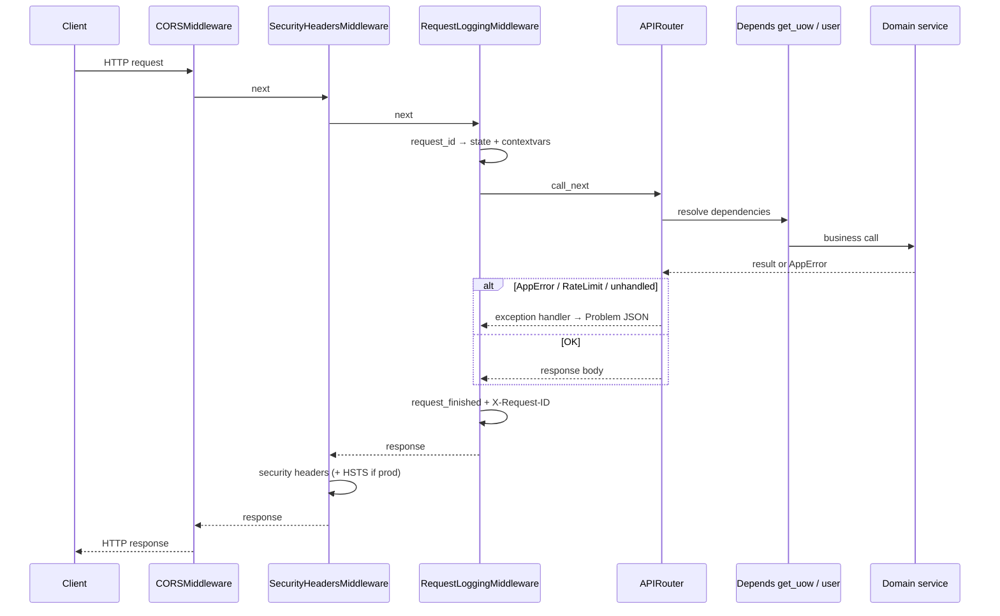

# 01 — Bootstrap (main, middleware, routers)

## Цель

- Понять, как поднимается FastAPI-приложение: `lifespan`, settings, logging, пул БД.
- Проследить путь HTTP-запроса: middleware → router → `Depends` → service (без доменной логики).
- Знать, какие роуты в `/api/v1`, а какие снаружи (health, metrics, webhooks).
- Уметь добавить новый domain router в `api_v1` по существующему паттерну.
- Осознавать production-ловушки: CSP vs `/docs`, HSTS, rate limit storage.

## Предусловия

- Прочитан `guides/00-inventory.md` (карта `app/`, слои, legacy-папки). Не дублируем карту доменов здесь.

## Карта файлов

| Путь | Роль |
|------|------|
| `backend/app/main.py` | Точка входа: FastAPI app, lifespan, middleware, exception handlers |
| `backend/app/api/router.py` | `register_routers`, `api_v1`, `model_rebuild()` схем |
| `backend/app/api/health.py` | `GET /`, `/health`, `/health/ready` |
| `backend/app/api/metrics.py` | `GET /metrics` (Prometheus) |
| `backend/app/core/config.py` | `Settings` + singleton `settings` |
| `backend/app/core/database.py` | `engine`, `async_session_maker`, `Base`, `get_db` |
| `backend/app/core/logging_config.py` | `setup_logging` (structlog) |
| `backend/app/core/middleware/logging_middleware.py` | `RequestLoggingMiddleware`, `X-Request-ID` |
| `backend/app/core/exceptions.py` | Иерархия `AppError` → HTTP mapping в `main` |
| `backend/app/core/rate_limit.py` | SlowAPI `limiter` (+ optional Redis) |
| `backend/app/core/observability.py` | `safe_log_fields`, `log_domain_event`, Prometheus counter |
| `backend/app/core/deps.py` | Shared DI: `get_uow`, `get_current_user`, `get_current_user_required` |
| `backend/.env.example` | Имена env-переменных для деплоя (без секретов в гайде) |
| `docs/ARCHITECTURE.md` | Production readiness: `DATABASE_URL`, `REDIS_URL` |

## Слои и зависимости

На уровне bootstrap цепочка такая:

```text
Client
  → Starlette middleware stack (CORS → SecurityHeaders → RequestLogging)
  → APIRouter (health | metrics | api_v1 | webhooks)
  → route handler
  → Depends(get_uow / get_current_user*)   # app.core.deps
  → domain service (modules/*)             # не разбираем здесь
```

- `main.py` импортирует `register_routers` из `app.api.router` и infra из `app.core.*`.
- `app.api.router` агрегирует domain routers из `app.modules.*.router` — это HTTP-агрегатор, не бизнес-логика (см. inventory).
- Routers зависят от `app.core.deps`, **не** наоборот: docstring `deps.py` явно держит API-слой сверху для import-linter.
- Services поднимают `AppError` subclasses; HTTP-маппинг — только в handlers `main.py` (`exceptions.py` docstring).

## Walkthrough функций

### `SecurityHeadersMiddleware` (`backend/app/main.py`)

- **Зачем:** базовые security headers на каждый response.
- **Вход:** `Request`, `call_next`.
- **Шаги:** 1) `await call_next(request)`; 2) `setdefault` для `X-Content-Type-Options`, `X-Frame-Options`, `Referrer-Policy`; 3) если `settings.is_production` — `Strict-Transport-Security`; 4) если путь **не** docs — `Content-Security-Policy` (`API_CONTENT_SECURITY_POLICY`).
- **Выход / ошибки:** возвращает response как есть; docs paths (`/docs`, `/redoc`, `/openapi.json`) без CSP API-режима (`_is_docs_path`).
- **Кто вызывает:** Starlette middleware stack (`app.add_middleware(SecurityHeadersMiddleware)`).

### `lifespan` (`backend/app/main.py`)

- **Зачем:** startup/shutdown без deprecated `@app.on_event`.
- **Вход:** `app: FastAPI`.
- **Шаги:** 1) startup: `setup_logging()`; 2) `yield`; 3) shutdown: `await engine.dispose()`.
- **Выход / ошибки:** context manager; закрывает пул БД при остановке.
- **Кто вызывает:** `FastAPI(..., lifespan=lifespan)`.

### `app` (`backend/app/main.py`)

- **Зачем:** единственный экземпляр FastAPI.
- **Вход:** `settings.APP_NAME`, `APP_VERSION`, `DEBUG`, `lifespan`.
- **Шаги:** создание app → `app.state.limiter = limiter` → exception handlers → middleware → `register_routers(app)`.
- **Выход / ошибки:** ASGI application, которую запускает uvicorn.
- **Кто вызывает:** процесс сервера (`uvicorn app.main:app`).

### `rate_limit_exceeded_handler` (`backend/app/main.py`)

- **Зачем:** единый 429 Problem JSON + rate-limit headers.
- **Вход:** `Request`, `RateLimitExceeded`.
- **Шаги:** 1) взять `request_id` из `request.state`; 2) `_problem_response` 429; 3) при наличии `view_rate_limit` — `_inject_headers` через `limiter`.
- **Выход / ошибки:** `JSONResponse` 429, `type: rate-limit-exceeded`.
- **Кто вызывает:** `app.add_exception_handler(RateLimitExceeded, ...)`.

### `app_error_handler` (`backend/app/main.py`)

- **Зачем:** доменные `AppError` → HTTP + warning-лог.
- **Вход:** `Request`, `AppError`.
- **Шаги:** 1) `structlog` warning `app_error`; 2) Problem JSON с `type: app-error:{ClassName}`, `status=exc.status_code`, `detail=exc.detail`.
- **Выход / ошибки:** статус из `exc.status_code` (см. subclasses в `exceptions.py`).
- **Кто вызывает:** `app.add_exception_handler(AppError, ...)`.

### `unhandled_exception_handler` (`backend/app/main.py`)

- **Зачем:** неожиданные исключения → 500 без утечки деталей клиенту.
- **Вход:** `Request`, `Exception`.
- **Шаги:** 1) error-лог с укороченным stack; 2) клиенту только `"Internal server error"`, `type: internal-error`.
- **Выход / ошибки:** всегда 500 Problem JSON.
- **Кто вызывает:** `app.add_exception_handler(Exception, ...)`.

### `_error_body` / `_request_id` / `_problem_response` (`backend/app/main.py`)

- **Зачем:** RFC 7807 Problem JSON + сохранение `X-Request-ID` на ошибках.
- **Вход:** detail/status/request_id; для response — content + status.
- **Шаги:** тело `{type, title, status, detail, request_id?}`; header `X-Request-ID` если id известен.
- **Выход / ошибки:** dict / `JSONResponse`.
- **Кто вызывает:** все exception handlers выше.

### `RequestLoggingMiddleware` (`backend/app/core/middleware/logging_middleware.py`)

- **Зачем:** correlation id + structured request logs.
- **Вход:** HTTP request.
- **Шаги:** 1) `_get_request_id` — из header `X-Request-ID` (валидный printable ≤128) или `uuid4`; 2) `request.state.request_id`; 3) `structlog.contextvars.bind_contextvars(request_id=...)`; 4) log `request_started` / после handler `request_finished` (level по status) / при исключении `request_failed`; 5) проставить header в response; 6) `clear_contextvars` в `finally`.
- **Выход / ошибки:** response с `X-Request-ID`; исключения пробрасываются дальше (пойдут в handlers).
- **Кто вызывает:** `app.add_middleware(RequestLoggingMiddleware)` в `main.py`. Опционально auth deps пишут `request.state.user_id` (`USER_ID_STATE_KEY`).

### `register_routers` (`backend/app/api/router.py`)

- **Зачем:** смонтировать все HTTP-поверхности на app.
- **Вход:** `FastAPI`.
- **Шаги:**
  1. `health_router` без prefix → `/`, `/health`, `/health/ready`
  2. тот же `health_router` с `prefix="/api/v1"` → `/api/v1/health`, …
  3. `metrics_router` → `/metrics`
  4. `api_v1` (`prefix="/api/v1"`) — domain routers
  5. `webhooks_router` снаружи versioned API (`prefix="/webhooks"` в модуле payment)
- **Выход / ошибки:** side-effect на `app`.
- **Кто вызывает:** конец `main.py`.

### `api_v1` include list (`backend/app/api/router.py`)

Роутеры внутри `/api/v1` (порядок как в коде):

| Router symbol | Модуль-источник (import в `router.py`) |
|---------------|----------------------------------------|
| `public_router` | `catalog.public` |
| `studio_router` | `catalog.studio` |
| `studio_occurrence_router` | `catalog.occurrence` |
| `schedule_router` | `catalog.schedule` |
| `service_router` | `catalog.service` |
| `occurrence_router` | `catalog.occurrence` |
| `booking_router` | `booking` |
| `occurrence_bookings_router` | `booking` |
| `order_router` | `booking.order` |
| `payment_router` | `payment` |
| `studio_payment_router` | `payment` |
| `auth_router` | `auth` |
| `account_router` | `auth` |
| `search_router` | `search` |

### `model_rebuild()` (`backend/app/api/router.py`)

- **Зачем:** комментарий в файле: *«Rebuild models with forward references before use in unions.»* Схемы booking/order/search используют `from __future__ import annotations`, из‑за чего аннотации откладываются; до первого использования в response unions их нужно материализовать.
- **На каких схемах (символы):**  
  `BookingSelfResponse`, `BookingCreatedResponse`, `BookingOwnerResponse`, `BookingWithUser`, `BookingSelfListItem`, `CourseBookingResponse`, `OrderListItem`, `SearchResult`.
- **Кто вызывает:** module-level side effect при импорте `app.api.router` (до `register_routers`).

### `health_check` / `readiness` (`backend/app/api/health.py`)

- **Зачем:** liveness/readiness для оркестраторов.
- **`health_check`:** `SELECT 1` через `engine` (`_check_database`). OK → `{status, version, db}` со `settings.APP_VERSION`; fail → **503**, `status: unready`, `db: fail`.
- **`readiness`:** DB обязателен (503 при fail); Stripe — лёгкий sync-запрос если задан `STRIPE_SECRET_KEY`, иначе `skip`; Resend — факт наличия `RESEND_API_KEY` (`configured` / `skip`). 503 только при падении DB (комментарий в handler).
- **Кто вызывает:** HTTP GET; также дублируется под `/api/v1` через второй `include_router`.

### `metrics` (`backend/app/api/metrics.py`)

- **Зачем:** Prometheus scrape без auth, `include_in_schema=False`.
- **Выход:** `generate_latest()`, `CONTENT_TYPE_LATEST`.

### `Settings` / `settings` (`backend/app/core/config.py`)

- **Зачем:** единый конфиг через pydantic-settings.
- **Загрузка:** `SettingsConfigDict(env_file=".env", case_sensitive=True, extra="ignore")`; модульный singleton `settings = Settings()`.
- **Критично для prod (имена из `.env.example` + поля Settings, без значений-секретов):**
  - `ENVIRONMENT` → `is_production` (HSTS, cookie Secure/SameSite)
  - `DATABASE_URL` (нормализация postgres→postgresql+asyncpg)
  - `SECRET_KEY` (обязателен, без default в Field)
  - `FRONTEND_URL`, `CORS_ORIGINS` → `cors_origins_list` / `allowed_redirect_hosts`
  - `REDIS_URL` — shared rate limit (см. ARCHITECTURE Production Readiness)
  - опционально: `STRIPE_*`, `RESEND_API_KEY`, `EMAIL_FROM`, `BOOKING_HOLD_MINUTES`

### `limiter` (`backend/app/core/rate_limit.py`)

- **Зачем:** SlowAPI, key = `get_remote_address`; при `REDIS_URL` — `storage_uri`.
- **Кто вызывает:** `app.state.limiter` в `main`; декораторы на чувствительных endpoint’ах (детали OTP — не этот гайд).

### Shared deps — обзор (`backend/app/core/deps.py`)

| Symbol | Роль (без глубокого auth) |
|--------|---------------------------|
| `get_uow` | (реэкспорт из `uow_factory`) сессия + repos на запрос |
| `get_current_user` | optional Bearer → `User \| None`; пишет `request.state.user_id` |
| `get_current_user_required` | то же + `UnauthorizedError` если нет user |

Глубина JWT/OTP — `guides/04-auth-identity.md`. UoW/commit — `guides/02-persistence.md`.

### `setup_logging` (`backend/app/core/logging_config.py`)

- **Зачем:** structlog: console при `DEBUG`, иначе JSON; поля `timestamp`, `level`, `service`, `request_id` (fallback `"unknown"`).
- **Кто вызывает:** `lifespan` на startup.

### `safe_log_fields` / `log_domain_event` (`backend/app/core/observability.py`)

- **Зачем:** выкинуть sensitive keys (`otp`, `secret`, `email`, …) до логгера; инкремент `zeeframe_domain_events_total`.
- **Кто вызывает:** middleware (`safe_log_fields`); domain services (`log_domain_event`) — вне bootstrap-флоу.

### `AppError` hierarchy (`backend/app/core/exceptions.py`)

Публичные классы: `AppError`, `NotFoundError` (404), `ForbiddenError` (403), `ValidationError` (400), `ConflictError` (409), `ServiceUnavailableError` (503), `UnauthorizedError` (401). Маппинг HTTP — только `app_error_handler`.

## Сквозной флоу



Порядок middleware в Starlette: **последний** `add_middleware` — **самый внешний**. В `main.py` порядок добавления: Logging → Security → CORS ⇒ на входе Client видит CORS первым, Logging ближе к handler (комментарий в `main.py`).

## Middleware / handlers — сводная таблица

| Middleware / handler | Файл | Зачем |
|----------------------|------|-------|
| `CORSMiddleware` | `main.py` | Origins из `settings.cors_origins_list`, credentials |
| `SecurityHeadersMiddleware` | `main.py` | nosniff / DENY / Referrer-Policy; HSTS в prod; CSP не на docs |
| `RequestLoggingMiddleware` | `logging_middleware.py` | `X-Request-ID`, structlog start/finish |
| `rate_limit_exceeded_handler` | `main.py` | 429 Problem JSON + limit headers |
| `app_error_handler` | `main.py` | `AppError` → HTTP + warning |
| `unhandled_exception_handler` | `main.py` | 500, без stack клиенту |
| `lifespan` | `main.py` | logging on / `engine.dispose` off |

## Почему так (решения)

- `lifespan` вместо `@app.on_event` — комментарий в `main.py` (FastAPI recommended, явный resource management).
- Exception handlers централизованы в `main.py`; services не бросают `HTTPException` (`exceptions.py` module docstring).
- Problem JSON (`type`, `title`, `status`, `detail`, optional `request_id`) — docstring `_error_body`.
- CSP API-режима (`default-src 'none'…`) **не** вешается на `/docs`/`/redoc`/`/openapi.json` — иначе Swagger UI ломается (`_is_docs_path` + `SecurityHeadersMiddleware`).
- HSTS только при `settings.is_production` (`ENVIRONMENT == "production"`).
- `model_rebuild` до include routers — forward refs / unions (`api/router.py` comment).
- Health монтируется и в корне, и под `/api/v1` — один `health_router`, два `include_router`.
- Webhooks вне `api_v1` — отдельный `webhooks_router` в `register_routers` (Stripe path prefix `/webhooks`).
- Redis для rate limit — `rate_limit.py` + `docs/ARCHITECTURE.md` Production Readiness.

## How-to: добавить новый router в `api_v1`

По паттерну существующих доменов:

1. В своём модуле создай `APIRouter` с `prefix` и `tags`, например  
   `router = APIRouter(prefix="/things", tags=["things"])`  
   (как `search_router` → `/search`, `booking_router` → `/bookings`).
2. Реализуй handlers: HTTP только в router; логика в service; БД через `Depends(get_uow)` из `app.core.deps`.
3. В `backend/app/api/router.py`:
   - импортируй `router as things_router` (или именованный `*_router`);
   - если response-схемы с `from __future__ import annotations` и вложенными типами / unions — вызови `YourSchema.model_rebuild()` рядом с остальными;
   - добавь router в кортеж `for r in (...): api_v1.include_router(r)`.
4. Не включай webhook/stripe callback внутрь `api_v1`, если контракт «снаружи версии» — регистрируй отдельно в `register_routers`, как `webhooks_router`.
5. Проверь OpenAPI: путь будет `/api/v1` + prefix роутера; health/metrics не трогай без нужды.

## Как читать самому

1. Открой `main.py` сверху вниз: constants CSP/HSTS → middleware class → lifespan → `app = FastAPI` → handlers → `add_middleware` (снизу вверх по стеку) → `register_routers`.
2. Открой `api/router.py`: сначала блок `model_rebuild`, потом список `api_v1`, потом `register_routers`.
3. Проследи один запрос: `RequestLoggingMiddleware._get_request_id` → `request.state.request_id` → handler → при ошибке `_request_id` в Problem JSON.
4. Дерни глазами `GET /health` и `GET /health/ready` в `health.py`.
5. Сверь имена env с `Settings` и `backend/.env.example` — не выдумывай переменные.
6. Для DI: только обзор `deps.py` `__all__`; дальше — persistence/auth гайды.

## What to watch out for

- **Docs vs CSP:** API CSP (`default-src 'none'`) намеренно **не** ставится на `/docs`, `/redoc`, `/openapi.json`. Если расширить CSP на docs — UI документации перестанет грузить assets.
- **Production HSTS:** заголовок появляется только при `ENVIRONMENT=production`. В staging/dev его нет — это ожидаемо (`SecurityHeadersMiddleware` + `is_production`).
- **Docs / OpenAPI утечки:** FastAPI docs включены конфигурацией по умолчанию (в `main.py` нет `docs_url=None`). В prod проверь, нужен ли публичный `/docs` и не светит ли схема лишнее (внутренние поля уже режутся на уровне schemas — детали в contracts-гайде).
- **Двойной health:** существуют и `/health`, и `/api/v1/health` — путаница в probe URL.
- **Middleware order:** «первый добавленный» ≠ «первый на входе». Смотри комментарий в `main.py` и таблицу выше.
- **Rate limit без Redis:** in-memory на процесс; multi-instance без `REDIS_URL` — раздельные счётчики (`rate_limit.py`, ARCHITECTURE).
- **`get_db` vs `get_uow`:** в `database.py` ещё есть legacy-ish `get_db`; актуальный путь роутеров — `Depends(get_uow)` из deps (см. inventory / persistence).

## Checkpoint questions

1. Что делает `lifespan` на startup и на shutdown? Какие символы вызываются?
2. Какие security headers ставятся всегда, а какой — только в production? Где проверка?
3. Где монтируются роутеры `/api/v1` и отдельно webhooks/metrics/health?
4. Зачем в `api/router.py` вызывается `model_rebuild()` и для каких схем?
5. Откуда берётся `request_id`, куда кладётся, какой response header, как попадает в Problem JSON?
6. Чем `/health` отличается от `/health/ready` по проверкам и коду ответа?
7. Какие шаги нужны, чтобы новый domain `APIRouter` появился под `/api/v1`?

<details>
<summary>Ключи (для Orchestrator; ученик отвечает сам)</summary>

1. Startup: `setup_logging()`; shutdown: `await engine.dispose()` — `lifespan` в `main.py`.
2. Всегда: `X-Content-Type-Options`, `X-Frame-Options`, `Referrer-Policy`; HSTS только если `settings.is_production` — `SecurityHeadersMiddleware`.
3. `register_routers`: health (± `/api/v1`), metrics, `api_v1`, `webhooks_router` отдельно.
4. Forward refs / unions после `from __future__ import annotations`; список схем в `router.py` (booking/order/search).
5. Header `X-Request-ID` или uuid → `request.state.request_id` + contextvars; response header; handlers читают через `_request_id`.
6. `/health`: DB + version; 503 если DB fail. `/ready`: DB + optional Stripe/Resend; 503 только при DB fail.
7. Domain router → import + optional `model_rebuild` → `api_v1.include_router` в `api/router.py`.

</details>

## Open questions

- нет
