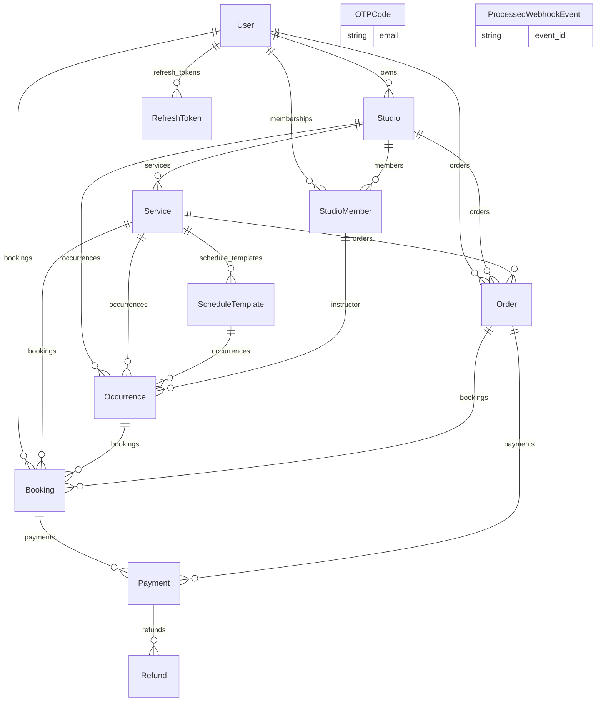
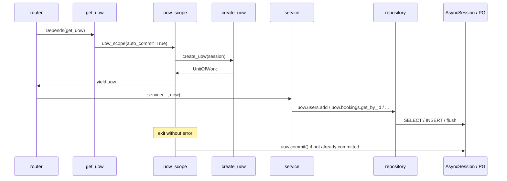

# 02 — Persistence (models, Alembic, UoW, repositories)

## Цель

- Понять, как появляется async-сессия и как `UnitOfWork` связывает репозитории одной транзакцией.
- Читать центральный ORM-граф в `app/models/` без угадывания колонок.
- Видеть путь «поле в модели → миграция Alembic → repository», не путая его с Pydantic-схемами (A3).
- Знать, кто коммитит транзакцию (`uow_scope` / `get_uow`), и почему wiring вынесен в `uow_factory`.
- Читать datetime-поля по ADR-001 (instant / calendar / wall-clock).

## Предусловия

- `guides/00-inventory.md` (карта модулей, ADR-003: models централизованы, UoW flat).
- Желательно `guides/01-bootstrap.md` (если уже есть) — где живёт `core/` и deps.

## Карта файлов

| Путь | Роль |
|------|------|
| `backend/app/core/database.py` | `engine`, `async_session_maker`, `Base`, legacy `get_db` |
| `backend/app/models/mixins.py` | `TimestampMixin` (`created_at` / `updated_at`) |
| `backend/app/models/__init__.py` | Реестр ORM + enum'ов для экспорта / Alembic |
| `backend/app/models/*.py` | Таблицы и relationships |
| `backend/app/core/uow.py` | Тип `UnitOfWork` (поля-репозитории, `commit`/`rollback`) |
| `backend/app/core/uow_factory.py` | `create_uow`, `uow_scope`, `get_uow` |
| `backend/app/core/deps.py` | Re-export `get_uow` для FastAPI `Depends` |
| `backend/app/core/repository.py` | `WriteRepositoryMixin` (`add` / `save` / `delete` / …) |
| `backend/app/core/datetime_utils.py` | `utc_now`, `ensure_utc`, `studio_local_to_utc`, … |
| `backend/app/modules/identity/repository.py` | Пример leaf-repo: `UserRepository` |
| `backend/app/modules/booking/repository/` | Пример составного repo (`BookingRepository` + mixins) |
| `backend/alembic/env.py` | `target_metadata = Base.metadata`, async online mode |
| `backend/alembic/versions/*.py` | История схемы (001…016) |
| `backend/docs/adr/001-datetime-and-studio-timezone.md` | Политика дат/времени |
| `docs/adr/003-modular-monolith.md` | §2 models централизованы; §3 UoW flat |
| `docs/ARCHITECTURE.md` | Layer rule; `uow` vs `uow_factory` |
| `backend/tests/integration/database/test_occurrence_lock_deadlock.py` | Иллюстрация locking / `uow_scope` |
| `backend/app/core/repositories/` | **LEGACY / empty shell** (нет `.py`) |

## Слои и зависимости

```text
router → Depends(get_uow) → uow_scope → create_uow(session)
                ↓
         service(uow) → uow.<repos> → SQLAlchemy AsyncSession → PostgreSQL
                ↓
              models (shared graph)
```

- **Сервисы** получают `UnitOfWork`, не открывают `async_session_maker` сами (`docs/ARCHITECTURE.md`).
- **Репозитории** — только запросы/запись; наследуют `WriteRepositoryMixin` для `add`/`flush`/`delete`.
- **Модели** — ORM-маппинг; не импортируют `app.modules` / `app.api` (ARCHITECTURE).
- **import-linter:** leaf-модули не тянут чужие домены; исключение — `app.core.uow_factory` может импортировать все repository-классы (ARCHITECTURE + ADR-003 §3). Именно поэтому тип UoW и wiring **разделены**: `uow.py` остаётся «лёгким» типом, фабрика — единственной точкой fan-in на repos.

## С нуля: как появляется поле в БД

1. **Model** — колонка в `app/models/<entity>.py` (`mapped_column` / `ForeignKey` / constraint в `__table_args__`).
2. **Экспорт** — при необходимости символ в `app/models/__init__.py` (комментарий: «для Alembic autogenerate»).
3. **Migration** — новый файл в `alembic/versions/` с **одним** логическим изменением (имя файла отражает смысл: `014_catalog_product_lifecycle.py`, не «misc»).
4. **Repository** — чтение/запись через `select` / `WriteRepositoryMixin.add` и т.п.
5. **Schema (A3)** — Pydantic request/response отдельно; ORM в HTTP не отдаём.

Не путать: правка только модели без миграции = рассинхрон с PostgreSQL.

## Каталог моделей (`app/models/__init__.py`)

Ниже — только то, что видно в коде моделей. «Зачем» — из docstring/имени; иначе `UNKNOWN`.

### `User` (`users`) — `user.py`

- **Зачем:** аккаунт клиента или владельца студии; создаётся после успешной OTP-верификации.
- **Ключевые колонки:** `id`, `email` (unique), `name`, `phone`, `marketing_consent`, `role`, `is_active`, `last_login_at`, `deleted_at` + timestamps.
- **Enum:** `UserRole` → `user` / `studio_owner` / `admin` (PG enum `user_role`).
- **FK / relationships:** владеет `Studio`, `StudioMember`, `Booking`, `Order`, `RefreshToken`.
- **Индексы:** `email`, `deleted_at`, PK.

### `Studio` (`studios`) — `studio.py`

- **Зачем:** бизнес с расписанием и услугами.
- **Ключевые колонки:** `owner_id`, `name`, `slug`, контакты/гео, `amenities` (JSONB), `timezone` (IANA), `is_active`, `cancel_before_hours`, Stripe Connect поля.
- **FK:** `owner_id` → `users.id`.
- **Constraints:** `ck_studios_cancel_before_hours_non_negative`.
- **Relationships:** `members`, `occurrences`, `services`, `orders`.

### `StudioMember` (`studio_members`) — `studio_member.py`

- **Зачем:** роль пользователя внутри конкретной студии (RBAC).
- **Ключевые колонки:** `studio_id`, `user_id`, `role`.
- **Enum:** `StudioMemberRole` → `owner` / `manager` / `instructor`.
- **Constraints:** `uq_studio_members_studio_user`; индексы `idx_studio_members_studio_id`, `idx_studio_members_user_id`.
- **Relationships:** `assigned_occurrences` (как instructor).

### `Service` (`services`) — `service.py`

- **Зачем:** продаваемое предложение (drop-in или course); не точка во времени.
- **Ключевые колонки:** `studio_id`, `name`, `type`, `category`, `duration_minutes`, `max_capacity`, цены в cents, soft/hard overbook ratios, `tags`, `visibility`, `is_active`.
- **Enums / константы:** `ServiceCategory` (StrEnum); `ServiceType` (`single`/`course`); `ServiceVisibility` (`draft`/`published`/`archived`).
- **Constraints:** `ck_services_visibility`.
- **Методы на модели:** `is_publicly_visible`, `is_bookable`, `get_capacity_status` — тонкие хелперы статуса; тяжёлая оркестрация остаётся в services.

### `ScheduleTemplate` (`schedule_templates`) — `schedule_template.py`

- **Зачем:** правило повторения (weekday + wall-clock + окно `valid_from`/`valid_to`) для генерации occurrences.
- **Ключевые колонки:** `service_id`, `day_of_week`, `start_time` (`TIME`), `valid_from`/`valid_to` (`DATE`).
- **FK:** `service_id` → `services.id`.

### `Occurrence` (`occurrences`) — `occurrence.py`

- **Зачем:** конкретный сеанс во времени, на который бронируют.
- **Ключевые колонки:** `studio_id`, `service_id`, `schedule_template_id`, `instructor_id`, `start_time`/`end_time` (TIMESTAMPTZ), `title`, capacity/prices, `status`, cancel fields.
- **Статусы:** `OccurrenceStatus` → `scheduled` / `cancelled` / `completed`.
- **Constraints / indexes:** `ck_occurrences_status`; `idx_occurrences_studio_service_start_time`.

### `Booking` (`bookings`) — `booking.py`

- **Зачем:** бронь места на occurrence (guest или user).
- **Ключевые колонки:** см. walkthrough ниже.
- **Статусы / типы:** `BookingStatus`, `BookingType`.
- **Partial unique indexes:** активные (`pending`/`confirmed`) по `(occurrence_id, guest_email)` и `(occurrence_id, user_id)`.

### `Order` (`orders`) — `order.py`

- **Зачем:** платёжный заказ (часто course: один Order → много Booking); для single может отсутствовать (legacy mode в docstring).
- **Ключевые колонки:** `studio_id`, `service_id`, buyer (user/guest), `total_amount_cents`, `currency`, fee/checkout/PI ids, `status`, `access_token`.
- **Статусы:** `OrderStatus`.

### `Payment` / `Refund` (`payments` / `refunds`) — `payment.py`

- **Зачем:** локальный ledger внешнего платежа / возврата.
- **Payment:** XOR parent — ровно один из `booking_id` / `order_id` (`ck_payments_exactly_one_parent`); Stripe session/PI ids; `amount_cents`, `status`, `provider`, `paid_at`, `refunded_amount_cents`.
- **Refund:** `payment_id`, `stripe_refund_id`, `idempotency_key`, `amount_cents`, `status`, `created_at` (**без** `TimestampMixin` / без `updated_at`).

### `OTPCode` (`otp_codes`) — `otp_code.py`

- **Зачем:** эфемерный OTP для passwordless email-auth (отдельная таблица, не поля User).
- **Ключевые колонки:** `email`, `code_hash`, `name`, `expires_at`, `used_at`, `attempts`, `request_ip`.
- **Индексы:** `(email, expires_at)`, `(email, created_at)`.
- **FK:** нет связи с `users`.

### `RefreshToken` (`refresh_tokens`) — `refresh_token.py`

- **Зачем:** сессия refresh (rotation по `jti`, logout-all, audit).
- **Ключевые колонки:** `user_id`, `jti`, `user_agent`, `ip_address`, `created_at`, `expires_at`, `revoked_at`, `last_used_at`.
- **Не** использует `TimestampMixin` (свой набор timestamp-полей).

### `ProcessedWebhookEvent` (`processed_webhook_events`) — `processed_webhook_event.py`

- **Зачем:** идемпотентность Stripe webhook по `event.id`.
- **Ключевые колонки:** `event_id` (unique), `event_type` (колонка БД `type`), `received_at`.

## Таблица статусов / enum-значений

| Имя в коде | Значения (из кода) |
|------------|-------------------|
| `UserRole` | `user`, `studio_owner`, `admin` |
| `StudioMemberRole` | `owner`, `manager`, `instructor` |
| `ServiceCategory` | `yoga`, `boxing`, `dance`, `hiit`, `pilates`, `martial_arts`, `strength` |
| `ServiceType` | `single`, `course` |
| `ServiceVisibility` | `draft`, `published`, `archived` |
| `OccurrenceStatus` | `scheduled`, `cancelled`, `completed` |
| `BookingStatus` | `pending`, `confirmed`, `cancelled`, `expired`, `completed`, `no_show` (+ `ACTIVE_STATUSES` = pending/confirmed) |
| `BookingType` | `single`, `course` |
| `OrderStatus` | `pending`, `paid`, `cancelled`, `expired`, `refunded`, `manual_review` |
| `PaymentStatus` | `pending`, `succeeded`, `refunded`, `partially_refunded`, `failed`, `manual_review` |
| `PaymentProvider` | `stripe` |
| `RefundStatus` | `pending`, `succeeded`, `failed` |

## ER (упрощённый)

Сверено с FK / `relationship` в моделях (OTP и webhook — без FK к домену):



## Walkthrough функций

### `TimestampMixin` (`backend/app/models/mixins.py`)

- **Зачем:** единые audit-поля UTC / TIMESTAMPTZ.
- **Вход:** наследование моделью.
- **Шаги:** `created_at` (`server_default=now`, index), `updated_at` (`onupdate=now`).
- **Выход:** колонки на таблице.
- **Кто вызывает:** большинство моделей; исключения: `Refund`, `RefreshToken`, `ProcessedWebhookEvent`.

### `UnitOfWork` (`backend/app/core/uow.py`)

- **Зачем:** одна транзакция = одна «сумка» репозиториев для use-case (data glue, не logic glue — ADR-003 §3).
- **Вход:** уже созданные repos + `AsyncSession` (собирает `create_uow`).
- **Поля:** `session`, `bookings`, `otp_codes`, `users`, `studios`, `occurrences`, `services`, `studio_members`, `schedule_templates`, `refresh_tokens`, `orders`, `payments`, `webhook_events`, `search`; `_committed`.
- **Шаги:** `commit()` → `session.commit()` + `_committed=True`; `rollback()` → `session.rollback()` + `_committed=False`.
- **Выход / ошибки:** сам по себе не ловит исключения — это делает `uow_scope`.
- **Кто вызывает:** сервисы через атрибуты; lifecycle — `uow_scope` / `get_uow`.

### `create_uow` (`backend/app/core/uow_factory.py`)

- **Зачем:** wiring всех repository-классов на один `session`.
- **Вход:** `AsyncSession`.
- **Шаги:** инстанцирует каждый repo `(session)` → возвращает `UnitOfWork(...)`.
- **Выход:** готовый UoW.
- **Кто вызывает:** `uow_scope`.

### `uow_scope` (`backend/app/core/uow_factory.py`)

- **Зачем:** границы транзакции (commit on success / rollback on error).
- **Вход:** опционально `session=`, `auto_commit=True|False`.
- **Шаги:**
  1. `_borrow_session` — чужая сессия или `async_session_maker()`.
  2. `create_uow(active_session)`.
  3. `yield uow`.
  4. Если `auto_commit` и ещё не `is_committed` → `commit()`.
  5. На исключении (если не committed) → `rollback()` и re-raise.
  6. При `auto_commit=False` и не committed → rollback в `finally`.
- **Выход:** контекстный менеджер с UoW.
- **Кто вызывает:** `get_uow`; тесты/фоновые пути напрямую (`test_occurrence_lock_deadlock.py`).

### `get_uow` (`backend/app/core/uow_factory.py`, re-export в `deps.py`)

- **Зачем:** FastAPI dependency — один UoW на request с auto-commit.
- **Вход:** нет (генератор dependency).
- **Шаги:** `async with uow_scope() as uow: yield uow`.
- **Выход:** `UnitOfWork` в handler / вложенные deps (`get_current_user` тоже берёт `Depends(get_uow)`).
- **Кто вызывает:** роутеры через `Annotated[UnitOfWork, Depends(get_uow)]`.

### `WriteRepositoryMixin` (`backend/app/core/repository.py`)

- **Зачем:** общие write-хелперы без копипасты.
- **Методы:** `add` (add+flush+refresh), `add_all`, `save` (flush+refresh), `flush`, `delete`.
- **Кто вызывает:** репозитории модулей (`UserRepository`, `BookingRepository`, …).

### Пример select — `UserRepository.get_by_id` (`identity/repository.py`)

- **Вход:** `user_id: int`.
- **Шаги:** `select(User).where(id == …, deleted_at.is_(None))` → `scalar_one_or_none()`.
- **Выход:** `User | None` (soft-delete скрыт по умолчанию).

### Пример select + eager load — `BookingGetMixin.get_by_id_with_occurrence` (`booking/repository/get.py`)

- **Вход:** `booking_id`.
- **Шаги:** `select(Booking).options(selectinload(Booking.occurrence)).where(...)`.
- **Выход:** booking с подгруженным occurrence (анти-N+1 для одного уровня).
- **Кто вызывает:** через `BookingRepository` (mixins: `list_queries` / `capacity_queries` наследуют `BookingGetMixin`).

### Образец модели целиком — `Booking`

| Аспект | Факт из кода |
|--------|----------------|
| Таблица | `bookings` |
| Timestamps | через `TimestampMixin` |
| FK | `occurrence_id` → occurrences; optional `service_id`, `order_id`, `user_id` |
| Identity | либо `user_id`, либо guest-поля (`guest_name` / `guest_email` / `guest_phone`) |
| Lifecycle | `status` + `reserved_until` (hold), `cancelled_at` / `checked_in_at` / `no_show_at` |
| Payment stubs | `checkout_session_id`, `payment_intent_id`, `payment_status`, `unit_price_cents` |
| Guest access | `access_token` |
| DB guards | partial unique indexes только для active pending/confirmed |
| Relationships | `occurrence`, `user`, `service`, `order`, `payments` |
| Helpers | `is_confirmed` / `is_pending` / … — тонкие предикаты статуса |

## Сквозной флоу

Типичный HTTP-запрос с записью в БД (без доменного checkout):



## Почему так (решения)

| Решение | Откуда | Суть |
|---------|--------|------|
| Models в `app/models/`, не per-module | ADR-003 §2 | Плотный FK-граф + cross-domain loads; split = циклы; YAGNI |
| UoW flat, data-only | ADR-003 §3 | `uow.bookings`, запрещён `uow.booking.create_booking()` |
| Wiring в `uow_factory` | ARCHITECTURE + import-linter | Единственный разрешённый fan-in на все repos |
| Instant = TIMESTAMPTZ / aware UTC | ADR-001 | Schedule: DATE+TIME в timezone студии → `studio_local_to_utc` |
| Partial unique на active bookings | миграции 002/003 + модель | Конкурентные дубликаты режет БД |
| `processed_webhook_events` | docstring модели + 004 | Stripe может прислать `event.id` повторно |
| Одна миграция = одно логическое изменение | практика filenames 001…016 + правила проекта | Timeline читаем по именам файлов |

## Alembic: metadata и timeline

- `env.py`: `target_metadata = Base.metadata`; URL из `settings.DATABASE_URL`; online path — async engine + `run_sync(do_run_migrations)`.
- `models/__init__.py` комментирует импорт моделей «для Alembic autogenerate».
- **Факт для ученика:** применённые revision'ы — hand-written SQL в `versions/`; см. Open questions про импорт моделей в `env.py`.

Краткая история эволюции (filename → смысл):

| File | Суть |
|------|------|
| `001_initial_schema.py` | Squash: полный schema + TIMESTAMPTZ + `studios.timezone` (ADR-001) |
| `002_booking_active_uniqueness.py` | Partial unique для active bookings |
| `003_booking_expired_completed_indexes.py` | Expired/completed не блокируют re-book |
| `004_processed_webhook_events.py` | Idempotency ledger |
| `005_domain_vocabulary.py` | Slot/Schedule → Occurrence/ScheduleTemplate |
| `006_booking_access_token.py` | Guest access tokens |
| `007_rename_slot_fk_constraints.py` | Чистка имён constraint после rename |
| `008_order_guest_phone.py` | `orders.guest_phone` |
| `009_studio_media_urls.py` | logo/cover URLs |
| `010_rbac_studio_members.py` | User roles + `studio_members` |
| `011_instructors_attendance.py` | Instructor на occurrence + attendance timestamps |
| `012_stripe_connect_payment_ledger.py` | Connect fields + payments/refunds |
| `013_gdpr_user_privacy.py` | Privacy fields |
| `014_catalog_product_lifecycle.py` | Visibility / lifecycle каталога |
| `015_order_checkout_session_id.py` | `orders.checkout_session_id` |
| `016_anonymize_deleted_user_pii.py` | Анонимизация soft-deleted PII |

## Date/time: как читать поля (ADR-001)

| Семантика | Хранение | Python | Примеры |
|-----------|----------|--------|---------|
| Instant | `TIMESTAMPTZ` | aware UTC | `Occurrence.start_time`, `Booking.reserved_until`, timestamps mixin |
| Calendar date | `DATE` | `date` | `ScheduleTemplate.valid_from` / `valid_to` |
| Wall-clock | `TIME` | `time` | `ScheduleTemplate.start_time` (в `Studio.timezone`) |

Утилиты: `utc_now`, `ensure_utc` (naive → ValidationError), `studio_local_to_utc`, `studio_local_date_now`, `validate_iana_timezone` — всё в `datetime_utils.py`.

## Как читать самому

1. Открой `database.py` → найди `async_session_maker` и `Base`.
2. Открой `uow.py` → перечисли атрибуты repos; открой `uow_factory.py` → сравни с `create_uow`.
3. Проследи `deps.get_uow` → `uow_scope` → кто вызывает `commit`.
4. Выбери модель из `__init__.py` → таблица → FK → relationships → `__table_args__`.
5. Найди соответствующий repo (`identity` или `booking/repository`) и один `select` + один `add`.
6. Открой ADR-001 и сопоставь тип колонки с Instant/DATE/TIME.
7. `ls alembic/versions` — прочитай docstring последних 2–3 миграций.

## What to watch out for

- **N+1:** relationship по умолчанию lazy; в async без явного `selectinload`/`joinedload` легко словить `MissingGreenlet`. Смотри паттерн `get_by_id_with_occurrence`.
- **Session lifecycle:** объекты живут в сессии UoW; после выхода из `uow_scope` сессия закрыта. `expire_on_commit=False` помогает внутри запроса, не «навсегда».
- **Кто коммитит:** обычно `uow_scope` при `auto_commit=True`, не service. Явный `uow.commit()` возможен; повторный auto-commit тогда пропускается (`is_committed`).
- **Не класть бизнес-флоу в model:** допустимы тонкие предикаты (`is_pending`); оркестрация checkout/webhook — в module services (другие гайды).
- **Не угадывать колонки:** источник истины — файл модели + миграции, не «общие знания SaaS».
- **`Refund` / tokens / webhook** — не все сущности имеют полный `TimestampMixin`.

## Checkpoint questions

1. Что такое `UnitOfWork` в этом проекте: объект с бизнес-логикой или «сумка репозиториев»?
2. Кто вызывает `commit()` при обычном HTTP-запросе через `Depends(get_uow)` — service или deps/scope?
3. Зачем `uow.py` и `uow_factory.py` разделены?
4. Перечисли значения `BookingStatus` **из кода** (не по памяти).
5. Какая связь у `Payment` с `Booking` и `Order` на уровне constraint?
6. Чем Instant отличается от `ScheduleTemplate.start_time` по ADR-001?
7. Назови две модели из `__init__.py`, у которых **нет** `TimestampMixin`.

<details>
<summary>Ключи (для Orchestrator)</summary>

1. Сумка репозиториев + session; logic glue запрещён (ADR-003 §3, docstring `UnitOfWork`).
2. `uow_scope` внутри `get_uow` при `auto_commit=True` (если service сам не вызвал `commit`).
3. import-linter / ARCHITECTURE: wiring всех repos — исключение только в `uow_factory`.
4. `pending`, `confirmed`, `cancelled`, `expired`, `completed`, `no_show`.
5. `ck_payments_exactly_one_parent` — ровно один из `booking_id` / `order_id` NOT NULL.
6. Instant = TIMESTAMPTZ/aware UTC; `start_time` шаблона = wall-clock `TIME` в timezone студии.
7. Любые два из: `Refund`, `RefreshToken`, `ProcessedWebhookEvent`.

</details>

## Open questions

- UNKNOWN: `alembic/env.py` выставляет `target_metadata = Base.metadata`, но **не** импортирует `app.models`. Комментарий в `models/__init__.py` про autogenerate предполагает регистрацию моделей — кто именно импортирует пакет при `alembic revision --autogenerate` в текущем workflow, из whitelist не видно.
- UNKNOWN (вне среза): полный список методов capacity locking в booking repo — только иллюстрация в `tests/integration/database/`; доменный разбор — `guides/06-booking.md`.
- ADR-003 §3 формулирует импорт repos в `uow.py` через published interface; фактический runtime-wiring — в `uow_factory.py` с прямыми импортами `...repository`. Для ученика ориентир — **код** + ARCHITECTURE («type in uow, wiring in uow_factory»).
