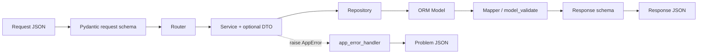
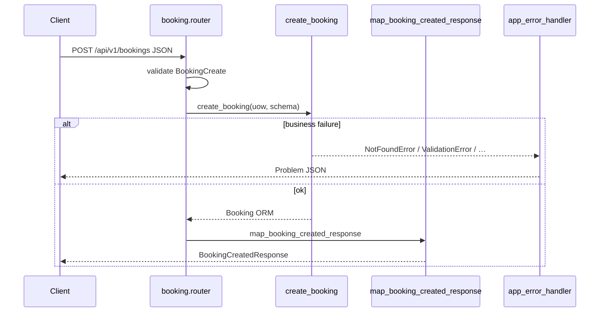

# 03 — Contracts (schemas, DTO, pagination, errors)

## Цель

- Читать **границу HTTP ↔ сервис**: request/response schemas vs domain DTO.
- Называть envelope списков по коду (`PaginatedResponse`), а не «как обычно в FastAPI».
- Прослеживать `AppError` → HTTP status → поля Problem JSON в `main.py`.
- Понимать, почему router не отдаёт ORM и где живут mapper-функции.
- Уметь пройти чеклист «добавить поле в response» по слоям.

## Предусловия

- `guides/00-inventory.md` — карта модулей и порядок чтения (router → schemas → …).
- Желательно: `guides/01-bootstrap.md` (`model_rebuild` в `api/router.py`), `guides/02-persistence.md` (ORM в `models/`).

## Карта файлов

| Путь | Роль |
|------|------|
| `backend/app/core/exceptions.py` | Иерархия `AppError` + status на классе |
| `backend/app/core/pagination.py` | `PaginatedResponse[T]`, `pagination_offset`, `build_paginated_response`, `paginate_all` |
| `backend/app/main.py` | `_error_body`, `_problem_response`, `app_error_handler`, `unhandled_exception_handler`, rate-limit handler |
| `backend/app/api/router.py` | `*.model_rebuild()` перед монтированием роутов |
| `backend/app/modules/identity/schemas.py` | Канон `*Create` / `*Update` / `*Response` + `from_attributes` |
| `backend/app/modules/auth/schemas.py` | Auth request/response; enrichment поверх `UserResponse` |
| `backend/app/modules/booking/schemas.py` | Booking create/response/list; perspectives Self/Owner |
| `backend/app/modules/booking/mapping.py` | ORM `Booking` → response schema |
| `backend/app/modules/booking/order/dto.py` | Frozen dataclasses для course booking (не Pydantic) |
| `backend/app/modules/booking/order/schemas.py` | Order / course HTTP schemas |
| `backend/app/modules/booking/order/mappers.py` | DTO → `CourseBookingResponse` |
| `backend/app/modules/catalog/public/schemas.py` | Public storefront response shapes |
| `backend/app/modules/catalog/public/dto.py` | Public aggregate DTOs |
| `backend/app/modules/catalog/public/mappers.py` | `StudioPublicDTO` → `StudioPublicResponse` |
| `backend/app/modules/catalog/service/schemas.py` | Service CRUD + availability response |
| `backend/app/modules/catalog/service/dto.py` | Availability / course capacity DTOs |
| `backend/app/modules/catalog/service/mappers.py` | `ServiceAvailabilityDTO` → response |
| `backend/app/modules/payment/schemas.py` | Checkout / Connect / ledger list / refund |
| `backend/app/modules/search/schemas.py` | Leaf search shapes (mirror catalog, без импорта catalog) |
| `backend/app/api/mappers/` | **LEGACY / empty shell** — только `__pycache__`; маппинг в `modules/*/mappers.py` и `booking/mapping.py` |
| `backend/tests/integration/api/test_frontend_readiness_contracts.py` | Контракты list envelope, authz, `CurrentUserUpdate` |
| `backend/tests/integration/api/test_aware_datetime_schemas.py` | Aware datetime на границе схем |
| `backend/tests/unit/booking/test_booking_schema_serialization.py` | Snapshot: Stripe internals не утекают в client schemas |
| `docs/ARCHITECTURE.md` | Layout / layers; **отдельной pagination-секции нет** (см. Open questions) |

## Слои и зависимости

```text
HTTP JSON
  → Pydantic request schema (modules/*/schemas.py)
  → router (HTTP only: Depends, status, response_model)
  → service (+ optional domain DTO from dto.py)
  → repository → ORM model (app/models)
  → mapper / model_validate → Pydantic response schema
  → HTTP JSON
```

- **Schemas (Pydantic)** — контракт API: валидация входа, сериализация выхода, OpenAPI.
- **DTO (`dataclass`, frozen)** — внутренний результат сервиса/агрегата **без** HTTP-полей; живёт рядом с продюсером (`catalog/public/dto.py`, `catalog/service/dto.py`, `booking/order/dto.py`).
- **Mapper** — явное `DTO|ORM → Response`; не бизнес-логика.
- **Exceptions** — сервисы/deps поднимают `AppError`; HTTP-маппинг **только** в handlers (`main.py`). Docstring `exceptions.py`: routers **не** используют `HTTPException`.

Два частых пути к response:

1. **ORM → schema:** `XxxResponse.model_validate(orm)` при `ConfigDict(from_attributes=True)` (например identity `UserResponse`, catalog `ServiceResponse`).
2. **DTO → schema:** ручной mapper (`map_studio_public`, `map_service_availability`, `map_course_booking_result`).

## Почему не отдаём ORM из router

**Пример:** `create_booking_endpoint` (`backend/app/modules/booking/router.py`).

- Сервис `create_booking` возвращает ORM `Booking` (с полями вроде `checkout_session_id`, `payment_intent_id`, `access_token`).
- Router **не** возвращает ORM: вызывает `map_booking_created_response` (`backend/app/modules/booking/mapping.py`) → `BookingCreatedResponse`.
- `BookingResponseBase` в docstring явно исключает Stripe `checkout_session_id` / `payment_intent_id`.
- Тест `test_booking_client_schema_serialization_snapshot` (`backend/tests/unit/booking/test_booking_schema_serialization.py`) фиксирует: даже если на объекте есть секреты Stripe, `model_dump` client schema их **не** содержит.

**Зачем так:** response schema = allowlist полей + perspectives (Self/Owner) + one-time `access_token` только в create. ORM — persistence-детализация, не публичный контракт.

Аналог public storefront: `get_studio_public_endpoint` → `get_studio_public` (DTO) → `map_studio_public` → `StudioPublicResponse` (`catalog/public/router.py` + `mappers.py`).

## Паттерн именования: schema vs DTO

| Суффикс / имя | Слой | Примеры (якоря) |
|---------------|------|-----------------|
| `*Base` | Shared fields create/response | `UserBase`, `BookingBase`, `ServiceBase` |
| `*Create` | Request body create | `UserCreate`, `BookingCreate`, `ServiceCreate`, `CheckoutSessionCreate` |
| `*Update` | Partial patch; часто все поля `Optional` | `UserUpdate`, `ServiceUpdate`; `CurrentUserUpdate` + `extra="forbid"` |
| `*Response` | HTTP output | `UserResponse`, `ServiceResponse`, `TokenResponse` |
| `*ListItem` | Элемент списка (часто nested) | `BookingSelfListItem`, `OrderListItem`, `PaymentListItem` |
| Perspectives | Разные views одной сущности | `BookingSelfResponse`, `BookingOwnerResponse`, `BookingCreatedResponse` |
| Auth-specific | Не CRUD-сущность | `OTPRequest`, `OTPVerify`, `OTPSentResponse` |
| `*DTO` | Domain dataclass, не HTTP | `StudioPublicDTO`, `CourseAvailabilityDTO`, `CourseBookingResultDTO` |
| Search mirror | Leaf без импорта catalog | `SearchStudioResponse`, `SearchServiceResponse`, `SearchResult` |

**DTO vs schema в модулях:**

| Модуль | Schema | DTO | Mapper |
|--------|--------|-----|--------|
| `identity` | да | нет | `model_validate` в callers (auth router) |
| `auth` | да | нет | compose `UserResponse.model_validate` |
| `booking` | да | нет (single) | `mapping.py` |
| `booking/order` | да | `CourseBookingInput`, `CourseBookingResultDTO` | `order/mappers.py` |
| `catalog/public` | да | `StudioPublicDTO`, … | `public/mappers.py` |
| `catalog/service` | да | availability DTOs | `service/mappers.py` |
| `payment` | да | нет в whitelist | `PaymentListItem.model_validate` в router |
| `search` | да | нет | `model_validate` в `search/service.py` |

## Walkthrough функций

### `PaginatedResponse` / helpers (`backend/app/core/pagination.py`)

- **Зачем:** единый envelope списков `{items, total, page, size}`.
- **Вход:** generic `T` (обычно response schema).
- **Поля:** `items: list[T]`; `total: int` (`ge=0`); `page: int` (`ge=1`); `size: int` (`ge=1`, `le=100`).
- **`pagination_offset(page, size)`:** `(page - 1) * size, size` → SQL skip/limit.
- **`build_paginated_response(items, *, total, page, size)`:** собрать envelope после repo count + page fetch.
- **`paginate_all(items)`:** одна «страница» на весь in-memory список; `page=1`, `size=max(total, 1)`.
- **Кто вызывает:** list-роуты booking / order / studio / occurrence / payment; `paginate_all` — например `GET /studios/my`, schedule list у service.

Типичный Query на роутере (якорь `list_bookings`): `page: Query(1, ge=1)`, `size: Query(20, ge=1, le=100)`.

Тест-контракт envelope: `owner_payload["items"]` + `owner_payload["total"]` в `test_owner_id_studio_filters_require_matching_authenticated_owner`.

### `_error_body` / `app_error_handler` (`backend/app/main.py`)

- **Зачем:** RFC 7807 Problem JSON для доменных ошибок.
- **Поля body:** `type`, `title`, `status`, `detail`, опционально `request_id`.
- **`type` для AppError:** `f"app-error:{type(exc).__name__}"` (например `app-error:NotFoundError`).
- **`title`:** из `_STATUS_TITLES` по `status_code` (400→`Bad Request`, …; неизвестный код → `"Error"`).
- **HTTP status:** `exc.status_code` с экземпляра `AppError`.
- **Заголовок:** `X-Request-ID` через `_problem_response`, если request_id есть.
- **Лог:** `logger.warning("app_error", …)` без PII в handler.
- **Unhandled:** `unhandled_exception_handler` → 500, `detail="Internal server error"`, `type="internal-error"`.
- **Rate limit:** `rate_limit_exceeded_handler` → 429, `type="rate-limit-exceeded"`, `detail="Too many requests. Please try again later."`.

### `AppError` hierarchy (`backend/app/core/exceptions.py`)

См. таблицу ошибок ниже. Конструктор базы: `AppError(detail, status_code=500)`.

### `map_booking_created_response` (`backend/app/modules/booking/mapping.py`)

- **Вход:** ORM `Booking`.
- **Шаги:** проверить `booking.access_token`; `BookingSelfResponse.model_validate(booking).model_dump()` + `access_token`.
- **Ошибки:** `ValidationError("Booking access token is missing")` → 400 Problem JSON.
- **Кто вызывает:** `create_booking_endpoint`.

### `map_studio_public` (`backend/app/modules/catalog/public/mappers.py`)

- **Вход:** `StudioPublicDTO`.
- **Выход:** `StudioPublicResponse` (вложенные `PublicService` + optional `Availability`).
- **Кто вызывает:** `get_studio_public_endpoint`.

### `map_service_availability` / `map_course_booking_result`

- `catalog/service/mappers.py` → `ServiceAvailabilityResponse`.
- `booking/order/mappers.py` → `CourseBookingResponse` (order + bookings + availability + `access_token`); при отсутствии token — `ValueError` (не `AppError`; попадёт в unhandled 500, если не перехвачено — см. Open questions).

### `*.model_rebuild()` (`backend/app/api/router.py`)

После импорта схем с forward/циклическими ссылками (booking ↔ occurrence/studio, order, search):

`BookingSelfResponse`, `BookingCreatedResponse`, `BookingOwnerResponse`, `BookingWithUser`, `BookingSelfListItem`, `CourseBookingResponse`, `OrderListItem`, `SearchResult`.

Кратко: без rebuild Pydantic v2 может не резолвить nested types. Детали старта — `guides/01-bootstrap.md`.

## Walkthrough репрезентативных схем

### 1. `UserCreate` / `UserUpdate` / `UserResponse` (`identity/schemas.py`)

- Docstring модуля: RORO + security (не отдавать internal auth fields) + разные правила create/update.
- `UserCreate`: email, name, phone?, `marketing_consent` default `False`.
- `UserUpdate`: все поля optional.
- `CurrentUserUpdate`: только `name` / `phone` / `marketing_consent`; `extra="forbid"` — тест `test_patch_auth_me_updates_only_editable_profile_fields` → 422 на `email`/`role`.
- `UserResponse`: id, role, flags, `AwareDatetime` timestamps; `from_attributes=True`.

### 2. `BookingCreate` → `BookingCreatedResponse` (`booking/schemas.py`)

- Create: `occurrence_id`, guest fields, `booking_type` default `BookingType.SINGLE`, optional `service_id` (course).
- Response base: status, `reserved_until: AwareDatetime | None`, `payment_status`, attendance timestamps; **без** Stripe IDs.
- `@computed_field is_guest_booking` ← `user_id is None`.
- `BookingCreatedResponse` добавляет one-time `access_token`.
- List: `BookingSelfListItem` = self + nested `OccurrenceResponse` + `StudioResponse`.

### 3. `ServiceCreate` / `ServiceResponse` (`catalog/service/schemas.py`)

- Create наследует base (name, prices, capacity ratios, tags, visibility) + `studio_id`.
- Валидация: `ge`/`le` на capacity ratios и prices; `visibility` literal.
- Response: id, studio_id, `is_active`, `created_at`/`updated_at` (`datetime`, не `AwareDatetime` — отличие от booking/identity; см. Open questions).

### 4. `CheckoutSessionCreate` (`payment/schemas.py`)

- `booking_id`, `HttpUrl` success/cancel, optional guest `access_token`.
- Отдельная функция `validate_checkout_redirect_urls` → `ValidationError` если host не в allowlist settings.

### 5. List item: `PaymentListItem` / envelope

- Ledger row с `from_attributes=True`.
- Router: `pagination_offset` → repo → `[PaymentListItem.model_validate(p) for p in payments]` → `build_paginated_response`.

## Таблица ошибок

| Exception class | status | Когда (из кода / тестов) |
|-----------------|--------|---------------------------|
| `NotFoundError` | 404 | Ресурс отсутствует, напр. `get_booking_for_user_or_raise` → `"Booking not found"`; studio/service not found |
| `ForbiddenError` | 403 | Нет доступа к студии / CSRF fail (`auth/router`); тесты FR: stranger на services/orders |
| `UnauthorizedError` | 401 | Нет auth (`deps.get_current_user_required`); invalid refresh; public list с `owner_id` без токена (FR test) |
| `ValidationError` | **400** | Бизнес/входные правила сервиса: `"studio_id is required"` (orders list); OTP invalid; redirect URL; timezone change с occurrences |
| `ConflictError` | 409 | Напр. `ConflictError("Studio slug is already in use")` — FR test duplicate slug |
| `ServiceUnavailableError` | 503 | OTP delivery unavailable (`auth/service`); webhook path в тестах 503 |
| `AppError` (base) | 500 default | База; обычно не инстанцируют напрямую |
| `RateLimitExceeded` (slowapi) | 429 | Handler в `main.py`, не подкласс `AppError` |
| Необработанный `Exception` | 500 | `unhandled_exception_handler`; клиенту generic detail |
| Pydantic/FastAPI body validation | **422** | Нет кастомного handler в `main.py` — дефолт FastAPI. Тесты: naive datetime create occurrence; `CurrentUserUpdate` extra fields |

Problem JSON (доменные + rate-limit + unhandled), поля из `_error_body`:

```json
{
  "type": "app-error:NotFoundError",
  "title": "Not Found",
  "status": 404,
  "detail": "Booking not found",
  "request_id": "<uuid-if-present>"
}
```

**Важно:** доменный `ValidationError` (AppError) → **400**, не 422. 422 — провал Pydantic на границе запроса.

## Datetime timezone-aware

Тесты `backend/tests/integration/api/test_aware_datetime_schemas.py` (MID-2):

1. `OccurrenceResponse.model_dump(mode="json")` — instants с offset (`Z` / `±HH:MM`); Berlin input сериализуется с `Z`.
2. `BookingSelfResponse` — `reserved_until` / timestamps aware ISO.
3. `OccurrenceCreate` отвергает naive `datetime` (ValueError / schema).
4. Integration: POST `/api/v1/occurrences` с `"2026-06-15T18:00:00"` (без offset) → **422**.

Якорь схемы occurrence: поля `AwareDatetime` + нормализация UTC в `catalog/occurrence/schemas.py` (`_normalize_to_utc`).

## Сквозной флоу



Пример create booking:



## Почему так (решения)

- **Schemas отдельно от ORM** — docstring `identity/schemas.py` (security, разные правила create/update, computed later); booking docstring исключает Stripe IDs; unit snapshot фиксирует non-leak.
- **DTO без Pydantic** — module docstrings `*/dto.py`: «Domain DTOs … (no Pydantic)»; границы сервиса не тащат HTTP Field/OpenAPI.
- **Один handler для AppError** — docstring `exceptions.py`: mapping to HTTP in one place; routers без `HTTPException`.
- **Единый pagination envelope** — `PaginatedResponse` в `core/pagination.py`; FR/integration тесты читают `items`/`total`.
- **Search дублирует shapes** — WHY в `search/schemas.py`: leaf не импортирует catalog; shapes mirror public/catalog для API compatibility.
- **`model_rebuild` в aggregator** — комментарий `api/router.py`: finalize forward references before unions/use.

## How-to: добавить поле в response

Чеклист для ученика (порядок слоёв):

1. **Нужно ли поле клиенту?** Если internal (Stripe id, hash) — не добавлять в `*Response` (см. booking snapshot).
2. **ORM / источник данных:** колонка уже есть в `app/models`? Если нет — это persistence-задача (A2), не только schema.
3. **Response schema:** добавить поле в нужный `*Response` / `*ListItem` с типом (`AwareDatetime` для instants) и `Field(description=…)`.
4. **Perspective:** Self vs Owner vs Public — правильный класс (`BookingSelfResponse` vs `BookingOwnerResponse` vs `PublicService`).
5. **Mapper / validate:**
   - `from_attributes=True` и имя поля совпадает с ORM → часто достаточно `model_validate`.
   - DTO-путь → обновить dataclass **и** ручной mapper (`mappers.py`).
6. **Create-only поля** (как `access_token`) — отдельный schema-класс, не list/GET.
7. **Forward refs:** если nested cross-module — убедиться, что тип в `model_rebuild` списке (`api/router.py`) при необходимости.
8. **Тест контракта:** unit dump snapshot и/или integration assert на JSON key; для datetime — offset в ISO.
9. **Не** править `app/api/mappers/` (пусто) и не возвращать ORM из router.

## Как читать самому

1. Открой `core/pagination.py` — запомни 4 поля envelope и три helper-функции.
2. Открой `core/exceptions.py` + handlers в `main.py` — сверь `type`/`title`/`status`/`detail`/`request_id`.
3. Выбери один create-эндпоинт (`booking/router.py` `create_booking_endpoint`) — проследи schema → service → mapper → response_model.
4. Выбери один list (`list_bookings`) — `pagination_offset` → count/list → `build_paginated_response`.
5. Сравни DTO-путь: `catalog/public/service.py` → `map_studio_public`.
6. Прочитай три теста из whitelist: FR contracts, aware datetime, booking serialization.

## What to watch out for

- **`ValidationError` (app) ≠ FastAPI 422.** Домен → 400 Problem JSON; schema fail → 422 (дефолтный body FastAPI, не `_error_body`).
- **`app/api/mappers/` пустой.** Искать `modules/**/mappers.py` и `booking/mapping.py`.
- **Не все datetime — `AwareDatetime`.** Booking/identity/payment list — да; `ServiceResponse.created_at` — обычный `datetime` (рассинхрон контракта).
- **`paginate_all` ≠ page из Query.** Игнорирует клиентский page/size; одна страница на весь список.
- **Create response ≠ list item.** `access_token` только в create schemas.
- **Search schemas — копии, не импорт catalog** — менять оба места при выравнивании публичного контракта (или осознанный drift).

## Checkpoint questions

1. Какие четыре поля у `PaginatedResponse` и чем `build_paginated_response` отличается от `paginate_all`?
2. Какие поля Problem JSON собирает `_error_body`, и какой `type` ставит `app_error_handler` для `NotFoundError`?
3. Почему `create_booking_endpoint` вызывает `map_booking_created_response`, а не возвращает ORM `Booking`?
4. Чем domain DTO (`StudioPublicDTO`) отличается от `StudioPublicResponse`, и где происходит преобразование?
5. Доменный `ValidationError("studio_id is required")` даёт какой HTTP status? Чем это отличается от naive datetime в `OccurrenceCreate`?
6. Зачем в `api/router.py` вызывается `BookingSelfListItem.model_rebuild()` (и соседние rebuild)?
7. Какие поля ORM booking **намеренно** отсутствуют в `BookingSelfResponse` согласно схеме и unit-тесту?

## Open questions

- UNKNOWN: в `docs/ARCHITECTURE.md` нет отдельной заметки про pagination envelope — канон только `core/pagination.py` + роутеры/тесты.
- UNKNOWN: точная JSON-форма дефолтного FastAPI **422** (не кастомизирована в `main.py`); тесты проверяют в основном `status_code`.
- UNKNOWN: `map_course_booking_result` бросает голый `ValueError` при отсутствии order token — задумано ли это vs `ValidationError` как в `map_booking_created_response`.
- UNKNOWN: планируется ли выровнять `ServiceResponse` timestamps на `AwareDatetime` как в booking/identity (сейчас `datetime`).
- нет блокирующих дыр для чтения границы API по whitelist A3.
