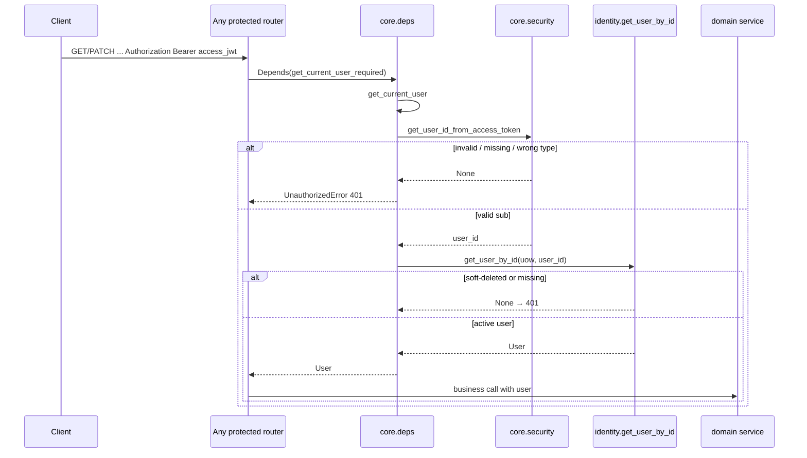

# 04 — Auth + Identity

## Цель

- Разделить **auth** (OTP, JWT-сессии, cookies) и **identity** (User, ownership policy, soft-delete).
- Пройти OTP login → issue tokens → refresh rotation → Bearer request end-to-end.
- Назвать точные deps (`get_current_user` / `get_current_user_required`) и понять, где живёт studio RBAC.
- Увидеть точку оркестрации auth → booking (`attach_guest_resources`) без разбора booking internals.
- Понять GDPR soft-delete / anonymize и поведение повторного входа после delete.

## Предусловия

- `guides/00-inventory.md` — карта модулей, ADR-003 (auth orchestration).
- `guides/02-persistence.md` — `User`, `OTPCode`, `RefreshToken`, `StudioMember`, UoW.
- `guides/03-contracts.md` — auth/identity schemas, Problem JSON.
- Желательно: `guides/01-bootstrap.md` — settings, middleware, rate limit.

## Карта файлов

| Путь | Роль |
|------|------|
| `backend/app/modules/auth/router.py` | HTTP: `/auth/*` + `account_router` `/me/delete-account`; cookies/CSRF |
| `backend/app/modules/auth/service.py` | OTP, verify, refresh rotation, logout, resolve user from access JWT |
| `backend/app/modules/auth/repository.py` | `OTPCodeRepository`, `RefreshTokenRepository` |
| `backend/app/modules/auth/schemas.py` | `OTPRequest`, `OTPVerify`, `TokenResponse`, `CurrentUserResponse`, … |
| `backend/app/modules/auth/__init__.py` | Published: repos + lazy `get_current_user_from_token` |
| `backend/app/modules/identity/service.py` | `get_or_create_user`, profile update, soft-delete |
| `backend/app/modules/identity/repository.py` | `UserRepository` (active vs including-deleted) |
| `backend/app/modules/identity/schemas.py` | `UserResponse`, `CurrentUserUpdate`, … |
| `backend/app/modules/identity/policies.py` | `is_owned_by_user` — ownership по `user_id` / `guest_email` |
| `backend/app/modules/identity/__init__.py` | Published: repo, schemas, lazy service symbols |
| `backend/app/models/user.py` | ORM `User`, `UserRole` |
| `backend/app/models/otp_code.py` | ORM `OTPCode` |
| `backend/app/models/refresh_token.py` | ORM `RefreshToken` (jti, revoke, expiry) |
| `backend/app/models/studio_member.py` | ORM `StudioMember`, `StudioMemberRole` |
| `backend/app/core/security.py` | JWT access/refresh, OTP hash/generate, CSRF token |
| `backend/app/core/access_tokens.py` | **Не JWT:** guest resource access tokens (booking IDOR) |
| `backend/app/core/deps.py` | `get_current_user`, `get_current_user_required`, re-export `get_uow` |
| `backend/app/core/config.py` | TTL/limits: `ACCESS_TOKEN_EXPIRE_MINUTES`, `REFRESH_TOKEN_EXPIRE_DAYS`, `OTP_*`, cookie flags |
| `backend/app/integrations/email/service.py` | `send_otp_email` (Resend / dev mode) |
| `backend/app/modules/catalog/studio/service.py` | Studio RBAC: `STUDIO_PERMISSIONS_BY_ROLE`, `require_studio_permission` |
| `backend/alembic/versions/010_rbac_studio_members.py` | `user_role` + `studio_members` + backfill owners |
| `backend/alembic/versions/013_gdpr_user_privacy.py` | `marketing_consent`, `deleted_at` |
| `backend/alembic/versions/016_anonymize_deleted_user_pii.py` | nullable `name` + backfill anonymize |
| `backend/tests/unit/auth/**`, `backend/tests/unit/identity/**` | JWT/OTP, email logging, ownership policy |
| `backend/tests/integration/api/test_api_auth.py` | Full cookie flow, CSRF, delete-account |
| `backend/tests/integration/api/test_studio_rbac.py` | Authz по `StudioMemberRole` |
| `backend/tests/integration/api/test_attach_guest_bookings.py` | OTP verify → attach guest bookings |
| `docs/ARCHITECTURE.md` | Leaf `identity`; auth fan-out; soft-delete note |
| `docs/adr/003-modular-monolith.md` | Auth orchestration only via published interfaces |

**Нет отдельного identity router.** Account HTTP живёт в `auth/router.py` (`/auth/me`, `/me/delete-account`).

## Слои и зависимости

```text
HTTP (/api/v1/auth/*, /api/v1/me/*)
  → auth/router (cookies, CSRF, rate-limit decorators, response_model)
  → auth/service  ──orchestrates──► identity (get_or_create_user, get_user_by_id, …)
                  ──orchestrates──► booking.attach_guest_resources  (published)
                  ──orchestrates──► integrations.email.send_otp_email
                  ──uses──────────► core.security (JWT/OTP helpers)
  → auth repositories (otp_codes, refresh_tokens) via UnitOfWork
  → identity repository (users) via UnitOfWork

Authenticated request:
  Bearer → core.deps.get_current_user
        → core.security.get_user_id_from_access_token
        → identity.get_user_by_id  (soft-deleted → None)
```

**Разделение ответственности**

| Слой | `auth` | `identity` |
|------|--------|------------|
| Router | да (`router`, `account_router`) | **нет** |
| Service | OTP + session tokens | User lifecycle / profile / soft-delete |
| Repository | `OTPCodeRepository`, `RefreshTokenRepository` | `UserRepository` |
| Schemas | OTP/token/current-user enrichment | `User*` CRUD shapes + `CurrentUserUpdate` |
| Policies | — | `is_owned_by_user` (ownership, не studio RBAC) |

**import-linter / ARCHITECTURE:** `identity` — leaf (`core` + `models` only). `auth` может тянуть `booking` + `identity` + `integrations` (orchestration). Studio RBAC живёт в `catalog.studio`, не в identity.

**Не путать токены**

| Механизм | Где | Назначение |
|----------|-----|------------|
| Access JWT | `core.security.create_access_token` | Bearer `Authorization` |
| Refresh JWT + DB row | `create_refresh_token` + `RefreshToken.jti` | Cookie `refresh_token`, rotation |
| CSRF | `create_csrf_token` | Cookie `csrf_token` + header `X-CSRF-Token` |
| Resource access token | `core.access_tokens` | Guest booking IDOR — см. `guides/06-booking.md` |

## Auth vs Identity (кратко)

**Почему два модуля:** сессия/секреты (auth) отделены от сущности пользователя и ownership (identity). ADR-003: auth оркестрирует identity/booking/email **только** через published symbols.

**HTTP deps (`core/deps.py`):** docstring явно — resolve user через `core.security` + `identity`, **не** через `auth.service`. Параллельно `auth.service.get_current_user_from_token` существует для callers, которым нужен тот же resolve с UoW + raw token string.

## Settings (TTL / limits) — только имена из кода

Источник: `backend/app/core/config.py` → класс `Settings`.

| Setting | Default в коде | Где используется |
|---------|----------------|------------------|
| `SECRET_KEY` | из env (required) | JWT sign + OTP HMAC |
| `ALGORITHM` | `"HS256"` | JWT |
| `ACCESS_TOKEN_EXPIRE_MINUTES` | `15` | access JWT `exp` |
| `REFRESH_TOKEN_EXPIRE_DAYS` | `7` | refresh JWT `exp` + cookie `max_age` |
| `OTP_EXPIRE_MINUTES` | `10` | `get_otp_expires_at` |
| `OTP_LENGTH` | `6` | `generate_otp_code` |
| `OTP_MAX_ATTEMPTS` | `5` | `verify_otp` |
| `OTP_MAX_REQUESTS_PER_EMAIL_PER_HOUR` | `3` | `request_otp` rate limit |
| `OTP_RETENTION_DAYS` | `7` | cleanup job (не login path) |
| `cookie_secure` | `True` если `ENVIRONMENT == "production"` | Set-Cookie |
| `cookie_samesite` | `"none"` в production, иначе `"lax"` | Set-Cookie |
| `RESEND_API_KEY` / `EMAIL_FROM` | optional / default sender | `send_otp_email` |

HTTP rate limits (slowapi на router): `10/minute` otp/request, `20/minute` otp/verify, `30/minute` refresh.

## Walkthrough функций

### Auth service — публичные

#### `request_otp` (`backend/app/modules/auth/service.py`)

- **Зачем:** выдать одноразовый код на email; **User ещё не создаётся**.
- **Вход:** `uow`, `email`, `name`, optional `request_ip`.
- **Шаги:**
  1. `uow.users.get_by_email_including_deleted` — только для `user_id` в логах.
  2. `uow.otp_codes.count_recent_requests` за последний час; если `>= OTP_MAX_REQUESTS_PER_EMAIL_PER_HOUR` → `ValidationError`.
  3. `invalidate_active_for_email` — старые активные коды пометить `used_at`.
  4. `generate_otp_code` → `hash_otp_code` → `uow.otp_codes.add(OTPCode(...))` с `expires_at=get_otp_expires_at()`.
  5. `send_otp_email(email, code)`; если `False` → `ServiceUnavailableError`.
- **Выход / ошибки:** `None` / rate limit 400 / delivery 503.
- **Кто вызывает:** `otp_request` в `auth/router.py`.

#### `verify_otp` (`backend/app/modules/auth/service.py`)

- **Зачем:** проверить код и выдать сессию.
- **Вход:** `uow`, `email`, `code`, optional `booking_id`.
- **Шаги:**
  1. `get_latest_active_for_email`; нет → `ValidationError` (единое сообщение invalid/expired).
  2. `attempts >= OTP_MAX_ATTEMPTS` → invalidate + `ValidationError`.
  3. `verify_otp_code`; fail → increment attempts (и invalidate при лимите) + `ValidationError`.
  4. Делегирует в `_complete_otp_login`.
- **Выход:** `(User, access_token, refresh_token, csrf_token)`.
- **Кто вызывает:** `otp_verify` router.

#### `_complete_otp_login` (private, тот же файл)

- Помечает OTP `used_at`.
- `get_or_create_user(uow, email=otp.email, name=otp.name)` — name только для **нового** user (WHY в коде).
- Обновляет `last_login_at`.
- **Оркестрация booking:** `await attach_guest_resources(uow, user, booking_id=booking_id)` — published symbol `app.modules.booking.attach_guest_resources` (реализация в `booking/queries.py`). Детали attach — см. `guides/06-booking.md`.
- Создаёт access/refresh/csrf; парсит refresh → `uow.refresh_tokens.add(RefreshToken(user_id, jti, expires_at))`.

#### `refresh_access_token` (`backend/app/modules/auth/service.py`)

- **Зачем:** rotation: старый refresh revoke → новый access + refresh + csrf.
- **Вход:** `uow`, raw `refresh_token` string.
- **Шаги:**
  1. `parse_refresh_token` → `UnauthorizedError` если invalid.
  2. `get_by_user_and_jti`; missing → 401.
  3. Если `revoked_at is not None` (**reuse detection**): `revoke_active_for_user` + `await uow.commit()` (WHY: side effect должен пережить rollback 401) → 401.
  4. Если не `is_active(now)` → 401.
  5. Revoke current session; `get_user_by_id` (soft-deleted → None → 401).
  6. Issue new tokens + persist new `RefreshToken` row; `flush`.
- **Выход:** `(access_token, new_refresh_token, new_csrf_token)`.
- **Кто вызывает:** `refresh_tokens` router (после CSRF check).

#### `get_current_user_from_token` (`backend/app/modules/auth/service.py`)

- **Зачем:** resolve `User | None` из access JWT + UoW.
- **Шаги:** `get_user_id_from_access_token` → `get_user_by_id`.
- **Кто вызывает:** published через `modules/auth/__init__.py`; HTTP path использует `core.deps` (не этот symbol).

#### `logout_current_session` (`backend/app/modules/auth/service.py`)

- **Зачем:** revoke **одного** refresh (идемпотентный no-op при чужом/битом токене).
- **Шаги:** parse → match `user.id` → set `revoked_at` / `last_used_at` если ещё active.
- **Кто вызывает:** `logout` router.

### Auth repositories

#### `OTPCodeRepository` (`backend/app/modules/auth/repository.py`)

| Метод | Роль |
|-------|------|
| `count_recent_requests` | Rate limit по `(email, created_at)` — считает и invalidated |
| `invalidate_active_for_email` | Supersede / soft-delete cleanup OTP |
| `get_latest_active_for_email` | Verify target |
| `delete_expired_before` | Retention cleanup (job) |
| `add` / `save` | из `WriteRepositoryMixin` |

#### `RefreshTokenRepository` (`backend/app/modules/auth/repository.py`)

| Метод | Роль |
|-------|------|
| `get_by_user_and_jti` | Lookup session |
| `revoke_active_for_user` | Logout-all / reuse / soft-delete |
| `add` / `save` / `flush` | mixin + session |

### Identity service — публичные

#### `get_user_by_id` / `get_user_by_email` (`backend/app/modules/identity/service.py`)

- Тонкие wrappers над `uow.users.get_by_id` / `get_by_email` — **только non-deleted** (`deleted_at IS NULL`).
- **Кто вызывает:** deps, auth refresh/verify helpers, другие домены через published `__init__`.

#### `get_or_create_user` (`backend/app/modules/identity/service.py`)

- **Зачем:** регистрация на успешном OTP verify.
- **Шаги:**
  1. `get_by_email_including_deleted`.
  2. Active user → return **без** перезаписи `name`.
  3. Soft-deleted row с тем же email → `_anonymize_deleted_user_pii` + save, затем создать **нового** `User`.
  4. Нет строки → `User(email, name, phone)` + `add`.
- **Кто вызывает:** `_complete_otp_login`.

#### `update_current_user_profile` (`backend/app/modules/identity/service.py`)

- Применяет только поля из `CurrentUserUpdate` (`name`, `phone`, `marketing_consent`); `extra="forbid"` на схеме.
- Лог `user_profile_updated` с `updated_fields`.
- **Кто вызывает:** `PATCH /auth/me`.

#### `soft_delete_current_user_account` (`backend/app/modules/identity/service.py`)

- **Зачем:** GDPR soft-delete + revoke sessions.
- **Шаги:** set `deleted_at` (если ещё null) → invalidate OTP for original email → `_anonymize_deleted_user_pii` (`email=deleted+{id}@deleted.local`, `name`/`phone` null) → `revoke_active_for_user` → save.
- **Кто вызывает:** `POST /me/delete-account`.

#### `_anonymize_deleted_user_pii` (private)

- Домен `deleted.local`; совпадает с backfill миграции `016_anonymize_deleted_user_pii`.

### Key policy

#### `is_owned_by_user` (`backend/app/modules/identity/policies.py`)

- **Зачем:** канон ownership: `user_id == user.id` **или** case-insensitive `guest_email == user.email`.
- **Не** studio RBAC.
- **Кто вызывает:** `booking/policies.py`, `payment/access.py` (через import identity policy).

### Core deps

#### `get_current_user` (`backend/app/core/deps.py`)

- Optional auth: нет/битый Bearer → `None`; иначе `get_user_id_from_access_token` + `get_user_by_id`; пишет `request.state.user_id` для logging middleware.

#### `get_current_user_required`

- Обёртка: `None` → `UnauthorizedError("Authentication required")`.

**Отдельных permission Depends в `deps.py` нет.** Studio checks — `require_studio_permission` / `has_studio_permission` в `catalog.studio.service` (вызываются из studio/booking/payment services/routers).

## Таблица эндпоинтов

Префикс API: `/api/v1` (`backend/app/api/router.py`).

| Method | Path | Handler | Service | Auth |
|--------|------|---------|---------|------|
| `POST` | `/auth/otp/request` | `otp_request` | `request_otp` | public (+ slowapi 10/min) |
| `POST` | `/auth/otp/verify` | `otp_verify` | `verify_otp` | public (+ slowapi 20/min); sets cookies |
| `POST` | `/auth/refresh` | `refresh_tokens` | `refresh_access_token` | cookie refresh + CSRF header (+ 30/min) |
| `POST` | `/auth/logout` | `logout` | `logout_current_session` | Bearer required; clears cookies |
| `GET` | `/auth/me` | `get_current_user_me` | identity user already from deps; roles via `get_current_user_studio_roles` | Bearer required |
| `PATCH` | `/auth/me` | `update_current_user_me` | `update_current_user_profile` | Bearer required |
| `POST` | `/me/delete-account` | `delete_current_user_account` | `soft_delete_current_user_account` | Bearer required; clears cookies |

Cookie names (router constants): `refresh_token` (httpOnly), `csrf_token` (readable JS), header `X-CSRF-Token`.

## Published interface

### `modules/auth/__init__.py`

`__all__`: `OTPCodeRepository`, `RefreshTokenRepository`, `get_current_user_from_token`.

`get_current_user_from_token` — lazy via `__getattr__` (WHY: избежать cycle с booking/repos).

### `modules/identity/__init__.py`

`__all__`: `UserRepository`, `UserCreate`, `UserUpdate`, `UserResponse`, `UserPublic`, `get_or_create_user`, `get_user_by_email`, `get_user_by_id`, `soft_delete_current_user_account`.

Service symbols — lazy `__getattr__` (WHY: cycle с `core.uow` ↔ `UserRepository`).

**Не в `__all__`, но используется auth router напрямую:** `update_current_user_profile`, `CurrentUserUpdate`, `is_owned_by_user` (policy import path).

## Сквозной флоу

### Sequence: OTP login + refresh

```mermaid
sequenceDiagram
  participant C as Client
  participant R as auth/router
  participant AS as auth/service
  participant ID as identity/service
  participant BK as booking.attach_guest_resources
  participant EM as send_otp_email
  participant DB as UoW repos

  C->>R: POST /auth/otp/request {email,name}
  R->>AS: request_otp
  AS->>DB: count_recent_requests / invalidate / add OTPCode
  AS->>EM: send_otp_email(email, code)
  EM-->>AS: True/False
  AS-->>R: None
  R-->>C: OTPSentResponse

  C->>R: POST /auth/otp/verify {email,code,booking_id?}
  R->>AS: verify_otp
  AS->>DB: get_latest_active_for_email + verify hash
  AS->>ID: get_or_create_user
  AS->>BK: attach_guest_resources(uow, user, booking_id)
  Note over BK: details → guides/06-booking.md
  AS->>DB: add RefreshToken(jti)
  AS-->>R: user, access, refresh, csrf
  R-->>C: JSON access_token+user; Set-Cookie refresh_token, csrf_token

  C->>R: POST /auth/refresh (Cookie refresh+csrf, Header X-CSRF-Token)
  R->>R: _require_csrf_header
  R->>AS: refresh_access_token
  AS->>DB: rotate jti (revoke old, add new)
  AS-->>R: new access, refresh, csrf
  R-->>C: TokenResponse + rotated cookies
```

### Sequence: authenticated request with Bearer



## RBAC: граница identity vs studio

| Концепт | Где | Смысл |
|---------|-----|-------|
| `UserRole` | `models/user.py` | Глобально: `user` / `studio_owner` / `admin` |
| `StudioMemberRole` | `models/studio_member.py` | Per-studio: `owner` / `manager` / `instructor` |
| Таблица `studio_members` | migration `010_rbac_studio_members` | Backfill owners из `studios.owner_id` |
| Permission matrix | `catalog/studio/service.py` → `STUDIO_PERMISSIONS_BY_ROLE` | `view_dashboard`, `manage_studio`, … |
| Enforce | `require_studio_permission` / `has_studio_permission` | **Не** в identity, **не** в `deps.py` |
| Roles в `/auth/me` | `get_current_user_studio_roles` | Hint для UI navigation |
| Ownership guest/user | `identity.policies.is_owned_by_user` | Booking/payment «свой ресурс» |

Тесты authz: `backend/tests/integration/api/test_studio_rbac.py` (manager vs instructor 403 на settings/schedule).

**Правило:** RBAC checks в service (`require_studio_permission`), не размазывать по router кроме тонкого вызова.

## Guest attach (граница auth → booking)

В `_complete_otp_login`:

```text
from app.modules.booking import attach_guest_resources
await attach_guest_resources(uow, user, booking_id=booking_id)
```

- Published symbol: `attach_guest_resources` (`modules/booking/__init__.py` → `booking/queries.py`).
- Optional `OTPVerify.booking_id` прокидывается из router.
- Интеграционный якорь: `test_attach_guest_bookings.py`.
- Внутренняя логика attach (email match, orders) — **см. `guides/06-booking.md`**. Здесь важно только: auth оркестрирует, booking владеет правилами.

## GDPR / soft-delete / anonymize

| Артефакт | Что делает |
|----------|------------|
| Migration `013_gdpr_user_privacy` | Колонки `marketing_consent`, `deleted_at` + index |
| Migration `016_anonymize_deleted_user_pii` | `name` nullable; backfill `deleted+{id}@deleted.local` для уже удалённых |
| `soft_delete_current_user_account` | `deleted_at`, anonymize PII, invalidate OTP, revoke all refresh |
| `UserRepository.get_by_id` / `get_by_email` | Исключают soft-deleted → Bearer/`/me` дают 401 |
| `get_or_create_user` | Освобождает email у deleted row и позволяет создать **нового** user |

Поведение после delete (интеграционный тест `test_delete_account_soft_deletes_user_and_revokes_sessions`):

1. Cookies cleared; старый refresh → 401; старый access `/auth/me` → 401.
2. Старый OTP (запрошенный до delete) → verify 400 (invalidated).
3. Новый OTP request + verify с тем же email → **200 и новый `user.id`**.

`docs/ARCHITECTURE.md` Production notes формулирует MVP как «cannot authenticate again with the same email» — это **расходится** с текущим тестом/кодом (см. Open questions). Ориентир для ученика: код + `test_api_auth.py`.

## Email integration

- Вызов: только `request_otp` → `send_otp_email` (`integrations/email/service.py`).
- Без `RESEND_API_KEY`: `DEBUG=True` → accept + log `otp_dev_mode_no_provider` с **masked** email; иначе → `False` / error log `otp_provider_not_configured`.
- С Resend: лог `otp_email_sent` с `resend_id` — **не** OTP, **не** plain email.
- Тесты: `backend/tests/unit/auth/test_email_logging.py` — запрет утечки OTP/plain email в логах.

## Почему так (решения)

- **Strict cookie refresh** — docstring `auth/router.py`: refresh не в JSON body; httpOnly cookie.
- **Double-submit CSRF** — `create_csrf_token` docstring + `_require_csrf_header` на refresh.
- **Refresh rotation + reuse detection** — `RefreshToken.jti`; reuse → revoke all + explicit `uow.commit()` (WHY в `refresh_access_token`).
- **OTP hash HMAC(SECRET_KEY)** — dump БД не восстанавливает plaintext (`hash_otp_code` docstring).
- **User создаётся на verify, не на request** — docstring `request_otp`.
- **Name не перезаписывается на login** — WHY в `_complete_otp_login` / `get_or_create_user`.
- **Auth orchestration** — ADR-003: допустимо через published interfaces; fan-out accepted.
- **Deps без auth import** — `core/deps.py` docstring: identity leaf + security, избежать циклов/coupling.

## Как читать самому

1. Открой `auth/router.py` — таблицу endpoints + cookie helpers.
2. Проследи `request_otp` → `verify_otp` → `_complete_otp_login` в `auth/service.py`.
3. Сверь TTL с `Settings` в `core/config.py` (не запоминай числа из головы).
4. Открой `core/deps.py` vs `auth.service.get_current_user_from_token` — два пути resolve.
5. Прочитай `identity/service.py` soft-delete + `get_or_create_user` ветку deleted.
6. Найди `attach_guest_resources` import в auth — не углубляйся в booking repo.
7. Открой `catalog/studio/service.py` `STUDIO_PERMISSIONS_BY_ROLE` / `require_studio_permission`.
8. Прогони глазами: `test_api_auth.py` full flow + delete-account; `test_email_logging.py`; `test_identity_policies.py`.

## What to watch out for

- **Cookie flags:** `refresh_token` httpOnly=True; `csrf_token` httpOnly=False; `secure`/`samesite` из `settings.cookie_*` (в prod SameSite=none → нужен Secure).
- **Два rate limit на OTP:** slowapi per-IP/minute **и** `OTP_MAX_REQUESTS_PER_EMAIL_PER_HOUR` в service.
- **Soft-deleted users:** обычные lookups возвращают `None` → 401; email освобождается anonymize; повторный OTP создаёт **новый** аккаунт (см. тест).
- **Не класть RBAC checks в router** как бизнес-логику — матрица и `require_studio_permission` в studio service; identity даёт только ownership policy.
- **`access_tokens.py` ≠ access JWT** — guest resource tokens для booking.
- **Не логировать OTP/секреты** — покрыто unit-тестами email logging.
- **Refresh reuse:** повтор старого cookie после rotation убивает все активные сессии пользователя.

## Checkpoint questions

1. В каком модуле создаётся `User` при первом входе, и почему `POST /auth/otp/request` этого не делает?
2. Где хранится refresh token после `otp/verify`, и какие флаги cookie выставляет `_set_refresh_cookie`?
3. Чем `get_current_user` в `core/deps.py` отличается от `get_current_user_from_token` в `auth/service.py`?
4. Что происходит в `refresh_access_token`, если в БД у найденной сессии уже есть `revoked_at`?
5. Какой published symbol booking вызывает auth при verify, и где описаны детали attach?
6. Чем `is_owned_by_user` отличается от `require_studio_permission` / `StudioMemberRole`?
7. После `POST /me/delete-account`: что станет с email в строке `users`, и что вернёт новый OTP verify с исходным email (по интеграционному тесту)?

<details>
<summary>Ответы для Orchestrator (не для ученика при первом проходе)</summary>

1. `identity.service.get_or_create_user` из `_complete_otp_login`; request только шлёт OTP (docstring `request_otp`).
2. httpOnly cookie `refresh_token`; флаги: httponly=True, secure=`settings.cookie_secure`, samesite=`settings.cookie_samesite`, path=`/`, max_age от `REFRESH_TOKEN_EXPIRE_DAYS`.
3. Deps: HTTP Bearer optional/required + logging state, ходит в identity напрямую. Auth helper: raw token string + UoW; published для non-HTTP/lazy callers.
4. Reuse detection: revoke all active sessions, `await uow.commit()`, `UnauthorizedError`.
5. `attach_guest_resources`; детали → `guides/06-booking.md`.
6. Ownership guest/user resource vs per-studio RBAC matrix в catalog.studio.
7. Email → `deleted+{id}@deleted.local`; новый verify после нового request → 200 и **другой** `user.id`.

</details>

## Open questions

- UNKNOWN / drift: `docs/ARCHITECTURE.md` (§ Production Readiness Notes) утверждает, что soft-deleted accounts cannot authenticate again with the same email; интеграционный тест `test_delete_account_soft_deletes_user_and_revokes_sessions` и `get_or_create_user` показывают создание **нового** user на том же email после anonymize. Уточнить канон продукта и синхронизировать ARCHITECTURE или код.
- UNKNOWN: планируется ли вынести `require_studio_permission` в shared/identity (упоминается в tech-debt docs) — сейчас канон в `catalog.studio.service`.
- нет блокирующих дыр для чтения auth/identity по whitelist A4.
