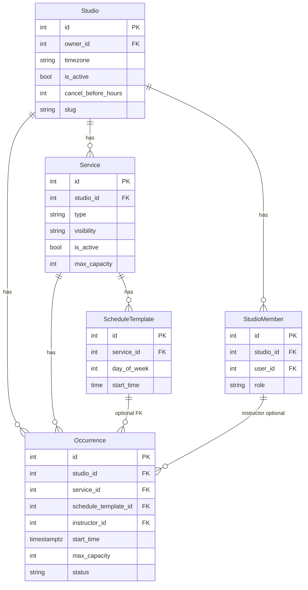
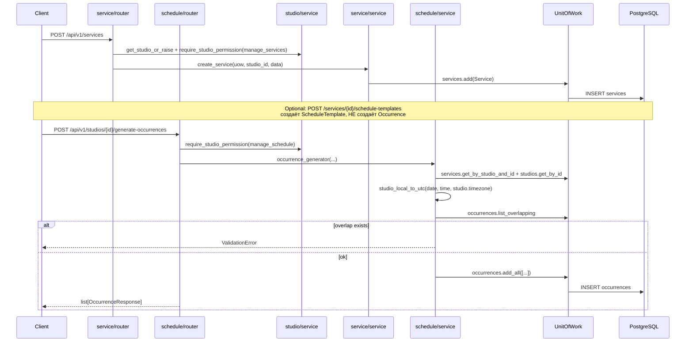

# 05 — Catalog (studio → service → schedule → occurrence → public)

## Цель

- Понять продуктовую иерархию каталога **до** бронирования: что студия продаёт и как появляются слоты (`Occurrence`).
- Различать пять субдоменов (`studio`, `service`, `schedule`, `occurrence`, `public`) и их published API.
- Читать lifecycle/visibility/status enums из моделей и migration `014`, не угадывая.
- Знать, какие `StudioPermission` закрывают write-операции, и где проходит граница public vs owner.
- Понять, почему `catalog` не импортирует `booking`/`payment`, и чем `studio/explore.py` отличается от модуля `search`.

## Предусловия

- `guides/00-inventory.md` — карта доменов, published interfaces, import-linter.
- `guides/02-persistence.md` — UoW, модели `Studio`/`Service`/`Occurrence`, ADR-001.
- Желательно `guides/03-contracts.md` — Pydantic schemas vs ORM (если уже есть).
- Auth/identity (`guides/04-auth-identity.md`) полезен для `get_current_user*`, но catalog RBAC живёт в `studio/service.py`.

**Не в этом гайде:** создание booking hold, checkout, Stripe — см. `guides/06-booking.md`, `guides/07-payment.md`.

## Карта файлов

| Путь | Роль |
|------|------|
| `backend/app/modules/catalog/__init__.py` | Корневой export: только 4 repository-класса для UoW |
| `backend/app/modules/catalog/studio/` | CRUD студии, RBAC, list/explore, `/studios/my` |
| `backend/app/modules/catalog/studio/explore.py` | `attach_services_to_studios` — карточки Explore внутри catalog |
| `backend/app/modules/catalog/service/` | CRUD услуги, visibility, availability HTTP |
| `backend/app/modules/catalog/service/availability.py` | Course capacity checks + calendar modal |
| `backend/app/modules/catalog/service/availability_stats.py` | Internal stats/helpers для availability |
| `backend/app/modules/catalog/schedule/` | CRUD `ScheduleTemplate` + `occurrence_generator` |
| `backend/app/modules/catalog/occurrence/` | CRUD конкретных сессий, instructor, soft-cancel |
| `backend/app/modules/catalog/public/` | Анонимная витрина по `slug` |
| `backend/app/modules/catalog/capacity.py` | Pure capacity/overbooking math (shared) |
| `backend/app/models/studio.py` | ORM `Studio` (`timezone`, `is_active`, `cancel_before_hours`, …) |
| `backend/app/models/service.py` | ORM `Service` + `ServiceVisibility` / `ServiceType` / `ServiceCategory` |
| `backend/app/models/schedule_template.py` | ORM `ScheduleTemplate` |
| `backend/app/models/occurrence.py` | ORM `Occurrence` + `OccurrenceStatus` |
| `backend/app/models/studio_member.py` | ORM `StudioMember` + `StudioMemberRole` |
| `backend/alembic/versions/009_studio_media_urls.py` | `studios.logo_url`, `cover_url` |
| `backend/alembic/versions/010_rbac_studio_members.py` | таблица `studio_members` |
| `backend/alembic/versions/011_instructors_attendance.py` | `occurrences.instructor_id` |
| `backend/alembic/versions/014_catalog_product_lifecycle.py` | `visibility`, cancel fields, status rename |
| `backend/app/core/datetime_utils.py` | `studio_local_to_utc`, `ensure_utc`, … |
| `backend/docs/adr/001-datetime-and-studio-timezone.md` | Политика TZ |
| `docs/adr/003-modular-monolith.md` | Границы доменов; course order вынесен из catalog |
| `docs/ARCHITECTURE.md` | Allowed edges: catalog ↛ booking/payment/auth |
| `backend/pyproject.toml` → contract `catalog does not depend on booking/payment/auth` | Машинный запрет импортов |
| `backend/tests/unit/catalog/` | capacity + service helpers |
| `backend/tests/integration/api/test_catalog_product_lifecycle.py` | visibility / cancel / template ≠ mutate occurrences |
| `backend/tests/integration/api/test_studio_rbac.py` | owner/manager/instructor matrix |
| `backend/app/api/router.py` | Подключение всех catalog routers под `/api/v1` |

### Пять субдоменов

| Папка | Ответственность |
|-------|-----------------|
| `studio/` | Студия как бизнес-единица; membership/RBAC; list + Explore-фильтры |
| `service/` | Продукт (single/course); lifecycle `visibility`; availability API |
| `schedule/` | Правила `ScheduleTemplate` + bulk `occurrence_generator` |
| `occurrence/` | Конкретный bookable instant в UTC |
| `public/` | Анонимный storefront aggregate по slug |

## Слои и зависимости

```text
router (catalog/*/router.py)
  → service functions (catalog/*/service.py, availability.py, …)
    → uow.<repos> (studios, services, schedule_templates, occurrences, studio_members, …)
      → models (central ORM)
```

- HTTP-агрегатор: `backend/app/api/router.py` → `api_v1` prefix `/api/v1`.
- Layer rule внутри модуля: router → service → repository (`docs/ARCHITECTURE.md`).
- **import-linter** (`backend/pyproject.toml`): `app.modules.catalog` **запрещено** импортировать `app.modules.booking`, `app.modules.payment`, `app.modules.auth`.
- **ARCHITECTURE** edge: `catalog` → `identity`, `core`, `models` (not booking/payment/auth).
- **Нюанс UoW:** catalog **может читать** counts через `uow.bookings.*` (flat data access), но **не** импортирует пакет `app.modules.booking`.
- **Нюанс explore:** `studio/explore.py` импортирует DTO из `app.modules.search` (`SearchResult`). Обратный импорт search→catalog запрещён контрактом `search is read-only leaf`. В таблице ARCHITECTURE catalog→search не перечислен — в коде зависимость на search **schemas** есть; отдельного forbidden-контракта catalog↛search нет.

### Published interfaces (`__all__`)

| Пакет | Экспорт |
|-------|---------|
| `catalog` | `OccurrenceRepository`, `ScheduleTemplateRepository`, `ServiceRepository`, `StudioRepository` |
| `catalog.studio` | repos + schemas + `create_studio`, `update_studio`, `delete_studio`, `get_*`, `require_studio_permission`, `has_studio_permission`, `ensure_studio_owner`, … (lazy `__getattr__`) |
| `catalog.service` | schemas/DTOs + CRUD + `check_course_availability*`, `get_service_availability` |
| `catalog.schedule` | schemas + template CRUD + `occurrence_generator` |
| `catalog.occurrence` | schemas + CRUD + `get_my_instructor_occurrences` (+ count в `service.py`, не в `__all__`) |
| `catalog.public` | `get_studio_public` + Public schemas/DTOs |

## Иерархия и lifecycle

```text
Studio
  ├── StudioMember (role: owner | manager | instructor)
  └── Service (visibility: draft | published | archived)
        ├── ScheduleTemplate  (optional metadata; не генерирует slots сам)
        └── Occurrence        (status: scheduled | cancelled | completed)
```

### Как появляются сущности (реальный код)

| Шаг | Функция | Путь |
|-----|---------|------|
| Studio | `create_studio` | `studio/service.py` → `uow.studios.add` + `StudioMember(OWNER)` |
| Service | `create_service` | `service/service.py` → `uow.services.add` |
| ScheduleTemplate | `create_schedule_template` | `schedule/service.py` → `uow.schedule_templates.add` |
| Bulk slots | `occurrence_generator` | `schedule/service.py` → `studio_local_to_utc` + `add_all` |
| Manual slot | `create_occurrence` | `occurrence/service.py` → `ensure_utc` + `add` |

**Важно:** `occurrence_generator` **не** читает `ScheduleTemplate` и **не** выставляет `Occurrence.schedule_template_id`. Template CRUD и bulk generate — **параллельные** пути. Docstring модели (`occurrence.py`: «Generated from ScheduleTemplate…») описывает намерение; текущий bulk path — параметрический (`days`, `start_time`, `weeks_count`).

### Enums / статусы (точные значения)

**`ServiceVisibility`** (`models/service.py`): `DRAFT="draft"`, `PUBLISHED="published"`, `ARCHIVED="archived"`.

- `Service.is_publicly_visible()` → `is_active and visibility == published`
- `Service.is_bookable()` → то же, что publicly visible
- `deactivate_service` → `is_active=False` + `visibility=ARCHIVED`
- Комментарий модели: `is_active` — legacy flag; source of truth lifecycle — `visibility`

**`ServiceType`:** `SINGLE="single"`, `COURSE="course"`.

**`ServiceCategory`:** `yoga`, `boxing`, `dance`, `hiit`, `pilates`, `martial_arts`, `strength`.

**`OccurrenceStatus`:** `SCHEDULED="scheduled"`, `CANCELLED="cancelled"`, `COMPLETED="completed"`.

- `Occurrence.is_bookable()` → `status == scheduled`
- Migration `014`: legacy `active` → `scheduled`

**`StudioMemberRole`:** `OWNER="owner"`, `MANAGER="manager"`, `INSTRUCTOR="instructor"`.

**Studio:** отдельного visibility enum нет — флаг `Studio.is_active`; плюс `cancel_before_hours` (default 24, migration 014).

### ER / class diagram



## Walkthrough функций

Ниже — **публичные** (не `_`) функции из `*/service.py` и published availability. Private helpers (`_iterate_weeks`, `_validate_instructor_assignment`, …) опущены.

### Studio — `backend/app/modules/catalog/studio/service.py`

#### `get_studio` / `get_studio_or_raise`
- **Зачем:** lookup студии.
- **Вход:** `uow`, `studio_id`.
- **Шаги:** `uow.studios.get_by_id`; `_or_raise` → `NotFoundError("Studio not found")`.
- **Выход:** `Studio | None` / `Studio`.
- **Кто вызывает:** почти все studio-scoped routers.

#### `get_studios` / `get_studios_count`
- **Зачем:** пагинированный list + Explore-фильтры (`city`, `category`, `query`, `amenities`, …).
- **Вход:** skip/limit + фильтры.
- **Шаги:** делегирует в `uow.studios.list_` / `count`.
- **Кто вызывает:** `list_studios` (`studio/router.py`).

#### `get_my_studios`
- **Зачем:** memberships текущего пользователя.
- **Выход:** `list[StudioMember]`.
- **Кто вызывает:** `GET /studios/my`.

#### `get_current_user_studio_roles`
- **Зачем:** studio-scoped roles для nav/client hints.
- **Выход:** `list[StudioRoleResponse]`.
- **Кто вызывает:** auth `/me` (вне catalog routers; published export).

#### `has_studio_permission` / `require_studio_permission`
- **Зачем:** studio-scoped RBAC.
- **Вход:** `studio`, `user`, `permission: StudioPermission`.
- **Шаги:** роль из `studio_members` (fallback `studio.owner_id` → owner); матрица `STUDIO_PERMISSIONS_BY_ROLE`; optional admin bypass.
- **Ошибки:** `require_*` → `ForbiddenError("Access denied for this studio")`.
- **Кто вызывает:** все write/dashboard gates в catalog routers; `get_public_or_authorized_service_or_raise`.

#### `ensure_studio_owner`
- **Зачем:** legacy check `studio.owner_id == user_id`.
- **Ошибки:** `ForbiddenError`.
- **Кто вызывает:** **нет callers** в текущем коде (экспорт сохранён для совместимости).

#### `ensure_studio_slug_available`
- **Зачем:** уникальность slug.
- **Ошибки:** `ConflictError("Studio slug is already in use")`.
- **Кто вызывает:** `create_studio`, `update_studio` (не в `__all__`).

#### `create_studio`
- **Зачем:** создать студию + OWNER membership; promote `UserRole.USER` → `STUDIO_OWNER`.
- **Вход:** `StudioCreate` (`owner_id` обязателен из токена).
- **Ошибки:** `ValidationError` (нет owner), `ConflictError` (slug).
- **Кто вызывает:** `POST /studios`.

#### `update_studio`
- **Зачем:** partial update.
- **Шаги:** если меняется `timezone` и есть occurrences → `ValidationError("Cannot change timezone after occurrences have been created")`.
- **Кто вызывает:** `PATCH /studios/{id}` (`manage_studio`).

#### `delete_studio`
- **Зачем:** hard delete студии.
- **Кто вызывает:** `DELETE /studios/{id}` (`manage_studio`).

### Service — `backend/app/modules/catalog/service/service.py`

#### `create_service`
- **Зачем:** создать продукт студии.
- **Вход:** `studio_id`, `data: dict`.
- **Шаги:** `Service(...)` → `uow.services.add` + log `service_created`.
- **Кто вызывает:** `POST /services` (`manage_services`).

#### `get_service` / `get_service_or_raise`
- **Зачем:** lookup.
- **Ошибки:** `NotFoundError("Service not found")`.

#### `get_public_or_authorized_service_or_raise`
- **Зачем:** публично только published; менеджер с `manage_services` видит draft/archived.
- **Шаги:** если не `is_publicly_visible()` и нет permission → `NotFoundError` (скрытие, не 403).
- **Кто вызывает:** `GET /services/{id}`, availability, list templates.

#### `get_services_for_studio` / `get_services_for_studio_count`
- **Зачем:** dashboard list.
- **Кто вызывает:** `GET /studios/{id}/services` (`manage_services`).

#### `update_service`
- **Зачем:** partial update, включая `visibility`.
- **Кто вызывает:** `PATCH /services/{id}`.

#### `deactivate_service`
- **Зачем:** soft archive (`is_active=False`, `visibility=ARCHIVED`).
- **Кто вызывает:** `DELETE /services/{id}`.

### Availability — `service/availability.py` (+ stats/capacity)

#### `check_course_availability`
- **Зачем:** course capacity без row lock.
- **Ошибки:** not found / not course / not bookable.
- **Кто вызывает:** published export; HTTP-эндпоинта нет. Consumer с lock — booking order (см. A6; здесь только сторона catalog API).

#### `check_course_availability_for_update`
- **Зачем:** то же + `FOR UPDATE` через `get_course_occurrences_with_capacity_for_update`.
- **Кто вызывает:** booking order (через published catalog export), не catalog router.

#### `get_service_availability`
- **Зачем:** календарь occupancy для modal.
- **Выход:** `ServiceAvailabilityDTO` (can_book, warning, schedule_details).
- **Кто вызывает:** `GET /services/{id}/availability`.

**Внутренние helpers:** `availability_stats.py` (`get_course_occurrences_with_capacity*`, `evaluate_course_availability`, …) читают occurrences + `uow.bookings.get_confirmed_pending_counts_by_occurrence_ids`.  
**Pure math:** `catalog/capacity.py` — `classify_occurrence_capacity`, `build_public_course_availability`, status strings `"HARD_LIMIT_REACHED"` / `"SOFT_LIMIT_REACHED"` из `Service.get_capacity_status`.

### Schedule — `backend/app/modules/catalog/schedule/service.py`

#### `create_schedule_template` / `get_schedule_templates_for_service` / `get_schedule_template` / `get_schedule_template_or_raise` / `update_schedule_template` / `delete_schedule_template`
- **Зачем:** CRUD метаданных шаблона.
- **Важно:** `update_schedule_template` **не** мутирует уже созданные occurrences (зафиксировано docstring + `test_catalog_product_lifecycle.py`).
- **Кто вызывает:** routes под `/services/.../schedule-templates` (`manage_schedule` на write).

#### `occurrence_generator`
- **Зачем:** bulk создание course sessions.
- **Вход:** `studio_id`, `service_id`, `days: list[int]` (0–6), `start_time`, `weeks_count`, optional `start_date`.
- **Шаги:**
  1. Валидация weeks/days.
  2. Load service+studio.
  3. `start_date or studio_local_date_now(studio.timezone)`.
  4. Нормализация к Monday; для каждой даты → `studio_local_to_utc` + duration.
  5. `list_overlapping` → при конфликте `ValidationError`.
  6. Создать `Occurrence` с capacity/price **скопированными** с Service; `add_all`.
- **Ошибки:** `ValidationError`, `NotFoundError`.
- **Кто вызывает:** `POST /studios/{id}/generate-occurrences`.

### Occurrence — `backend/app/modules/catalog/occurrence/service.py`

#### `get_occurrence` / `get_occurrence_or_raise` / `get_occurrences` / `get_occurrences_count`
- **Зачем:** read/list с фильтрами.
- **Кто вызывает:** list/get endpoints (`view_dashboard` на dashboard lists).

#### `get_my_instructor_occurrences` / `get_my_instructor_occurrences_count`
- **Зачем:** сессии, где user — instructor member.
- **Кто вызывает:** `GET /occurrences/mine` (auth; count — companion для pagination).

#### `create_occurrence`
- **Зачем:** ручной слот.
- **Шаги:** validate times; studio/service belong together; instructor must be `StudioMemberRole.INSTRUCTOR` той же студии; `ensure_utc` на instants.
- **Кто вызывает:** `POST /occurrences` (`manage_schedule`).

#### `update_occurrence`
- **Зачем:** partial update status/times/instructor/cancel fields.
- **Шаги:** validate status ∈ {scheduled, cancelled, completed}; при cancel — `cancelled_at`; при return to scheduled — clear cancel fields.
- **Кто вызывает:** `PATCH /occurrences/{id}`.

#### `delete_occurrence`
- **Зачем:** удалить или soft-cancel.
- **Шаги:** если `uow.bookings.count_by_occurrence > 0` → status `cancelled` + reason; иначе hard `delete`.
- **Кто вызывает:** `DELETE /occurrences/{id}`.

### Public — `backend/app/modules/catalog/public/service.py`

#### `get_studio_public`
- **Зачем:** анонимный aggregate по slug.
- **Шаги:** `get_by_slug_with_services_occurrences` → фильтр `is_publicly_visible` → upcoming bookable occurrences → capacity map через `uow.bookings…` → для `COURSE` — `build_public_course_availability`.
- **Ошибки:** `NotFoundError("Studio not found")`.
- **Кто вызывает:** `GET /studios/slug/{slug}/public` → `map_studio_public`.

### Explore helper — `studio/explore.py`

#### `attach_services_to_studios`
- **Зачем:** к уже отфильтрованному list studios подтянуть active services в shape `SearchResult`.
- **Кто вызывает:** `GET /studios?include_services=true`.
- **Граница vs `search`:** Explore — удобный list внутри catalog; модуль `search` — отдельный leaf (`GET /api/v1/search`, geo/radius, свой repository). Не путать.

## Таблица routers

Полный путь = `/api/v1` + prefix + path. Роутеры подключены в `api/router.py`.

| Router file | Prefix | Method + path | Auth / permission | Service function |
|-------------|--------|---------------|-------------------|------------------|
| `public/router.py` | `/studios` | `GET /slug/{slug}/public` | none | `get_studio_public` |
| `studio/router.py` | `/studios` | `GET ""` | optional user; explore filters | `get_studios` (+ `attach_services_to_studios`) |
| `studio/router.py` | `/studios` | `GET /my` | required | `get_my_studios` |
| `studio/router.py` | `/studios` | `GET /{studio_id}` | none (uow) | `get_studio_or_raise` |
| `studio/router.py` | `/studios` | `POST ""` | required | `create_studio` |
| `studio/router.py` | `/studios` | `PATCH /{studio_id}` | `manage_studio` | `update_studio` |
| `studio/router.py` | `/studios` | `DELETE /{studio_id}` | `manage_studio` | `delete_studio` |
| `studio/router.py` | `/studios` | `GET /{studio_id}/services` | `manage_services` | `get_services_for_studio(+count)` |
| `service/router.py` | `/services` | `POST ""` | `manage_services` | `create_service` |
| `service/router.py` | `/services` | `GET /{service_id}` | optional; public-or-auth | `get_public_or_authorized_service_or_raise` |
| `service/router.py` | `/services` | `GET /{id}/availability` | optional; public-or-auth | + `get_service_availability` |
| `service/router.py` | `/services` | `PATCH /{service_id}` | `manage_services` | `update_service` |
| `service/router.py` | `/services` | `DELETE /{service_id}` | `manage_services` | `deactivate_service` |
| `service/router.py` | `/services` | `GET /{id}/schedule-templates` | optional; public-or-auth | `get_schedule_templates_for_service` |
| `service/router.py` | `/services` | `POST /{id}/schedule-templates` | `manage_schedule` | `create_schedule_template` |
| `service/router.py` | `/services` | `PATCH /schedule-templates/{id}` | `manage_schedule` | `update_schedule_template` |
| `service/router.py` | `/services` | `DELETE /schedule-templates/{id}` | `manage_schedule` | `delete_schedule_template` |
| `schedule/router.py` | `/studios` | `POST /{id}/generate-occurrences` | `manage_schedule` | `occurrence_generator` |
| `occurrence/router.py` | `/occurrences` | `GET ""` | `view_dashboard` | `get_occurrences(+count)` |
| `occurrence/router.py` | `/occurrences` | `GET /mine` | required (instructor self) | `get_my_instructor_occurrences` |
| `occurrence/router.py` | `/occurrences` | `GET /{id}` | none (uow) | `get_occurrence_or_raise` |
| `occurrence/router.py` | `/occurrences` | `POST ""` | `manage_schedule` | `create_occurrence` |
| `occurrence/router.py` | `/occurrences` | `PATCH /{id}` | `manage_schedule` | `update_occurrence` |
| `occurrence/router.py` | `/occurrences` | `DELETE /{id}` | `manage_schedule` | `delete_occurrence` |
| `occurrence/router.py` (`studio_occurrence_router`) | `/studios` | `GET /{id}/occurrences` | `view_dashboard` | `get_occurrences(+count)` |

### RBAC matrix (write-relevant)

`StudioPermission` + `STUDIO_PERMISSIONS_BY_ROLE` в `studio/service.py`:

| Permission | owner | manager | instructor | Catalog write usage |
|------------|-------|---------|------------|---------------------|
| `manage_studio` | ✓ | — | — | PATCH/DELETE studio |
| `manage_services` | ✓ | ✓ | — | service CRUD, nested list |
| `manage_schedule` | ✓ | ✓ | — | templates, generate, occurrence write |
| `view_dashboard` | ✓ | ✓ | ✓ | occurrence lists |
| `manage_members` | ✓ | — | — | (не catalog routers в этом срезе) |

Тесты: `test_studio_rbac.py` — manager создаёт service/occurrence; 403 на rename studio; instructor 403 на create occurrence.

## Сквозной флоу

Owner создаёт service и генерирует occurrences (по реальному коду):



Альтернатива bulk: `POST /api/v1/occurrences` → `create_occurrence` (явные UTC instants, `manage_schedule`).

## Почему так (решения)

1. **Catalog не импортирует booking/payment** — `docs/ARCHITECTURE.md` Allowed edges: `catalog | identity, core, models (not booking, payment, auth)`. Контракт import-linter с тем же смыслом. ADR-003: course order **перенесён** из catalog в `modules/booking/order/`, чтобы catalog оставался продуктовым слоем без checkout-оркестрации.
2. **Timezone студии immutable после occurrences** — ADR-001 + `update_studio`: иначе wall-clock шаблонов и UTC instants разъедутся.
3. **Visibility vs legacy `is_active`** — migration `014` + комментарий модели: product lifecycle = `visibility`; deactivate пишет оба поля.
4. **Template edit ≠ mutate occurrences** — явный docstring на `update_schedule_template` / PATCH endpoint; тест lifecycle.
5. **Soft-cancel при delete с bookings** — `delete_occurrence` сохраняет историю, не ломая FK на bookings (через UoW count, без импорта booking-модуля).
6. **Draft скрывается как 404** — `get_public_or_authorized_service_or_raise`: не раскрывать существование draft анониму.

## Как читать самому

1. Открой `api/router.py` — какие catalog routers висят на `/api/v1`.
2. Выбери субдомен: `studio/router.py` → соответствующий `service.py` → `repository.py`.
3. Для иерархии: модели `studio.py` → `service.py` → `schedule_template.py` → `occurrence.py` → `studio_member.py`.
4. Для lifecycle: `ServiceVisibility` / `OccurrenceStatus` + `014_catalog_product_lifecycle.py` + `test_catalog_product_lifecycle.py`.
5. Для RBAC: `STUDIO_PERMISSIONS_BY_ROLE` + `test_studio_rbac.py`.
6. Для слотов: сравни `create_occurrence` и `occurrence_generator` (UTC vs studio-local).
7. Для витрины: `public/service.py` → `is_publicly_visible` / `is_bookable`.
8. Границы: `ARCHITECTURE.md` + `pyproject.toml` contract name `catalog does not depend on booking/payment/auth`.

## What to watch out for

- **Timezone студии:** generate использует `studio_local_to_utc` / `studio_local_date_now`; manual create — `ensure_utc`. Смена TZ после появления occurrences запрещена.
- **Capacity на Occurrence:** при generate копируется `service.max_capacity` на occurrence; дальше живёт **отдельно** (правка service не пересчитывает старые slots автоматически).
- **Soft lifecycle:** `visibility` (service) + `OccurrenceStatus` + soft-cancel при delete с bookings; не путать с hard delete studio.
- **ScheduleTemplate ≠ генератор:** FK `schedule_template_id` есть, но current generate path его не заполняет.
- **Explore ≠ Search:** `GET /studios?include_services=true` vs `GET /search`.
- **UoW bookings ≠ import booking:** counts через `uow.bookings` разрешены; `from app.modules.booking…` — нет.
- Не уходить в payment/booking create в этом срезе.

## Checkpoint questions

1. Какая цепочка сущностей от студии до bookable слота, и какая функция создаёт bulk occurrences?
2. Чем `ServiceVisibility.DRAFT` отличается от `PUBLISHED` для анонимного `GET /services/{id}` (какой HTTP-смысл ошибки)?
3. Какие три permission-строки закрывают write для studio / service / schedule+occurrence?
4. Почему `PATCH` schedule template не меняет уже сгенерированные occurrences?
5. Чем `studio/explore.attach_services_to_studios` отличается от модуля `app.modules.search`?
6. Почему catalog может вызывать `uow.bookings.count_by_occurrence`, но не должен импортировать `app.modules.booking`?
7. Что произойдёт при `DELETE /occurrences/{id}`, если на occurrence уже есть bookings?

## Open questions

- UNKNOWN: есть ли (планируется ли) путь, который генерирует occurrences **из** строк `ScheduleTemplate` и заполняет `schedule_template_id` — в текущем whitelist-коде такого path нет.
- UNKNOWN: должен ли ARCHITECTURE явно разрешить `catalog → search` (schemas/DTO), раз `explore.py` уже импортирует `SearchResult`.
- `ensure_studio_owner` — published legacy без callers; UNKNOWN, когда будет удалён.
- нет других блокирующих UNKNOWN для чтения catalog до booking.

<details>
<summary>Ключи для Orchestrator (не для ученика в первом проходе)</summary>

1. `Studio → Service → (optional ScheduleTemplate) → Occurrence`; bulk = `occurrence_generator` в `schedule/service.py`.
2. Draft/archived без `manage_services` → `NotFoundError` («Service not found»), не 403.
3. `manage_studio`, `manage_services`, `manage_schedule`.
4. Docstring/endpoint: metadata only; owners правят occurrences явно; тест lifecycle.
5. Explore — post-process list studios внутри catalog; search — отдельный leaf router/repo с geo и т.д.
6. Flat UoW data access разрешён; package import запрещён ARCHITECTURE + import-linter.
7. Soft-cancel: `status=cancelled`, `cancelled_at`, default `cancellation_reason`; hard delete только если bookings_count == 0.

</details>
