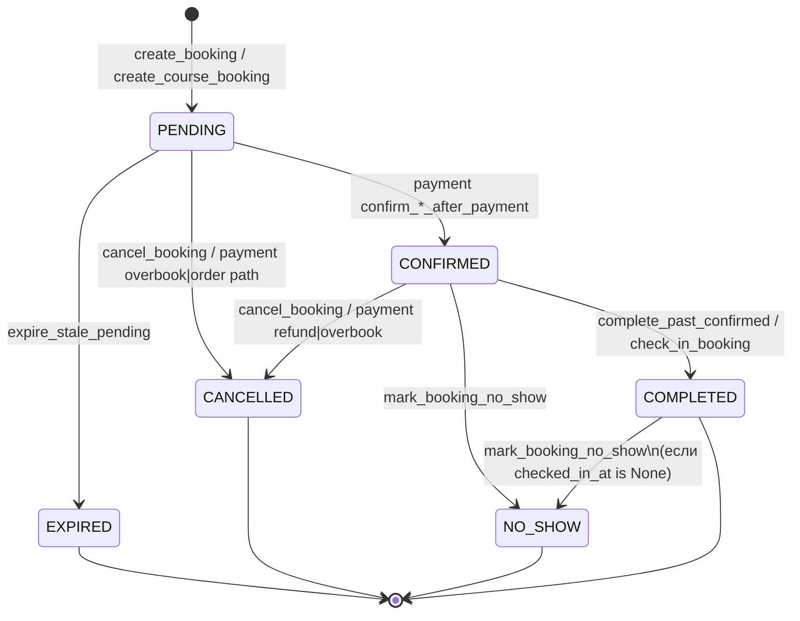
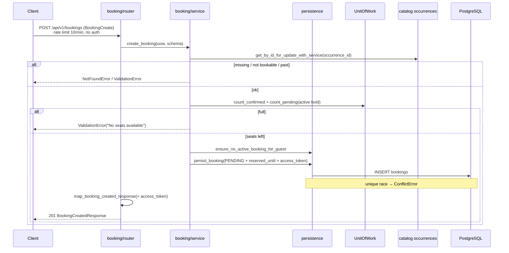
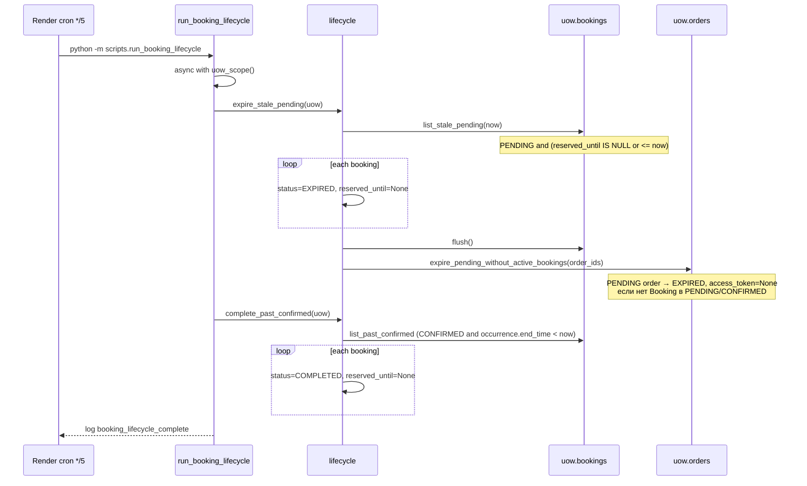

# 06 — Booking + Order + Lifecycle

## Цель

- Понять **ядро продукта**: hold на seat (`Booking`), родительский `Order` для course, capacity, uniqueness, cancel/attendance, cron lifecycle.
- Прочитать каждый публичный символ в `booking/service.py`, `lifecycle.py`, `policies.py`, `order/service.py` и ключевых helpers потока create/list.
- Различать, где seat защищён **кодом** (counts + FOR UPDATE), а где — **DB partial unique indexes**.
- Знать границу с payment: какие поля/статусы отдаёт booking/order наружу, **без** разбора Stripe webhook.

## Предусловия

- `guides/00-inventory.md` — домены, published interfaces, import-linter.
- `guides/02-persistence.md` — UoW, модели, ADR-001 (datetime).
- `guides/05-catalog.md` — `Occurrence` / `Service.is_bookable()` / course availability; booking вызывает catalog **только** через published API (`check_course_availability_for_update`, `get_occurrence_or_raise`, studio permissions).
- Auth (`guides/04-auth-identity.md`) полезен для OTP → `attach_guest_resources`.

**Не в этом гайде:** Stripe Checkout/webhook internals — см. `guides/07-payment.md`. Здесь только точки стыка (символы).

## Карта файлов

| Путь | Роль |
|------|------|
| `backend/app/modules/booking/__init__.py` | Published surface booking (+ lazy imports от cycle с UoW) |
| `backend/app/modules/booking/router.py` | HTTP `/bookings` + `occurrence_bookings_router` |
| `backend/app/modules/booking/service.py` | Create / cancel / check-in / no-show |
| `backend/app/modules/booking/lifecycle.py` | `expire_stale_pending`, `complete_past_confirmed` |
| `backend/app/modules/booking/policies.py` | `is_own_booking`, `can_access_booking` |
| `backend/app/modules/booking/persistence.py` | Duplicate guards + `persist_booking(s)` |
| `backend/app/modules/booking/queries.py` | Read paths, authz load, guest attach |
| `backend/app/modules/booking/mapping.py` | ORM → Self/Owner/Created schemas |
| `backend/app/modules/booking/schemas.py` | `BookingCreate`, response schemas |
| `backend/app/modules/booking/repository/` | Get / capacity / list mixins → `BookingRepository` |
| `backend/app/modules/booking/order/` | Course Order + N bookings; list orders |
| `backend/app/models/booking.py` | ORM + `BookingStatus` / `BookingType` + unique indexes |
| `backend/app/models/order.py` | ORM + `OrderStatus` |
| `backend/app/core/booking_holds.py` | Hold TTL (`BOOKING_HOLD_MINUTES`, default 15) |
| `backend/app/core/access_tokens.py` | `generate_resource_access_token` / verify |
| `backend/scripts/run_booking_lifecycle.py` | Cron entrypoint |
| `docs/ARCHITECTURE.md` → Background jobs | Schedule + идемпотентность |
| `render.yaml` | Cron `zeeframe-booking-lifecycle` `*/5 * * * *` |
| Migrations `002`, `003`, `006`, `008`, `015` | Uniqueness, access_token, guest_phone, checkout_session_id |
| `backend/tests/unit/booking/**` | Holds, lifecycle, lock order, schema serialization |
| Integration: `test_bookings_authz`, `test_attach_guest_bookings`, duplicates/overbooking/lifecycle script | Capacity, authz, attach, cron wiring |

## Слои и зависимости

```text
router (booking/router.py, order/router.py)
  → service / queries / lifecycle / order.service
    → persistence + uow.bookings / uow.orders / uow.occurrences (catalog repos)
      → models (Booking, Order)
```

- HTTP-агрегатор: `backend/app/api/router.py` → prefix `/api/v1`.
- **ARCHITECTURE:** booking → catalog, identity, core, models; payment импортирует `is_own_booking` и читает/меняет Booking/Order.
- **import-linter:** catalog ↛ booking; booking **не** импортирует payment.
- Lazy `__getattr__` в `booking/__init__.py`: WHY — eager import service тянет UoW → cycle с `BookingRepository`.

### Published interfaces (`__all__`)

| Пакет | Экспорт (ключевое) |
|-------|-------------------|
| `booking` | schemas + `BookingRepository` + policies + `create_booking` / `cancel_booking` / `check_in_booking` / `mark_booking_no_show` + lifecycle + queries/mapping + `DUPLICATE_BOOKING_MESSAGE` |
| `booking.order` | schemas/DTO + `OrderRepository` + `create_course_booking` / `get_my_orders` / `get_owner_orders` |

## Enums и статусы

### `BookingStatus` (`models/booking.py`)

| Символ | Значение |
|--------|----------|
| `PENDING` | `"pending"` |
| `CONFIRMED` | `"confirmed"` |
| `CANCELLED` | `"cancelled"` |
| `EXPIRED` | `"expired"` |
| `COMPLETED` | `"completed"` |
| `NO_SHOW` | `"no_show"` |
| `ACTIVE_STATUSES` | `frozenset({PENDING, CONFIRMED})` |

**Почему ACTIVE:** только pending/confirmed блокируют duplicate per occurrence+guest (комментарий модели + partial unique indexes).

### `BookingType`

| Символ | Значение |
|--------|----------|
| `SINGLE` | `"single"` |
| `COURSE` | `"course"` |

### `OrderStatus` (`models/order.py`)

| Символ | Значение |
|--------|----------|
| `PENDING` | `"pending"` |
| `PAID` | `"paid"` |
| `CANCELLED` | `"cancelled"` |
| `EXPIRED` | `"expired"` |
| `REFUNDED` | `"refunded"` |
| `MANUAL_REVIEW` | `"manual_review"` |

**Факт:** в `backend/app` assignment `OrderStatus.CANCELLED` **не найден** (константа есть; payment проверяет статус). Переходы PAID / EXPIRED / REFUNDED / MANUAL_REVIEW — у payment или lifecycle/order repo (см. ниже).

### Кто меняет BookingStatus (подтверждено кодом)

| Переход | Где |
|---------|-----|
| → `PENDING` | `create_booking`, `create_course_booking` |
| `PENDING` → `CONFIRMED` | payment: `confirm_booking_after_payment`, `confirm_order_after_payment` |
| `PENDING`/`CONFIRMED` → `CANCELLED` | `cancel_booking`; payment: `handle_overbooked_payment`, части `confirm_order_after_payment`, refunds |
| `PENDING` → `EXPIRED` | `expire_stale_pending` |
| `CONFIRMED` → `COMPLETED` | `complete_past_confirmed`; `check_in_booking` |
| `CONFIRMED` (и др. кроме pending/cancelled/expired) → `NO_SHOW` | `mark_booking_no_show` |
| lifecycle-`COMPLETED` → `NO_SHOW` | возможно, если нет `checked_in_at` (attendance helpers не блокируют `COMPLETED`) |

## State diagram (только кодовые переходы)



**What to watch out for:** не рисуй стрелки «из воздуха». `CONFIRMED` ставит **только payment**; booking-модуль сам подтверждение не делает.

## Capacity / uniqueness / locks

Три уровня защиты от double booking:

1. **Row lock на occurrence** — `uow.occurrences.get_by_id_for_update_with_service` (single) / `list_active_future_by_service_for_update` с `ORDER BY occurrences.id ASC` (course; anti-deadlock, см. unit `test_occurrence_repo_lock_order`).
2. **Capacity math в коде** — `count_confirmed_by_occurrence` + `count_pending_by_occurrence` (только **active hold**: `PENDING` + `reserved_until > now`) vs `occurrence.max_capacity`.
3. **DB partial unique** — `uq_bookings_occurrence_guest_email_active`, `uq_bookings_occurrence_user_id_active` WHERE `status IN ('pending','confirmed')`. Soft check: `ensure_no_active_booking_for_guest` → `ValidationError`; race → `persist_*` ловит `IntegrityError` → `ConflictError(DUPLICATE_BOOKING_MESSAGE)`.

**Hold TTL без cron для capacity:** `booking_holds.is_active_pending_hold` / SQL clause — истекший pending **не** занимает seat в counts ещё до того, как lifecycle переведёт статус в `EXPIRED`. Cron нужен, чтобы очистить статус/order token, не чтобы «освободить» capacity в query.

Migrations:

| Rev | Суть |
|-----|------|
| `002_booking_active_uniqueness` | Partial unique на active bookings (исторически `slot_id`) |
| `003_booking_expired_completed_indexes` | WHERE сужен до `pending`/`confirmed` — expired/completed не блокируют rebook |
| `006_booking_access_token` | `access_token` на bookings и orders |
| `008_order_guest_phone` | `orders.guest_phone` |
| `015_order_checkout_session_id` | `orders.checkout_session_id` + index |

(Имена `occurrence_*` после rename в `005_domain_vocabulary`.)

## Sequence: create pending booking (+ optional order)

### Single guest (`BookingCreate`)



`user_id` на create **не** ставится — после OTP auth вызывает `attach_guest_resources` (`queries.py`; caller: auth OTP complete).

### Course (`CourseBookingCreate` → Order + N bookings)

Тот же `POST /bookings`, ветка `isinstance(schema, CourseBookingCreate)`:

1. `create_course_booking` → catalog `check_course_availability_for_update`.
2. Lock future occurrences (`list_active_future_by_service_for_update`).
3. `Order(status=PENDING, access_token=generate_resource_access_token())`.
4. N× `Booking(PENDING, booking_type=COURSE, order_id, unit_price_cents, reserved_until)` — **без** per-booking `access_token`.
5. `persist_bookings` → `map_course_booking_result` → `CourseBookingResponse` с **order** `access_token`.

## Sequence: lifecycle expire



Идемпотентность: повторный прогон не трогает уже `EXPIRED`/`COMPLETED` (выборки по статусу). Local: `make booking-lifecycle` / `uv run python -m scripts.run_booking_lifecycle`. Prod: `docs/ARCHITECTURE.md` + `render.yaml` service `zeeframe-booking-lifecycle`, schedule `*/5 * * * *` UTC.

## Walkthrough публичных функций

### `booking/service.py`

| Функция | Зачем |
|---------|--------|
| `create_booking` | Guest single hold: lock occurrence, capacity, duplicate check, `PENDING` + `reserved_until` + `access_token` |
| `cancel_booking` | `PENDING`/`CONFIRMED` → `CANCELLED`; own user уважает `studio.cancel_before_hours` unless `manage_bookings` |
| `check_in_booking` | Staff/instructor attendance → `checked_in_at`, `COMPLETED` (идемпотентно) |
| `mark_booking_no_show` | → `NO_SHOW` + `no_show_at` (идемпотентно; конфликт с check-in) |

Приватные helpers (`_get_attendance_booking_or_raise`, `_ensure_can_manage_attendance`, `_ensure_attendance_action_allowed`) — RBAC owner/manager или instructor своего occurrence; блокируют pending/cancelled/expired для attendance.

### `booking/lifecycle.py`

| Функция | Зачем |
|---------|--------|
| `expire_stale_pending` | Массовый `PENDING`→`EXPIRED`; затем expire orphan pending orders |
| `complete_past_confirmed` | `CONFIRMED` с `Occurrence.end_time < now` → `COMPLETED` |

### `booking/policies.py`

| Функция | Зачем | Кто снаружи |
|---------|--------|-------------|
| `is_own_booking` | `user_id` или `guest_email` через `identity.policies.is_owned_by_user` | **payment** `assert_booking_checkout_access`; внутри booking: queries/service/mapping |
| `can_access_booking` | own **или** `studio_owner_id == user.id` | Published export; **вызовов из payment/auth в коде нет** (роуты используют `has_studio_permission("view_bookings")`) |

### `booking/order/service.py`

| Функция | Зачем |
|---------|--------|
| `create_course_booking` | Atomic Order(`PENDING`) + N course bookings |
| `get_my_orders` / `get_my_orders_count` | Customer list by `user_id` / guest email |
| `get_owner_orders` / `get_owner_orders_count` | Studio member list (router требует `studio_id` + `view_bookings`) |

Приватные: `_calculate_course_order_total_cents`, `_distribute_course_unit_prices` (пропорция `price_course_cents` для mid-term join).

### Persistence / queries (публичный поток)

| Символ | Роль |
|--------|------|
| `DUPLICATE_BOOKING_MESSAGE` | Единый текст 400/409 |
| `ensure_no_active_booking_for_guest` | Soft uniqueness |
| `persist_booking` / `persist_bookings` | Insert + map unique race → `ConflictError` |
| `get_booking_for_user_or_raise` | Own или `view_bookings`; иначе **404** (anti-enumeration) |
| `get_owner_bookings*` / `get_my_bookings*` / `get_bookings*` | List/count |
| `attach_guest_resources` (+ alias `attach_guest_bookings`) | OTP: bind bookings+orders by email |
| `map_booking_for_user` / `map_booking_created_response` | Response shaping; Created требует `access_token` |
| Repo capacity: `count_*`, `list_stale_pending`, `list_past_confirmed`, `attach_guest_bookings_by_email` | Data access |
| `OrderRepository.expire_pending_without_active_bookings` | Order `EXPIRED` + clear `access_token` |

### Core holds / tokens

| Символ | Роль |
|--------|------|
| `get_booking_reserved_until` | `now + BOOKING_HOLD_MINUTES` (default 15, config `ge=1,le=120`) |
| `is_active_pending_hold` | Capacity semantics; `reserved_until=NULL` = dead hold |
| `generate_resource_access_token` | `secrets.token_urlsafe(32)` → booking (single) или order (course) |

## HTTP routes

Префикс `/api/v1`.

### Bookings (`booking/router.py`)

| Method | Path | Auth | Handler → service |
|--------|------|------|-------------------|
| `POST` | `/bookings` | нет (+ `10/minute`) | `create_course_booking` **или** `create_booking` |
| `GET` | `/bookings` | required | `get_owner_bookings` |
| `GET` | `/bookings/my` | required | `get_my_bookings` (+ Occurrence/Studio embed) |
| `GET` | `/bookings/{booking_id}` | required | `get_booking_for_user_or_raise` |
| `PATCH` | `/bookings/{booking_id}/cancel` | required | `cancel_booking` |
| `PATCH` | `/bookings/{booking_id}/check-in` | required | `check_in_booking` |
| `PATCH` | `/bookings/{booking_id}/mark-no-show` | required | `mark_booking_no_show` |

### Occurrence bookings

| Method | Path | Auth | Handler |
|--------|------|------|---------|
| `GET` | `/occurrences/{occurrence_id}/bookings` | required + `view_bookings` | `get_bookings` |

### Orders (`order/router.py`)

| Method | Path | Auth | Handler |
|--------|------|------|---------|
| `GET` | `/orders/my` | required | `get_my_orders` |
| `GET` | `/orders` | required; **`studio_id` required** + `view_bookings` | `get_owner_orders` |

Отдельного `POST /orders` нет — course order создаётся через `POST /bookings`.

## Граница с payment («дальше A7»)

Booking/order **отдаёт** hold и identity; payment **подтверждает оплату и seats**. Без деталей Stripe:

**Payment читает (символы полей):**  
`Booking.status`, `reserved_until`, `access_token`, `checkout_session_id`, `payment_status`, `guest_email`, `occurrence_id` (+ occurrence/studio/price), `unit_price_cents`, `order_id`;  
`Order.status`, `access_token`, `checkout_session_id`, `total_amount_cents`, `currency`, `guest_email`, `application_fee_cents`, related bookings’ hold fields.

**Payment пишет (символы):**  
`Booking.checkout_session_id` (`create_checkout_session`);  
`Booking.status` / `payment_status` / `reserved_until` / `access_token` / `payment_intent_id` / `cancelled_at` (`confirm_booking_after_payment`, `confirm_order_after_payment`, `handle_overbooked_payment`, refunds);  
`Order.checkout_session_id` (`create_order_checkout_session`);  
`Order.payment_intent_id` (ledger);  
`Order.status` → `PAID` / `MANUAL_REVIEW` / `REFUNDED`; `Order.access_token = None` после confirm.

**Access gate:** `assert_booking_checkout_access` / `assert_order_checkout_access` — own (`is_own_booking` / `is_own_order`) **или** `verify_resource_access_token`; иначе 404.

**Checkout precondition (символы):** booking/order должен быть `PENDING` + active hold (`is_active_pending_hold` на bookings).

Client schemas booking **намеренно не отдают** `payment_intent_id` / `checkout_session_id` (кроме create `access_token`) — см. unit schema serialization.

## Почему так (решения)

1. **Hold + TTL** — seat резервируется без оплаты; capacity queries фильтруют по `reserved_until`, cron подчищает статусы/order token.
2. **Partial unique на ACTIVE** — expired/cancelled/completed не мешают повторной брони (migration `003`).
3. **Course Order в booking, не catalog** — ADR-003 / ARCHITECTURE: catalog остаётся продуктовым слоем.
4. **Guest token** — IDOR-защита checkout без обязательного login; single token на booking, course — на order.
5. **404 вместо 403** на чужой booking — не раскрывать существование (`get_booking_for_user_or_raise`, payment access).
6. **FOR UPDATE + ordered locks** — capacity races / deadlock prevention (tests).

## Как читать самому

1. `booking/__init__.py` → список published символов.
2. `models/booking.py` + `order.py` — enums и indexes.
3. `router.py` POST → `create_booking` / `create_course_booking` → `persistence` + `booking_holds`.
4. `repository/capacity_queries.py` — что считается «занятым» seat.
5. `lifecycle.py` + `scripts/run_booking_lifecycle.py` + `ARCHITECTURE.md` Background jobs.
6. `policies.py` → кто импортирует (`payment/access.py`).
7. Тесты: `tests/unit/booking/`, `test_bookings_authz.py`, `test_attach_guest_bookings.py`, duplicate/overbooking/lifecycle script.

## What to watch out for

- **Double booking:** soft check ≠ достаточно; unique index + ConflictError на race; capacity отдельно от uniqueness.
- **Hold TTL:** default 15 мин (`BOOKING_HOLD_MINUTES`); истёкший pending не в `count_pending_by_occurrence`, но статус может ещё быть `PENDING` до cron.
- **Guest PII:** `guest_email` / `guest_name` / `guest_phone` на booking и order; attach по email после OTP; не логировать PII (observability rules).
- **Transaction boundaries:** create/lifecycle внутри одного UoW/`uow_scope`; course = Order + N bookings atomically.
- **Access token location:** single → `Booking.access_token`; course → `Order.access_token` (bookings course без token на create).
- **Cancel cutoff:** только для own booking без `manage_bookings`; staff path другой.
- **Не путать** `BookingStatus.COMPLETED` (lifecycle/check-in) с `OrderStatus.PAID` (payment).

## Checkpoint questions

1. Какие три механизма вместе защищают от double booking одного guest на один occurrence?
2. Чем `count_pending_by_occurrence` отличается от «все строки со status=pending»?
3. Что делает `expire_stale_pending` с Order, и какое условие в `expire_pending_without_active_bookings`?
4. Кто (какой модуль/функция) переводит Booking в `CONFIRMED` — есть ли такой код в `modules/booking`?
5. Где лежит `access_token` после `POST /bookings` для single vs course, и зачем?
6. Почему `GET /bookings/{id}` на чужую бронь отдаёт 404, а не 403?
7. Какой schedule у production cron lifecycle, и какой script entrypoint?

## Open questions

- UNKNOWN: планируется ли assignment `OrderStatus.CANCELLED` в app-коде (константа есть, write path не найден).
- `BookingCreateAuthenticated` в schemas есть; HTTP create path сейчас guest-only через `BookingCreate` / `CourseBookingCreate` — отдельный authenticated create router не подключён.
- `can_access_booking` published, но live callers вне booking package не найдены (owner checks идут через studio permission).

<details>
<summary>Ключи для Orchestrator (не для ученика в первом проходе)</summary>

1. Soft `ensure_no_active_*` + DB partial unique + occurrence FOR UPDATE (+ capacity counts).
2. Только active hold: `PENDING` и `reserved_until > now` (NULL = не занимает).
3. Order → `EXPIRED`, `access_token=None`, если order ещё `PENDING` и нет booking в `PENDING`/`CONFIRMED`.
4. Только payment `confirm_*_after_payment` — в booking модуля перевода в CONFIRMED нет.
5. Single: `Booking.access_token`; course: `Order.access_token` — guest checkout без login.
6. Anti-enumeration в `get_booking_for_user_or_raise`.
7. `*/5 * * * *` UTC, `python -m scripts.run_booking_lifecycle` / Render `zeeframe-booking-lifecycle`.

</details>
