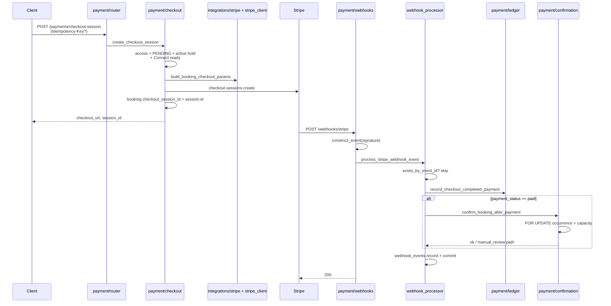
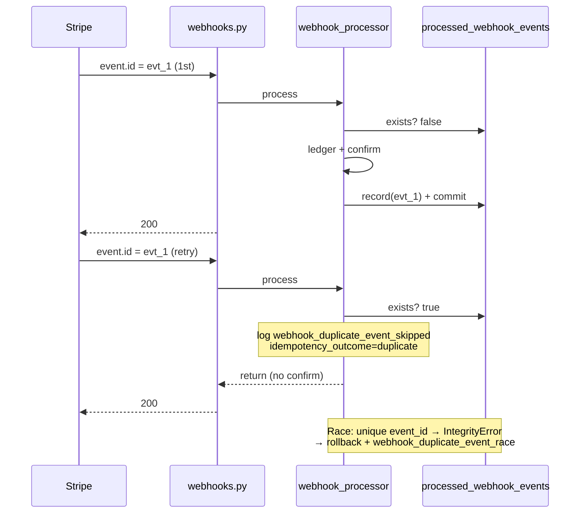
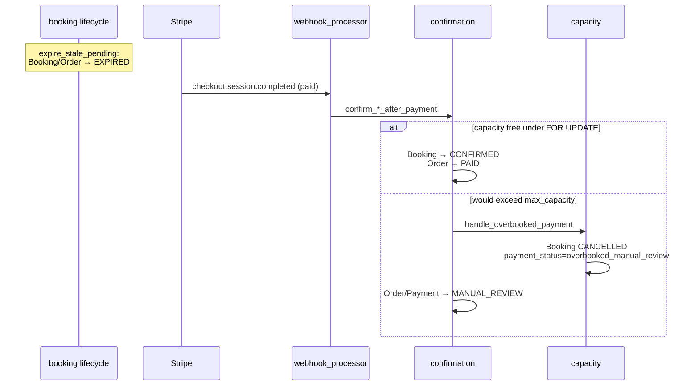

# 07 — Payment + Stripe + Webhooks

## Цель

- Понять **денежный контур**: Checkout Session → Stripe webhook → ledger → confirm seats / `manual_review` / refunds.
- Различать **`integrations/stripe`** (сборка Stripe params / IO shape) и **`modules/payment`** (доменные правила, access, capacity, ledger).
- Проследить webhook **end-to-end** с якорями: signature → `ProcessedWebhookEvent` → processor branches → confirm/refund/Connect.
- Знать Connect gate (`stripe_account_id` + `stripe_charges_enabled`) и что **platform fee model deferred** (`docs/ARCHITECTURE.md`).

## Предусловия

- `guides/02-persistence.md` — UoW, модели `Payment` / `Refund` / `ProcessedWebhookEvent`, Stripe-поля на `Studio` / `Order` / `Booking`.
- `guides/06-booking.md` — hold TTL, `BookingStatus` / `OrderStatus`, lifecycle expire; **internals booking здесь не повторяем**.
- Auth/identity (`guides/04-auth-identity.md`) — guest `access_token`, OTP attach (checkout access).

**Не в этом гайде:** «как работает Stripe вообще»; booking create/capacity SQL internals — см. guide 06.

## Карта файлов

| Путь | Роль |
|------|------|
| `backend/app/modules/payment/__init__.py` | Published surface: только `ProcessedWebhookEventRepository` |
| `backend/app/modules/payment/service.py` | **Тонкий compatibility shim** — re-export use-cases |
| `backend/app/modules/payment/checkout.py` | Create Checkout Session (booking / order) |
| `backend/app/modules/payment/webhooks.py` | HTTP `POST /webhooks/stripe` (вне `/api/v1`) |
| `backend/app/modules/payment/webhook_processor.py` | Idempotent event dispatch |
| `backend/app/modules/payment/confirmation.py` | `confirm_*_after_payment` |
| `backend/app/modules/payment/capacity.py` | Capacity recheck + `overbooked_manual_review` |
| `backend/app/modules/payment/ledger.py` | Local `Payment` row create/update + studio list |
| `backend/app/modules/payment/refunds.py` | Stripe refund + local ledger sync |
| `backend/app/modules/payment/connect.py` | Express onboarding + `account.updated` |
| `backend/app/modules/payment/access.py` | Checkout ownership / studio payout permission |
| `backend/app/modules/payment/stripe_client.py` | `StripeClient`, expiry, safe `AppError` mapping |
| `backend/app/modules/payment/repository.py` | `PaymentRepository` + `ProcessedWebhookEventRepository` |
| `backend/app/modules/payment/router.py` | `/api/v1/payments/*` + `/api/v1/studios/{id}/…` |
| `backend/app/modules/payment/schemas.py` | Request/response + redirect host allowlist |
| `backend/app/integrations/stripe/checkout.py` | Pure builders: `build_*_checkout_params` |
| `backend/app/models/payment.py` | `Payment` / `Refund` + status constants |
| `backend/app/models/processed_webhook_event.py` | Idempotency ledger |
| Migrations `004`, `012`, `015` | Webhook events; Connect+ledger; order `checkout_session_id` |
| Tests: `tests/unit/payment/**`, `test_webhooks.py`, `test_payment_confirm_queries.py` | Checkout/confirm/ledger/webhook |

## Слои и зависимости

```text
HTTP:
  /api/v1/payments|studios → router.py → checkout|connect|ledger|refunds (via service shim)
  /webhooks/stripe         → webhooks.py → webhook_processor → ledger/confirmation/connect/refunds

integrations/stripe/checkout.py  ← param builders only (no DB, no UoW)
modules/payment/stripe_client.py ← StripeClient + env secrets
```

- Mount: `api/router.py` → `payment_router` / `studio_payment_router` внутри `api_v1`; **`webhooks_router` отдельно** (`app.include_router(webhooks_router)` без `/api/v1`).
- ARCHITECTURE: `payment` → `booking`, `identity`, `core`, `models`, `integrations`.
- import-linter: payment **↛** `catalog`, `auth` (occurrence access через `uow.occurrences`, не через catalog package).
- Booking **не** импортирует payment (confirm seats только из payment).

### Published interface

| Экспорт | Где |
|---------|-----|
| `ProcessedWebhookEventRepository` | `payment/__init__.py` `__all__` (для UoW wiring) |
| Остальные use-cases | **не** в `__all__`; импорт из `payment.service` (shim) или прямых модулей (`checkout`, `confirmation`, …) |

`service.py` — **не** бизнес-логика: только re-export из `access` / `checkout` / `confirmation` / `connect` / `ledger` / `refunds` (+ константы статусов).

## HTTP поверхность

| Method | Path | Router | Auth | Handler → service |
|--------|------|--------|------|-------------------|
| `POST` | `/api/v1/payments/checkout-session` | `payment_router` | optional + guest token | `create_checkout_session` |
| `POST` | `/api/v1/payments/order-checkout-session` | `payment_router` | optional + guest token | `create_order_checkout_session` |
| `POST` | `/api/v1/payments/{payment_id}/refunds` | `payment_router` | required + payout perm | `create_refund_for_payment` |
| `GET` | `/api/v1/studios/{studio_id}/stripe/status` | `studio_payment_router` | required + payout | `get_stripe_connect_status` |
| `POST` | `/api/v1/studios/{studio_id}/stripe/onboard` | `studio_payment_router` | required + payout | `create_stripe_onboarding_link` |
| `GET/PATCH` | `/api/v1/studios/{studio_id}/payout-settings` | `studio_payment_router` | required + payout | status / `refresh_stripe_connect_status` |
| `GET` | `/api/v1/studios/{studio_id}/payments` | `studio_payment_router` | required + payout | `list_studio_payments` + count |
| `POST` | `/webhooks/stripe` | `webhooks_router` | **Stripe signature** | `process_stripe_webhook_event` |

Checkout/refund принимают header `Idempotency-Key` (min 8) → прокидывается в Stripe SDK `options`.

Rate limit checkout endpoints: `10/minute` (slowapi).

## Enums / статусы

### `PaymentStatus` (`models/payment.py`)

| Символ | Значение | Кто ставит |
|--------|----------|------------|
| `PENDING` | `"pending"` | ledger при unpaid/async incomplete |
| `SUCCEEDED` | `"succeeded"` | ledger при `payment_status == "paid"` |
| `FAILED` | `"failed"` | ledger при `"failed"` |
| `MANUAL_REVIEW` | `"manual_review"` | `mark_*_manual_review` из confirmation/capacity |
| `REFUNDED` / `PARTIALLY_REFUNDED` | … | refunds path |

### `RefundStatus`

| Символ | Значение |
|--------|----------|
| `PENDING` / `SUCCEEDED` / `FAILED` | строки из Stripe refund `status` |

### Booking `payment_status` (колонка string, не enum класса)

| Значение | Смысл |
|----------|--------|
| `"succeeded"` | `PAYMENT_STATUS_SUCCEEDED` после confirm |
| `"overbooked_manual_review"` | `PAYMENT_STATUS_OVERBOOKED_MANUAL_REVIEW` — деньги есть, seat не подтверждён |
| `"refunded"` | full refund applied to booking |

### Order ↔ Payment взаимодействия (код)

| Ситуация | Order | Payment ledger | Booking |
|----------|-------|----------------|---------|
| Happy paid webhook | `PAID` | `SUCCEEDED` | `CONFIRMED`, `payment_status=succeeded` |
| Late paid, capacity free (order/booking `EXPIRED`) | `PAID` | `SUCCEEDED` | revive → `CONFIRMED` |
| Overbooked / cannot safely seat | `MANUAL_REVIEW` (если есть manual seats) | `MANUAL_REVIEW` | `CANCELLED` + `overbooked_manual_review` |
| Order already `CANCELLED` / `REFUNDED` + paid webhook | `MANUAL_REVIEW` | `MANUAL_REVIEW` | bookings **не** трогаются |
| Unpaid / failed checkout event | без confirm | `PENDING` / `FAILED` | без confirm |
| Full refund succeeded | `REFUNDED` | `REFUNDED` | booking → `CANCELLED`, `payment_status=refunded` |
| Partial refund | без смены order (если не full) | `PARTIALLY_REFUNDED` | — |

**Fee:** колонка `Order.application_fee_cents` + передача в Stripe `application_fee_amount` **только если** значение `> 0`. В app-коде **writer, который заполняет fee, не найден** (только tests/fixtures). `ARCHITECTURE.md`: *Platform fee calculation remains deferred*. Не выдумывать модель комиссии.

## Sequence: checkout → Stripe → webhook → confirm



Order path аналогичен: metadata `order_id` → `confirm_order_after_payment` (batch counts, ordered locks).

## Sequence: duplicate webhook (idempotency)



WHY отдельная таблица (`ProcessedWebhookEvent` docstring): статус booking/order **недостаточен**, чтобы безопасно skip duplicate side effects.

## Sequence: late payment after hold expired

Код **обрабатывает** (не UNKNOWN): `PAYMENT_CONFIRMABLE_BOOKING_STATUSES = {PENDING, EXPIRED}`; unit-тест `test_confirm_order_after_payment_expired_order_can_confirm_if_capacity_free`.



**Связанный нюанс expiry:** `checkout_session_expires_at` = `max(BOOKING_HOLD_MINUTES, 30 min)` — Stripe минимум 30 минут. Hold может истечь раньше, чем Checkout Session; late paid webhook как раз для этого окна.

**Checkout create** после истечения hold **отклоняется** (`ValidationError: Booking hold has expired`) — новый session не создать; уже созданный может доплатить.

**Order `CANCELLED`/`REFUNDED` + paid:** сразу `OrderStatus.MANUAL_REVIEW` + `mark_order_manual_review`, bookings list не вызывается.

## Walkthrough публичных функций (по файлам)

### `service.py` — фасад

Re-export only. Делегирование:

| Символ | Реальный модуль |
|--------|-----------------|
| `create_checkout_session`, `create_order_checkout_session` | `checkout` |
| `confirm_*`, `PAYMENT_STATUS_SUCCEEDED` | `confirmation` |
| `PAYMENT_STATUS_OVERBOOKED_MANUAL_REVIEW` | `capacity` |
| `record_checkout_completed_payment`, `list_studio_payments` | `ledger` |
| Connect trio + `update_studio_connect_status_from_account` | `connect` |
| Refund helpers | `refunds` |
| `is_own_order` | `access` |

### `checkout.py`

- `_require_connect_account_for_checkout(studio)` → нужен `stripe_account_id` **и** `stripe_charges_enabled`, иначе `ValidationError` Connect-not-ready.
- `create_checkout_session` — access, `PENDING`, active hold, нет `checkout_session_id`, `price_cents > 0` → Stripe create → persist `booking.checkout_session_id`.
- `create_order_checkout_session` — то же для order; holds на всех pending bookings; amount = `total_amount_cents`; metadata `order_id`; optional `application_fee_cents` (см. fee note).

### `webhooks.py`

- `stripe_webhook`: raw body; `STRIPE_WEBHOOK_SECRET` отсутствует → **503**; bad payload/signature → **400**; иначе `uow_scope(auto_commit=False)` + `process_stripe_webhook_event` → **200**.
- Не логирует body/payload (только `error_type` / `request_id`).

### `webhook_processor.py`

Supported events:

| Event | Branch |
|-------|--------|
| `checkout.session.completed` | `_process_paid_checkout` |
| `checkout.session.async_payment_succeeded` | paid path (`payment_status` forced `"paid"`) |
| `checkout.session.async_payment_failed` | ledger `"failed"`, **без** confirm |
| `account.updated` | Connect flags |
| `refund.updated` | refund ledger sync |
| other | ignore (early return, **без** record) |

`_process_paid_checkout`: parse metadata → prefer `order_id` over `booking_id` → ledger → confirm only if `paid`. Если `record_checkout_completed_payment` вернул `False` (parent not found) — **event не записывается** (Stripe retry). Иначе почти всегда `record` + commit (в т.ч. unmatched).

### `confirmation.py`

- `confirm_booking_after_payment` — idempotent `CONFIRMED`; overbooked → `handle_overbooked_payment`; non-confirmable statuses → `mark_booking_manual_review` (без silent success as paid seat).
- `confirm_order_after_payment` — sorted occurrence FOR UPDATE; batch counts; in-memory capacity across bookings; any manual seats / zero confirms → order `MANUAL_REVIEW`, else `PAID`.

### `capacity.py`

- SQL check (`would_exceed_occurrence_capacity`) vs in-memory for order batch.
- `handle_overbooked_payment`: cancel seat, set `overbooked_manual_review`, ledger `MANUAL_REVIEW`. **Авто-refund нет** (WHY в комментарии).

### `ledger.py`

- `record_checkout_completed_payment` — upsert by `stripe_checkout_session_id`; exactly one of booking/order; maps Stripe `paid|failed|…` → `PaymentStatus`; sets `order.payment_intent_id`.
- `list_studio_payments` / `count_studio_payments` — dashboard filters.

### `refunds.py`

- `create_refund_for_payment` — local idempotency by `idempotency_key`; Stripe refund; on `succeeded` apply amounts; full → order `REFUNDED` / booking cancelled.
- `update_refund_from_stripe_object` — webhook sync; apply only on transition into `SUCCEEDED`.

### `connect.py`

- Express account create + AccountLink onboarding.
- Flags: `stripe_charges_enabled`, `stripe_payouts_enabled`; onboarding completed when **both** true.
- `update_studio_connect_status_from_account` — match by `stripe_account_id`.

### `access.py`

- Checkout: own (`is_own_booking` / `is_own_order`) **или** valid `access_token`; иначе **404**.
- Studio money ops: `OWNER` / `MANAGER` via `require_studio_payout_permission`.

### `stripe_client.py` + `integrations/stripe/checkout.py`

| Layer | Responsibility |
|-------|----------------|
| `integrations/stripe` | Pure `SessionCreateParams` (+ Connect `transfer_data` / optional fee) |
| `stripe_client` | Client from `STRIPE_SECRET_KEY`, map errors → 502 `AppError`, session expiry unix ts |
| `modules/payment` | Rules, DB, webhooks, capacity, ledger |

## Webhook path — якоря (DoD)

1. Mount: `register_routers` → `POST /webhooks/stripe` (`webhooks.py`).
2. Secret: `settings.STRIPE_WEBHOOK_SECRET`.
3. Verify: `stripe.Webhook.construct_event(payload, sig_header, secret)`.
4. UoW: `uow_scope(auto_commit=False)`.
5. Idempotency read: `uow.webhook_events.exists_by_event_id`.
6. Branches: account / refund / checkout (`webhook_processor.py`).
7. Ledger: `record_checkout_completed_payment`.
8. Confirm: `confirm_order_after_payment` | `confirm_booking_after_payment`.
9. Idempotency write: `_record_processed_event` → `record` + `commit`.
10. Race: `IntegrityError` → rollback + `duplicate_race` log.
11. Model/migration: `ProcessedWebhookEvent` / `004_processed_webhook_events.py`.

## Ledger semantics (migration `012`)

- Tables `payments`, `refunds`; Connect columns on `studios`; `orders.application_fee_cents`, `orders.payment_intent_id`.
- Constraint `ck_payments_exactly_one_parent`: ровно один из `booking_id` / `order_id`.
- Unique `stripe_checkout_session_id`, unique `stripe_refund_id`, unique refund `idempotency_key`.
- Migration `015`: `orders.checkout_session_id` (зеркало booking field для order checkout).

## Why (решения)

1. **Webhook вне `/api/v1`** — Stripe зовёт напрямую; нужен raw body для signature.
2. **ProcessedWebhookEvent** — идемпотентность на `event.id`, не только на domain status.
3. **Confirm recheck capacity** — между hold и paid другой клиент мог занять seat; деньги → `manual_review`, не silent overbook.
4. **EXPIRED confirmable** — late payment после lifecycle; seat revive только если capacity свободна.
5. **Connect gate before charge** — не создавать Checkout без `charges_enabled`.
6. **Fee deferred** — колонка/param hook есть; расчёт platform fee не реализован end-to-end (`ARCHITECTURE.md`).

## Как читать самому

1. `service.py` → список символов → открыть реальный файл.
2. `checkout.py` → Connect + hold gates → `integrations/stripe/checkout.py`.
3. `webhooks.py` → `webhook_processor.py` → confirmation/ledger.
4. `models/payment.py` + migrations `004`/`012`/`015`.
5. Unit: `test_payment_service.py` (late/overbooked), `test_payment_ledger_refunds.py`.
6. Integration: `test_webhooks.py`, `test_payment_confirm_queries.py` (O(1) batch counts).
7. Стык booking: `guides/06-booking.md` § «Граница с payment».

## What to watch out for

- **Idempotency keys:** client `Idempotency-Key` на checkout/refund → Stripe; webhook — `event.id` в `processed_webhook_events`; refund также unique local `idempotency_key`.
- **Secrets via env:** `STRIPE_SECRET_KEY`, `STRIPE_WEBHOOK_SECRET`, currency/settings — никогда не хардкодить; отсутствие webhook secret → 503.
- **Never log payloads with PII/secrets:** webhook логирует `event_id` / `event_type` / outcomes, не raw body и не card data.
- **Connect not ready:** checkout падает до вызова Stripe с явным ValidationError; dashboard onboard через `/studios/{id}/stripe/onboard`.
- **Ledger before confirm:** unpaid/failed всё равно пишутся в ledger; confirm только при `paid`.
- **No auto-refund on overbook:** owner resolves via refund API / ops.
- **Fee:** не предполагать application fee на всех payments — booking path fee не передаёт; order передаёт только если колонка заполнена.

## Checkpoint questions

1. Где mount webhook относительно `/api/v1`, и почему нужен raw body?
2. Какие два уровня идемпотентности есть у webhook (read + race), и какая таблица?
3. Что проверяет `_require_connect_account_for_checkout` до `sessions.create`?
4. Чем `PAYMENT_STATUS_OVERBOOKED_MANUAL_REVIEW` на booking отличается от `PaymentStatus.MANUAL_REVIEW` / `OrderStatus.MANUAL_REVIEW`?
5. Может ли paid webhook подтвердить booking со статусом `EXPIRED`? При каком условии уйдёт в manual path?
6. Где граница: кто строит `SessionCreateParams`, кто решает «можно ли charge»?
7. Что делает processor, если `record_checkout_completed_payment` вернул `False` — запишет ли `ProcessedWebhookEvent`?

## Open questions

- UNKNOWN: есть ли production writer для `Order.application_fee_cents` (в app modules не найден; fee model deferred).
- UNKNOWN: планируется ли auto-refund из `handle_overbooked_payment` (сейчас явно нет).

<details>
<summary>Ключи для Orchestrator (не для ученика в первом проходе)</summary>

1. `register_routers` → `webhooks_router` без prefix `/api/v1`; path `/webhooks/stripe`; `construct_event` на raw body.
2. `exists_by_event_id` skip + unique `event_id` / `IntegrityError` → `duplicate_race`; table `processed_webhook_events`.
3. `studio.stripe_account_id` and `studio.stripe_charges_enabled`.
4. Booking column string `overbooked_manual_review` = paid but seat cancelled; ledger/order use `manual_review` status constants.
5. Yes — in `PAYMENT_CONFIRMABLE_BOOKING_STATUSES`; overbook / non-confirmable / cancelled-refunded order → manual_review paths.
6. Params: `integrations/stripe/checkout.py`; charge rules: `modules/payment/checkout.py` (+ Connect/hold/access).
7. Нет — early `return` without `_record_processed_event` (Stripe retry).

</details>
