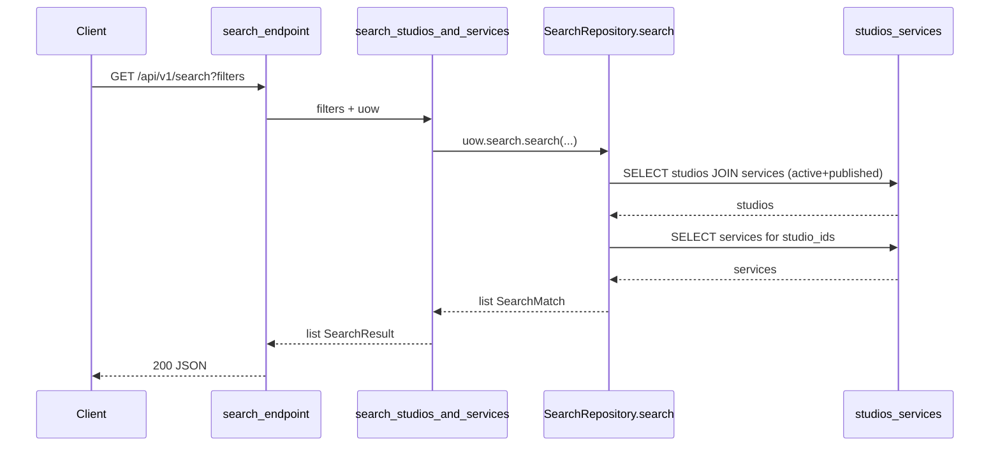
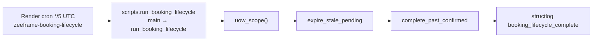

# 08 — Search + Ops + Observability

## Цель

- Понять search как **read-only leaf**: что ищет, какие таблицы, какие import-границы.
- Знать все entrypoints в `backend/scripts/`: какие — cron jobs, какие — dev helpers.
- Проследить booking lifecycle: cron → script → `uow_scope` → lifecycle-функции (детали статусов — guide 06).
- Ориентироваться в ops-срезе: rate limit (+ Redis), structlog / `request_id`, `/metrics`, `/health` → 503.
- Уметь добавить новый cron script по паттерну `run_booking_lifecycle`.

## Предусловия

- `guides/00-inventory.md` — leaf `search`, контракты import-linter.
- `guides/01-bootstrap.md` — lifespan, middleware stack, монтирование health/metrics (здесь не дублируем весь bootstrap).
- Желательно `guides/02-persistence.md` — `uow_scope` / UnitOfWork.
- Для семантики expire/complete — `guides/06-booking.md` (может ещё не быть; якоря lifecycle ниже достаточны для ops).

## Карта файлов

| Путь | Роль |
|------|------|
| `backend/app/modules/search/router.py` | `GET /search` → `search_endpoint` |
| `backend/app/modules/search/service.py` | `search_studios_and_services` |
| `backend/app/modules/search/repository.py` | `SearchRepository.search`, `SearchMatch` |
| `backend/app/modules/search/schemas.py` | `SearchResult`, studio/service response DTO; WHY leaf |
| `backend/app/modules/search/__init__.py` | Published: `SearchRepository`, `SearchQueryParams`, `SearchResult` |
| `backend/scripts/__init__.py` | Package marker («не часть FastAPI runtime») |
| `backend/scripts/run_booking_lifecycle.py` | Prod cron entrypoint: expire + complete |
| `backend/scripts/cleanup_otp_codes.py` | Local/staging OTP retention (Python) |
| `backend/scripts/pg_cron_otp_cleanup.sql` | Prod OTP cleanup via `pg_cron` |
| `backend/scripts/seed_100_studios.py` | **non-job helper**: destructive seed для UI |
| `backend/app/core/logging_config.py` | `setup_logging` (structlog) |
| `backend/app/core/observability.py` | `safe_log_fields`, `log_domain_event`, Prometheus counter |
| `backend/app/core/rate_limit.py` | SlowAPI `limiter` (+ optional Redis) |
| `backend/app/core/middleware/logging_middleware.py` | `RequestLoggingMiddleware`, `X-Request-ID` |
| `backend/app/core/middleware/__init__.py` | Package docstring |
| `backend/app/api/health.py` | `GET /health`, `/health/ready` |
| `backend/app/api/metrics.py` | `GET /metrics` |
| `backend/app/main.py` | `limiter` wiring, `rate_limit_exceeded_handler`, middleware add |
| `backend/app/modules/booking/lifecycle.py` | `expire_stale_pending`, `complete_past_confirmed` (вызываются скриптом) |
| `docs/ARCHITECTURE.md` | Background jobs, Production Readiness Notes |
| `render.yaml` | Cron `zeeframe-booking-lifecycle` |
| Root `Makefile` | target `booking-lifecycle` |
| `backend/tests/unit/core/test_logging_observability.py` | Контракты request_id / safe fields |
| `backend/tests/architecture/test_import_contracts.py` | Имя контракта `search is read-only leaf` |

Search unit/integration tests в repo **не найдены** (на момент написания гайда).

## Слои и зависимости

### Search (read-only leaf)

```text
GET /api/v1/search
  → search_endpoint (router)
  → search_studios_and_services (service)
  → uow.search.search (SearchRepository)
  → ORM tables: studios + services
```

- Разрешено: `core`, `models` (`docs/ARCHITECTURE.md` allowed edges; `pyproject.toml` contract `search is read-only leaf`).
- **Запрещено** search → `booking` / `catalog` / `payment` / `auth` (import-linter).
- WHY в `schemas.py`: *«search is a read-only leaf — it must not import catalog modules»*; response shapes зеркалят catalog для API compatibility, но живут в search.
- `SearchQueryParams` экспортируется из `__init__`, но HTTP-handler читает фильтры через FastAPI `Query(...)` напрямую (`router.py`).

### Ops / observability (вне доменов)

```text
HTTP request
  → RequestLoggingMiddleware (request_id + structlog)
  → route (+ optional @limiter.limit)
  → log_domain_event / safe_log_fields (domain / middleware)

Cron / CLI
  → scripts.*.main
  → uow_scope()
  → domain functions / repo deletes
```

Скрипты **не** часть FastAPI package (`scripts/__init__.py`); используют тот же `uow_scope`, что и app (`ARCHITECTURE.md` Background jobs).

## Таблица jobs

| name | entrypoint | schedule (из repo) | side effects | idempotent? |
|------|------------|--------------------|--------------|-------------|
| Booking lifecycle | `backend/scripts/run_booking_lifecycle.py` → `main` / `run_booking_lifecycle` | Prod: `*/5 * * * *` UTC (`render.yaml` → `zeeframe-booking-lifecycle`; docstring скрипта; `ARCHITECTURE.md`) | `expire_stale_pending` + `complete_past_confirmed` в одной транзакции `uow_scope`; лог `booking_lifecycle_complete` | **Да** (заявлено `ARCHITECTURE.md`: safe to re-run; повтор на уже expired/completed даёт 0 transitions) |
| OTP cleanup (prod) | `backend/scripts/pg_cron_otp_cleanup.sql` → job name `otp_codes_cleanup_daily` | `0 3 * * *` (в SQL); daily на DB | `DELETE FROM otp_codes WHERE expires_at < now() - interval '7 days'` | **Да** (повторный DELETE пустой) |
| OTP cleanup (local/staging) | `backend/scripts/cleanup_otp_codes.py` → `main` / `cleanup_otp_codes` | Нет в `render.yaml` / Makefile; docstring: manual / cron `uv run python -m scripts.cleanup_otp_codes` | `uow.otp_codes.delete_expired_before(cutoff)` где `cutoff = utc_now() - OTP_RETENTION_DAYS` | **Да** (повтор → 0 deleted) |
| Seed 100 studios | `backend/scripts/seed_100_studios.py` → `main` / `seed_100_studios` | **Нет** (не cron) | **non-job helper**: `TRUNCATE services, studios … CASCADE`, delete seed owners, insert 100 studios/services/occurrences | **Нет** для безопасного re-run на shared DB (деструктивный truncate) |

Локальный запуск lifecycle:

```bash
make booking-lifecycle
# эквивалент: cd backend && uv run python -m scripts.run_booking_lifecycle
```

OTP Python / seed:

```bash
cd backend && uv run python -m scripts.cleanup_otp_codes
cd backend && uv run python -m scripts.seed_100_studios
```

### OTP: Python vs `pg_cron` — что актуально

| Среда | Источник истины в repo |
|-------|------------------------|
| Production | `ARCHITECTURE.md` Background jobs + docstring `cleanup_otp_codes.py`: **`pg_cron_otp_cleanup.sql`** |
| Local / staging | Python script `cleanup_otp_codes.py` |

Оба пути чистят retention OTP; окно в SQL зашито `'7 days'`, в Python — `settings.OTP_RETENTION_DAYS` (default `7` в `config.py`). Расхождение при смене setting без правки SQL — см. Open questions / watch out.

## Walkthrough функций

### `search_endpoint` (`backend/app/modules/search/router.py`)

- **Зачем:** публичный MVP search (category, city, query, amenities, geo).
- **Вход:** `uow` via `Depends(get_uow)`; optional Query: `query`, `category`, `city`, `lat`, `lng`, `radius_km` (default 10, `ge=0`), `amenities` (repeatable).
- **Шаги:** делегирует в `search_studios_and_services(...)`.
- **Выход / ошибки:** `list[SearchResult]`; отдельной auth нет (публичный GET).
- **Кто вызывает:** HTTP `GET` под prefix `/search` (в `api_v1` через `search_router` — см. bootstrap).

### `search_studios_and_services` (`backend/app/modules/search/service.py`)

- **Зачем:** тонкий service: repo → Pydantic DTO.
- **Вход:** `UnitOfWork` + те же фильтры, что router.
- **Шаги:** 1) `await uow.search.search(...)`; 2) для каждого `SearchMatch` собрать `SearchResult` (`SearchStudioResponse` / `SearchServiceResponse.model_validate`).
- **Выход / ошибки:** `list[SearchResult]`; исключений домена не бросает.
- **Кто вызывает:** `search_endpoint`.

### `SearchRepository.search` (`backend/app/modules/search/repository.py`)

- **Зачем:** SQL read-model по `Studio` + `Service`.
- **Вход:** фильтры (все optional).
- **Шаги:**
  1. Базовые constraints: `Studio.is_active`, `Service.is_active`, `Service.visibility == PUBLISHED`.
  2. Опционально: city (case-insensitive exact), query (`ilike` на `Service.name` / `Studio.name`), amenities (`Studio.amenities.contains`), geo (bbox: `abs(lat/lng) <= radius_km/111` при обоих координатах).
  3. `select(Studio).join(Service).where(...).distinct(Studio.id)`; category — `text("services.category = :category_filter")`.
  4. Второй запрос: published active services для найденных `studio_ids` (с тем же category filter).
  5. Сборка `SearchMatch(studio, matched_services)`.
- **Выход / ошибки:** `list[SearchMatch]`; пустой список если студий нет.
- **Кто вызывает:** `search_studios_and_services` через `uow.search`.

### `SearchResult` / response schemas (`backend/app/modules/search/schemas.py`)

- **Зачем:** API shape без импорта catalog.
- **Вход:** ORM instances через `model_validate` / `from_attributes`.
- **Выход:** `SearchResult { studio, matched_services }`.
- **Кто вызывает:** service; также re-export для чужих модулей (например catalog explore — см. guide 05; не разбираем здесь).

### `run_booking_lifecycle` / `main` (`backend/scripts/run_booking_lifecycle.py`)

- **Зачем:** вне HTTP истечь stale pending holds и завершить прошедшие confirmed.
- **Вход:** нет CLI args; env/`Settings` через app wiring (DB).
- **Шаги:** 1) `async with uow_scope() as uow`; 2) `expired_count = await expire_stale_pending(uow)`; 3) `completed_count = await complete_past_confirmed(uow)`; 4) `logger.info("booking_lifecycle_complete", ...)`; 5) `main` печатает counts в stdout.
- **Выход / ошибки:** `tuple[int, int]`; исключения пробрасываются из asyncio.run (падение cron).
- **Кто вызывает:** Render cron `startCommand`; локально `make booking-lifecycle` / `uv run python -m scripts.run_booking_lifecycle`.

### `expire_stale_pending` / `complete_past_confirmed` (`backend/app/modules/booking/lifecycle.py`)

- **Зачем:** доменные переходы (детали статусов/orders — **guide 06**).
- **Кратко для ops:** pending с просроченным `reserved_until` → `EXPIRED` (+ expire orphan pending orders); confirmed с `occurrence.end_time < now` → `COMPLETED`. Возвращают counts; логируют через `log_domain_event`.
- **Кто вызывает:** `run_booking_lifecycle` (и потенциально тесты booking — вне этого среза).

### `cleanup_otp_codes` / `main` (`backend/scripts/cleanup_otp_codes.py`)

- **Зачем:** retention `otp_codes` без HTTP.
- **Шаги:** cutoff по `OTP_RETENTION_DAYS` → `uow_scope` → `uow.otp_codes.delete_expired_before(cutoff)` → лог `otp_codes_cleanup_complete`.
- **Кто вызывает:** manual/local cron; **не** Render blueprint.

### `seed_100_studios` / `main` (`backend/scripts/seed_100_studios.py`)

- **Зачем:** визуальный seed фронта (100 owners/studios).
- **Шаги:** truncate studios/services CASCADE → delete seed emails → insert data → commit → print counts.
- **Кто вызывает:** разработчик вручную; **не** production job.

### `setup_logging` (`backend/app/core/logging_config.py`)

- **Зачем:** structlog: console при `DEBUG`, иначе JSON; обязательные поля `timestamp`, `level`, `service` (`APP_NAME`), `request_id` (fallback `"unknown"`).
- **Кто вызывает:** `lifespan` startup (`main.py`) — детали в guide 01.

### `RequestLoggingMiddleware.dispatch` (`backend/app/core/middleware/logging_middleware.py`)

- **Зачем:** `X-Request-ID` + события `request_started` / `request_finished` / `request_failed`.
- **Шаги:** validate/generate request_id → `bind_contextvars` → call_next → log по status (5xx error, 401/403/429 warning) → header на response → `clear_contextvars`.
- **Кто вызывает:** middleware stack в `main.py`.

### `safe_log_fields` / `log_domain_event` (`backend/app/core/observability.py`)

- **Зачем:** выкинуть sensitive keys (`otp`, `token`, `email`, …); инкремент `zeeframe_domain_events_total{event,level}`.
- **Кто вызывает:** middleware; domain services (в т.ч. lifecycle).

### `limiter` / `_build_limiter` (`backend/app/core/rate_limit.py`)

- **Зачем:** SlowAPI, key = `get_remote_address`; если `settings.REDIS_URL` — `storage_uri`, иначе in-memory.
- **Кто вызывает:** `app.state.limiter` + `@limiter.limit` на чувствительных routes (auth/booking — не разбирать здесь).

### `rate_limit_exceeded_handler` (`backend/app/main.py`)

- **Зачем:** 429 Problem JSON + SlowAPI rate-limit headers.
- **Кто вызывает:** FastAPI exception handler для `RateLimitExceeded`.

### `health_check` / `readiness` (`backend/app/api/health.py`)

- **Зачем:** liveness/readiness probes.
- **`/health`:** `_check_database()` (`SELECT 1`); fail → **HTTP 503**, body `status=unready`, `db=fail`; ok → `status=ok`, `db=ok`.
- **`/health/ready`:** DB обязателен (503 при fail); Stripe/Resend — мониторинг (`skip`/`ok`/`fail`), **503 только при DB fail** (комментарий в handler).
- **Кто вызывает:** load balancer / ops; также дублируется под `/api/v1` (guide 01).

### `metrics` (`backend/app/api/metrics.py`)

- **Зачем:** Prometheus scrape без auth.
- **Выход:** `generate_latest()` + `CONTENT_TYPE_LATEST` (все зарегистрированные метрики процесса, в т.ч. `zeeframe_domain_events_total`).
- **Кто вызывает:** Prometheus / manual `GET /metrics`.

## Сквозной флоу

### Search (HTTP)



### Cron → booking lifecycle (ops)



Доменная семантика pending/confirmed/order — **`guides/06-booking.md`**. Здесь важен ops-контур: без cron holds с `reserved_until` не истекают автоматически.

## Почему так (решения)

- Search leaf + собственные schemas — `schemas.py` WHY + `ARCHITECTURE.md` + import-linter `search is read-only leaf`.
- Jobs вне FastAPI process, тот же `uow_scope` — `ARCHITECTURE.md` Background jobs.
- Booking lifecycle на Render Cron (Option A), не always-on worker — `ARCHITECTURE.md` / TD-11 ссылка.
- OTP в prod через `pg_cron` на DB, Python — local/staging — docstring `cleanup_otp_codes.py` + таблица ARCHITECTURE.
- Rate limit: Redis только если `REDIS_URL` — `rate_limit.py` docstring + Production Readiness.
- Structlog обязательные поля — module docstring `logging_config.py`; тесты `test_logging_observability.py` фиксируют `X-Request-ID` и redaction.
- `/health` требует DB и отдаёт 503 при fail — `health_check` + cursor rules / payload shape.

### Production readiness (только проверяемые в этом срезе)

Из `docs/ARCHITECTURE.md` → Production Readiness Notes, якоря в settings/code:

| Bullet | Проверка в коде |
|--------|-----------------|
| `DATABASE_URL` имеет local default; prod/cron должны override | `Settings.DATABASE_URL` default в `config.py`; cron env в `render.yaml` (`DATABASE_URL` sync:false) |
| `REDIS_URL` нужен для multi-instance rate limit | `Settings.REDIS_URL` optional; `_build_limiter` ставит `storage_uri` только если задан |

Остальные bullets ARCHITECTURE (Stripe Connect gate, `manage_members`, soft-delete re-reg) — **вне whitelist A8**; не утверждаем детали здесь.

## How-to: добавить новый cron script

По паттерну `backend/scripts/run_booking_lifecycle.py`:

1. Создай `backend/scripts/my_job.py` с module docstring: prod schedule (если есть), local command `uv run python -m scripts.my_job`.
2. Реализуй `async def run_my_job() -> …:` внутри `async with uow_scope() as uow:` — вызывай **published** domain/repo API, не сырой SQL без нужды.
3. Добавь `def main() -> None: asyncio.run(run_my_job())` и `if __name__ == "__main__": main()`.
4. Логируй итог через `structlog` (event name + counts), плюс короткий `print` для cron stdout.
5. Если job идемпотентен — явно напиши это в docstring/`ARCHITECTURE.md` Background jobs (как у lifecycle).
6. Wiring деплоя: для Render — блок `type: cron` в root `render.yaml` (как `zeeframe-booking-lifecycle`); для DB-native — SQL/`pg_cron` как OTP.
7. Локальный DX: при частом запуске — target в root `Makefile` (как `booking-lifecycle`).
8. Не клади скрипт в `app/scripts/` (inventory: empty shell); пакет — top-level `backend/scripts/`.

## Как читать самому

1. Search: `router.py` → `service.py` → `repository.py` (условия + две выборки) → `schemas.py` WHY leaf.
2. Контракт: `pyproject.toml` → `search is read-only leaf`; тест имени в `test_import_contracts.py`.
3. Jobs: список файлов в `backend/scripts/` → сверить с таблицей Background jobs в `ARCHITECTURE.md` и `render.yaml`.
4. Lifecycle: `run_booking_lifecycle` → импорты из `app.modules.booking` → `lifecycle.py` (затем guide 06).
5. OTP: docstring Python vs SQL schedule/interval.
6. Observability: `setup_logging` processors → middleware bind → `observability.py` → `GET /metrics`.
7. Health: `_check_database` + ветка 503 в `health_check`.
8. Rate limit: `rate_limit.py` + `REDIS_URL` Field description.

## What to watch out for

- **Multi-instance rate limit without Redis:** SlowAPI держит счётчики **в памяти процесса** (`rate_limit.py`). Несколько реплик API без `REDIS_URL` → лимиты разъезжаются; ARCHITECTURE: Redis обязателен для multi-instance prod.
- **Missing cron → holds never expire:** без `zeeframe-booking-lifecycle` / ручного `make booking-lifecycle` pending с `reserved_until` не истекают сами (`BOOKING_HOLD_MINUTES` WHY в config — capacity lock). Мониторинг: отсутствие `booking_lifecycle_complete` ≥ ~15 мин (`ARCHITECTURE.md`).
- **OTP dual path:** prod SQL hardcode `7 days` vs `OTP_RETENTION_DAYS` в Python — меняя setting, не забудь SQL.
- **Seed is destructive:** `TRUNCATE … CASCADE` снесёт bookings/slots и т.д. — только локальная/throwaway DB.
- **Search geo — bbox, не haversine:** `radius_km / 111.0` градусный квадрат; на больших широтах/радиусах — приближение.
- **Search description filter:** Query description говорит «name/description», код фильтрует только **names** (`ilike` name fields).
- **`request_id` outside HTTP:** у cron/scripts нет middleware → в логах `request_id` часто `"unknown"` (`_ensure_request_id`) — это ожидаемо.
- **Не путать seed / e2e helpers с prod jobs:** в таблице jobs только lifecycle + OTP; seed — helper.

## Checkpoint questions

1. Какие import-модули запрещены для `app.modules.search` и где это зафиксировано машинно?
2. Какие базовые leaf-constraints всегда накладывает `SearchRepository.search` на studio/service?
3. Чем prod OTP cleanup отличается от `cleanup_otp_codes.py` (entrypoint + schedule)?
4. Какие две функции вызываются внутри `run_booking_lifecycle` и в каком порядке?
5. Что происходит с HTTP-статусом `/health`, если `_check_database` вернул `False`?
6. При каком условии SlowAPI использует Redis, и что будет без него на нескольких инстансах?
7. Какие обязательные поля гарантирует `setup_logging`, и откуда берётся `request_id` в HTTP vs fallback?
8. Почему `seed_100_studios.py` нельзя ставить в `render.yaml` рядом с lifecycle?

<details>
<summary>Ключи (для Orchestrator; ученик отвечает сам)</summary>

1. Запрещены booking/catalog/payment/auth — контракт `search is read-only leaf` в `backend/pyproject.toml` (+ `ARCHITECTURE.md`).
2. `Studio.is_active`, `Service.is_active`, `Service.visibility == PUBLISHED`.
3. Prod: `pg_cron_otp_cleanup.sql` job `otp_codes_cleanup_daily` daily `0 3 * * *`; Python — local/staging manual `uv run python -m scripts.cleanup_otp_codes`, окно из `OTP_RETENTION_DAYS`.
4. Сначала `expire_stale_pending`, затем `complete_past_confirmed` в одном `uow_scope`.
5. `response.status_code = 503`, body `status=unready`, `db=fail` — `health_check`.
6. Если задан `settings.REDIS_URL` → `storage_uri`; иначе in-memory per process → раздельные счётчики на репликах.
7. `timestamp`, `level`, `service`, `request_id`; HTTP — middleware (`X-Request-ID` / uuid), иначе `"unknown"`.
8. Делает `TRUNCATE` CASCADE и не является идемпотентным ops-job; только dev seed.

</details>

## Open questions

- UNKNOWN: применяется ли `pg_cron_otp_cleanup.sql` на конкретном prod Postgres автоматически, или только «apply once» вручную (в repo есть SQL + инструкция `psql`, нет automation в `render.yaml`).
- UNKNOWN: есть ли отдельные unit/integration tests на `SearchRepository.search` (в дереве `backend/tests` не найдены).
- NOTE: при смене `OTP_RETENTION_DAYS` SQL job остаётся на `'7 days'` — синхронизация process не описана в ARCHITECTURE.
