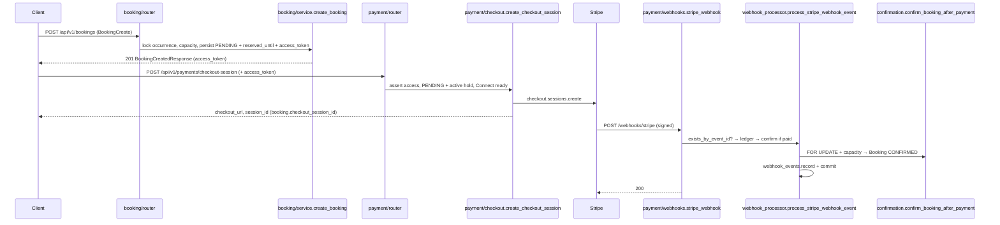
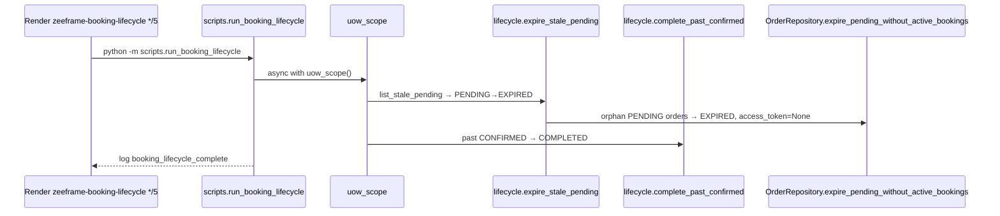
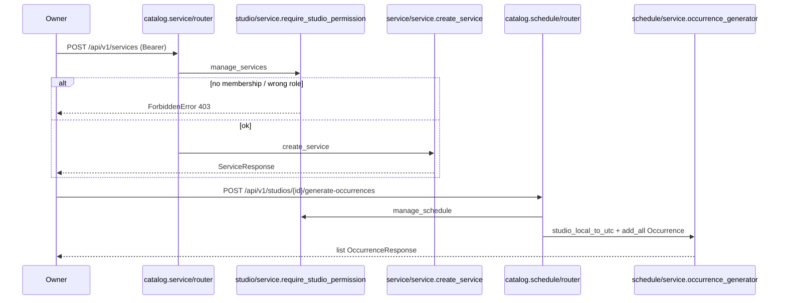
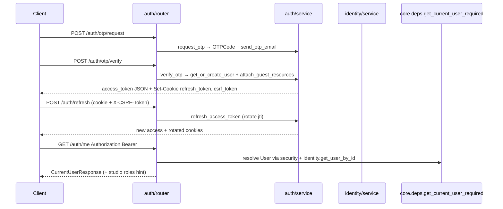
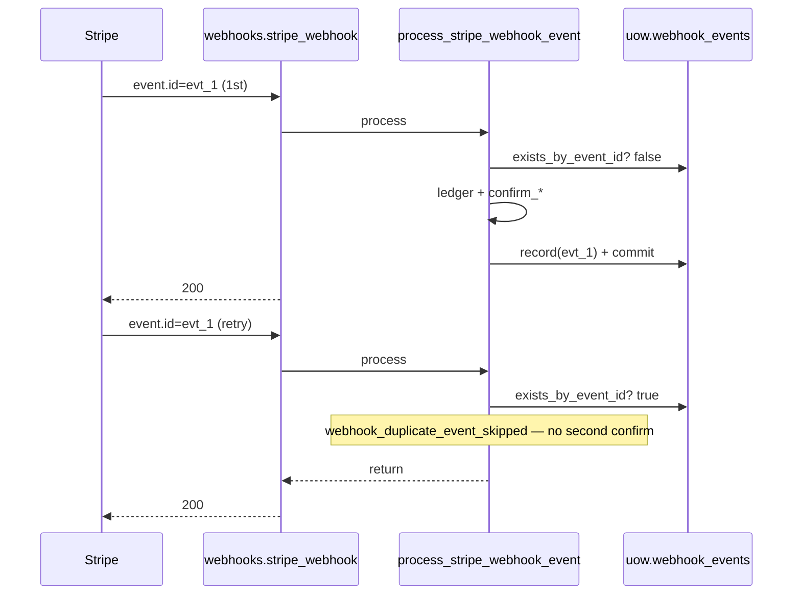

# 09 — Synthesis (сквозные флоу + глоссарий решений)

## Цель

- Склеить guides `00`…`08` в одну «карту головы»: сквозные сценарии, WHY-решения, куда класть изменения.
- Зафиксировать разрешения противоречий между гайдами / ADR / кодом (без новых фактов «из воздуха»).
- Дать метод чтения незнакомого кода и top pitfalls across domains.
- Подготовить финальный self-exam перед работой в репозитории.

## Предусловия

Прочитаны:

| Guide | Тема |
|-------|------|
| `00-inventory.md` | Modular monolith, published API, import-linter |
| `01-bootstrap.md` | lifespan, middleware, routers, Problem JSON |
| `02-persistence.md` | models, Alembic, UoW, repositories |
| `03-contracts.md` | schemas, DTO, pagination, errors |
| `04-auth-identity.md` | OTP, JWT, cookies, identity, RBAC boundary |
| `05-catalog.md` | Studio → Service → Occurrence, public vs owner |
| `06-booking.md` | hold, Order, capacity, lifecycle |
| `07-payment.md` | Checkout, webhook, ledger, Connect |
| `08-search-ops.md` | search leaf, cron, observability |

Этот гайд **не** заменяет предыдущие: он синтезирует и якорит. При сомнении — гайд домена + код.

---

## Conflicts resolved

Противоречия / пробелы из Open questions `00`–`08`, сверенные с кодом.

| # | Конфликт | Resolution (канон для ученика) | Где смотреть |
|---|----------|--------------------------------|--------------|
| 1 | ADR-003 §3: `from app.modules.booking import BookingRepository` vs фактический wiring | **Код + ARCHITECTURE.** Тип UoW — `core/uow.py`; fan-in wiring — только `core/uow_factory.py`, и он импортирует `…repository` напрямую (исключение ADR-003 §3 / import-linter). Доменный cross-import — через published package root. | `uow_factory.py`; ADR-003 §3; guide 02 |
| 2 | `payment/__init__.py` экспортирует только `ProcessedWebhookEventRepository`, а UoW использует `PaymentRepository` | **Тонкий published surface — факт.** Cross-domain payment use-cases не публикуются в `__all__`; routers внутри модуля импортируют `checkout` / `service` shim. `PaymentRepository` — wiring-only через factory. Не выдумывать «полный» payment public API. | `payment/__init__.py`; guide 00 / 07 |
| 3 | ARCHITECTURE allowed edges: `catalog` ↛ `search`, но `explore.py` импортирует `SearchResult` | **Код разрешает schemas/DTO из search; forbidden-контракта catalog↛search нет.** Таблица ARCHITECTURE неполная. Explore ≠ модуль search (разные HTTP surfaces). | `catalog/studio/explore.py`; guide 05 / 08 |
| 4 | «Только package root» vs `from app.modules.booking.policies import is_own_booking` в payment | **Символ published** (`booking.__all__` включает policies). Импорт submodule path — drift относительно строгой формулировки ARCHITECTURE; поведение то же. Предпочтительно `from app.modules.booking import is_own_booking`. | `payment/access.py`; guide 00 |
| 5 | ARCHITECTURE: soft-deleted «cannot authenticate again with the same email» vs код/тест | **Код + интеграционный тест.** После soft-delete email анонимизируется (`deleted+{id}@deleted.local`); новый OTP verify создаёт **нового** `User`. ARCHITECTURE Production note — устаревшая формулировка. | `identity/service.get_or_create_user`; `test_api_auth.py`; guide 04 |
| 6 | Docstring Occurrence «Generated from ScheduleTemplate» vs `occurrence_generator` не пишет `schedule_template_id` | **Текущий bulk path параметрический** (`days`, `start_time`, `weeks_count`); template CRUD параллелен. FK существует; path «из template» в whitelist не найден. | `schedule/service.occurrence_generator`; guide 05 |
| 7 | Platform fee / `application_fee_cents` | **Deferred.** Колонка + Stripe param hook есть; production writer fee в app modules не найден. `ARCHITECTURE.md`: platform fee calculation deferred. | guide 07 |
| 8 | `OrderStatus.CANCELLED` в enum, write path не найден | **Константа есть; assignment в app не найден** (payment проверяет статус). Не рисовать переход в CANCELLED без нового кода. | guide 06 |
| 9 | `alembic/env.py` не импортирует `app.models` | **UNKNOWN workflow autogenerate** (остаётся). Runtime metadata = `Base.metadata`; модели регистрируются, когда пакет импортирован другим путём. Не полагаться на autogenerate без проверки. | guide 02 |
| 10 | Доменный `ValidationError` → 400 vs FastAPI schema fail → 422 | **Не конфликт — два разных слоя.** AppError `ValidationError` → Problem JSON 400; Pydantic body → 422 default FastAPI. | guide 03 |

---

## End-to-end scenarios

### 1. Guest book → checkout → webhook confirm

**Якоря:** `create_booking` → `create_checkout_session` → `process_stripe_webhook_event` → `confirm_booking_after_payment`.

| Шаг | Path + symbol |
|-----|----------------|
| Hold | `modules/booking/service.py` → `create_booking` |
| Response | `modules/booking/mapping.py` → `map_booking_created_response` |
| Checkout | `modules/payment/checkout.py` → `create_checkout_session` |
| Webhook mount | `modules/payment/webhooks.py` → `stripe_webhook` (вне `/api/v1`) |
| Confirm | `modules/payment/confirmation.py` → `confirm_booking_after_payment` |

Course-вариант: `create_course_booking` + `create_order_checkout_session` + `confirm_order_after_payment` (token на `Order`).

---

### 2. Hold expire via lifecycle cron

**Якоря:** Render cron → `run_booking_lifecycle` → `expire_stale_pending` (+ `complete_past_confirmed`).

| Шаг | Path + symbol |
|-----|----------------|
| Entrypoint | `backend/scripts/run_booking_lifecycle.py` → `run_booking_lifecycle` |
| Expire | `modules/booking/lifecycle.py` → `expire_stale_pending` |
| Complete | `modules/booking/lifecycle.py` → `complete_past_confirmed` |
| Schedule | `render.yaml` → `*/5 * * * *`; local: `make booking-lifecycle` |

**Нюанс (guide 06/07):** capacity queries уже игнорируют истёкший hold (`reserved_until`); cron чистит статус. Late paid webhook всё ещё может revive `EXPIRED` → `CONFIRMED`, если capacity свободна.

---

### 3. Studio owner catalog write with RBAC

**Якоря:** `require_studio_permission` + create service / generate occurrences.

| Шаг | Path + symbol |
|-----|----------------|
| RBAC matrix | `catalog/studio/service.py` → `STUDIO_PERMISSIONS_BY_ROLE`, `require_studio_permission` |
| Service write | `catalog/service/service.py` → `create_service` |
| Bulk slots | `catalog/schedule/service.py` → `occurrence_generator` |
| Permissions | `manage_services` / `manage_schedule` (owner+manager); `manage_studio` — только owner |

Catalog **не** импортирует booking/payment (import-linter). Counts seats — через `uow.bookings`, не через package `booking`.

---

### 4. OTP login → refresh → authenticated `/me`

**Якоря:** `request_otp` → `verify_otp` → `refresh_access_token` → `get_current_user_required` → `GET /auth/me`.

| Шаг | Path + symbol |
|-----|----------------|
| OTP | `auth/service.py` → `request_otp`, `verify_otp`, `_complete_otp_login` |
| User | `identity/service.py` → `get_or_create_user` |
| Guest bind | `booking` published → `attach_guest_resources` |
| Refresh | `auth/service.py` → `refresh_access_token` |
| Bearer | `core/deps.py` → `get_current_user` / `get_current_user_required` |
| Me | `auth/router.py` → `get_current_user_me` |

Refresh — **httpOnly cookie**, не body. Soft-deleted → `get_user_by_id` = `None` → 401.

---

### 5. Duplicate webhook idempotency

**Якоря:** `ProcessedWebhookEvent` + `exists_by_event_id` + unique race.

| Шаг | Path + symbol |
|-----|----------------|
| Verify | `webhooks.py` → `stripe.Webhook.construct_event` |
| Idempotency read/write | `webhook_processor.py` → `exists_by_event_id` / `_record_processed_event` |
| Model | `models/processed_webhook_event.py` → `ProcessedWebhookEvent` |
| Race | unique `event_id` → `IntegrityError` → rollback + `duplicate_race` log |

WHY отдельная таблица (docstring модели / guide 07): статус booking/order **недостаточен**, чтобы безопасно skip duplicate side effects.

---

## WHY glossary

| Решение | Зачем | Где зафиксировано |
|---------|-------|-------------------|
| Package-by-domain (`app/modules/`) | Высокая cohesion; границы проверяет CI | ADR-003 §1; `docs/ARCHITECTURE.md` |
| Models централизованы в `app/models/` | Плотный FK-граф; split = циклы | ADR-003 §2 |
| UoW flat, data-only | `uow.bookings`, не `uow.booking.create_*` | ADR-003 §3; `core/uow.py` |
| Wiring в `uow_factory` | Единственный fan-in на все repos (import-linter) | ARCHITECTURE; guide 02 |
| Published vs `_` private | Cross-domain только через public API | ADR-003 §4; architecture tests |
| Auth оркестрирует identity/booking | Сессия отдельно от User entity | ADR-003; guide 04 |
| Instant = TIMESTAMPTZ / wall-clock = TIME | Не смешивать calendar и UTC instants | ADR-001; `datetime_utils.py` |
| Hold + `reserved_until` | Seat без оплаты; capacity фильтрует active hold | `booking_holds.py`; guide 06 |
| Partial unique на ACTIVE bookings | Expired/cancelled не блокируют rebook | migrations `002`/`003` |
| Course Order в booking, не catalog | Catalog остаётся продуктовым слоем | ADR-003; ARCHITECTURE |
| Guest `access_token` | Checkout без login; anti-IDOR | `access_tokens.py`; guide 06 |
| 404 вместо 403 на чужой booking | Anti-enumeration | `get_booking_for_user_or_raise`; payment access |
| Confirm seats только в payment | booking ↛ payment; CONFIRMED из webhook | guide 06 / 07 |
| `ProcessedWebhookEvent` | Идемпотентность Stripe `event.id` | migration `004`; guide 07 |
| Confirm recheck capacity | Late race → `manual_review`, не silent overbook | `confirmation.py` / `capacity.py` |
| Connect gate before Checkout | Нужны `stripe_account_id` + `charges_enabled` | `checkout._require_connect_account_for_checkout` |
| Platform fee deferred | Колонка есть; расчёт не end-to-end | ARCHITECTURE; guide 07 |
| Search leaf + mirrored schemas | Не тянуть catalog package | `search/schemas.py` WHY; import-linter |
| Jobs вне FastAPI + тот же `uow_scope` | Cron process; shared transaction pattern | ARCHITECTURE Background jobs; guide 08 |
| Problem JSON + центральные handlers | Services без `HTTPException` | `exceptions.py`; `main.py` |
| Refresh httpOnly + CSRF double-submit | XSS не крадёт refresh; CSRF на cookie mutation | `auth/router.py` docstring |

---

## How to make a change (layered checklist)

### Новый HTTP endpoint

1. **Домен:** в какой `app/modules/<domain>/`? Проверь allowed edges (`ARCHITECTURE.md` + import-linter).
2. **Router:** `modules/<domain>/router.py` — HTTP only (`Depends`, `status_code`, `response_model`).
3. **Schema:** `*Create` / `*Response` в `schemas.py`; не отдавай ORM; mapper при необходимости.
4. **Service:** бизнес-правила; принимает `UnitOfWork`; поднимает `AppError`.
5. **Repository:** только SQL; при write — `WriteRepositoryMixin`.
6. **Mount:** `api/router.py` → `api_v1.include_router`; при forward refs — `model_rebuild()`.
7. **Webhook / Stripe callback:** **не** в `/api/v1` — отдельно в `register_routers` (как `webhooks_router`).
8. **Authz:** Bearer deps в router; studio RBAC — `require_studio_permission` в service; ownership — policies.
9. **Тест:** happy path + 401/403/422 + business rule; architecture suite если трогал границы.

### Новое поле (модель → API)

1. Колонка в `app/models/<entity>.py` (+ enum/constraint/index).
2. Экспорт в `models/__init__.py` при необходимости.
3. Alembic migration — **одно** логическое изменение, descriptive filename.
4. Repository read/write, если нужно.
5. Response/request schema + mapper/DTO.
6. Perspective: Self / Owner / Public — правильный класс.
7. Не светить internal (Stripe ids) — см. booking schema snapshot tests.
8. Integration/unit assert на JSON key / AwareDatetime.

### Новый background job

1. `backend/scripts/my_job.py` (не `app/scripts/`).
2. `async with uow_scope()` → published domain API.
3. Идемпотентность в docstring + `ARCHITECTURE.md` Background jobs.
4. Render `type: cron` в `render.yaml` и/или Makefile target.
5. structlog event + counts; ожидаемый `request_id=unknown` вне HTTP.

### Новый cross-domain вызов

1. Экспорт символа в `__all__` published package (lazy `__getattr__` если cycle).
2. Импорт **с корня пакета**, не `_private`, не чужой `.service` если можно через public.
3. Не ломай leaf-контракты (`identity`, `search`) и `catalog ↛ booking/payment/auth`.

Пример «список моих заказов» уже есть: `GET /api/v1/orders/my` → `booking.order` → `get_my_orders`. Новый похожий endpoint — в тот же слой `booking/order`, не в payment и не в catalog.

---

## How to read unfamiliar code in this repo

Метод из `01-CURRICULUM.md`, уточнённый практикой гайдов:

1. **Снаружи внутрь:** `router` → `schemas` → `service` → `repository` → `models`.
2. **Published surface:** открой `modules/<domain>/__init__.py` — что можно импортировать снаружи.
3. **По имени:** `create_*`, `ensure_*`, `confirm_*`, `expire_*`, `require_*` — глагол = ответственность.
4. **По границам:** кто импортирует модуль? import-linter + `tests/architecture/`.
5. **По ошибкам:** какие `AppError` и HTTP status? handlers только в `main.py`.
6. **По тестам:** `tests/unit|integration|architecture` — что считается контрактом.
7. **По WHY:** ADR, комментарий `WHY:`, docstring — не выдумывать мотив.
8. **Legacy ловушка:** пустые `app/services|schemas|repositories|api/v1` — код в `modules/`.
9. **UoW:** не ищи commit в service — смотри `uow_scope` / `get_uow`.
10. **Стык доменов:** booking↔payment — кто пишет `CONFIRMED`; catalog↔booking — только UoW counts / published catalog API.

---

## What to watch out for (top 10 pitfalls)

1. **Legacy-папки** выглядят как слои — исходники в `modules/`.
2. **`catalog` импорт `booking`/`payment`** — упадёт import-linter / CI; counts через `uow.bookings` ≠ package import.
3. **Кто коммитит:** обычно `uow_scope(auto_commit=True)`, не service; webhooks часто `auto_commit=False` + явный commit после record.
4. **Hold vs cron:** истёкший pending не занимает capacity в counts, но статус `PENDING` до lifecycle; без cron — «зомби» holds.
5. **Late payment:** Checkout Session живёт ≥30 мин Stripe; hold может истечь раньше → `EXPIRED` ещё confirmable при free capacity.
6. **Duplicate webhook:** без `ProcessedWebhookEvent` повторный confirm опасен; domain status ≠ достаточный guard.
7. **Overbook after pay:** `overbooked_manual_review` — деньги есть, seat cancelled; **нет auto-refund**.
8. **Auth cookies:** refresh httpOnly; CSRF на refresh; Soft-delete → 401, повторный email = **новый** user (не ARCHITECTURE prose).
9. **Contracts:** AppError `ValidationError` = **400**; Pydantic fail = **422**; ORM не в response.
10. **Multi-instance без Redis:** rate limit in-memory per process; OTP SQL retention hardcode `7 days` vs `OTP_RETENTION_DAYS`.

---

## Checkpoint questions (финальные)

Расширенный self-exam «готов к работе» (дополняет CHECKPOINTS шаг 9):

1. Нарисуй sequence: guest создаёт booking и платит (модули + ключевые функции).
2. Что случится, если webhook пришёл дважды с тем же `event.id`?
3. Что случится, если hold истёк, а paid webhook пришёл позже (capacity free vs full)?
4. Куда положить новый endpoint «список моих заказов» и какие слои создать? (если бы его не было)
5. Какой тест/линтер упадёт, если `catalog` импортирует `payment.service`?
6. Кто вызывает `commit()` в типичном `POST /bookings` через `Depends(get_uow)`?
7. Чем `identity.policies.is_owned_by_user` отличается от `require_studio_permission`?
8. Почему `CONFIRMED` не ставится внутри `modules/booking`?
9. Что проверить перед `checkout.sessions.create` со стороны Connect?
10. Как локально прогнать booking lifecycle и чем он идемпотентен?

---

## Open questions

Собраны остаточные UNKNOWN из guides `00`–`08` (не закрыты этим синтезом):

| Источник | UNKNOWN |
|----------|---------|
| 00 / 02 | Полный канон «package root only» для repos vs submodule imports (policies, uow_factory) — нужна ли правка ADR/ARCHITECTURE |
| 00 / 05 | Должен ли ARCHITECTURE явно разрешить `catalog → search` (schemas) |
| 02 | Кто импортирует `app.models` при `alembic revision --autogenerate` в текущем workflow |
| 03 | Выравнивание `ServiceResponse` timestamps на `AwareDatetime`; `ValueError` vs `ValidationError` в `map_course_booking_result` |
| 03 | Точная JSON-форма дефолтного FastAPI 422 |
| 04 | Синхронизировать ARCHITECTURE soft-delete note с кодом; вынос RBAC из catalog.studio |
| 05 | Path генерации occurrences **из** `ScheduleTemplate` + заполнение `schedule_template_id`; удаление legacy `ensure_studio_owner` |
| 06 | Writer для `OrderStatus.CANCELLED`; authenticated `BookingCreateAuthenticated` HTTP path |
| 06 | Live callers `can_access_booking` вне booking package |
| 07 | Production writer `Order.application_fee_cents`; auto-refund из overbook |
| 08 | Автоматизация apply `pg_cron_otp_cleanup.sql` на prod; отсутствие search unit/integration tests; sync SQL `7 days` ↔ `OTP_RETENTION_DAYS` |

**Правило:** пока UNKNOWN не закрыт кодом/ADR — не утверждай в PR как факт продукта.

---

## Как читать самому (после синтеза)

1. Пройди пальцем **пять** sequence выше по реальным файлам (не по памяти).
2. Ответь на checkpoint questions письменно с path+symbol.
3. Сверь ответы с ключами в `CHECKPOINTS.md` (шаги 0–9).
4. Возьми маленький bugfix / тест — примени checklist «How to make a change».

## DoD этого гайда

- [x] 5 сквозных сценариев с якорями path+symbol
- [x] Conflicts resolved по guides + точечной сверке кода
- [x] WHY glossary + change checklist + reading method + pitfalls
- [x] Open questions собраны
- [x] Код приложения не изменён
