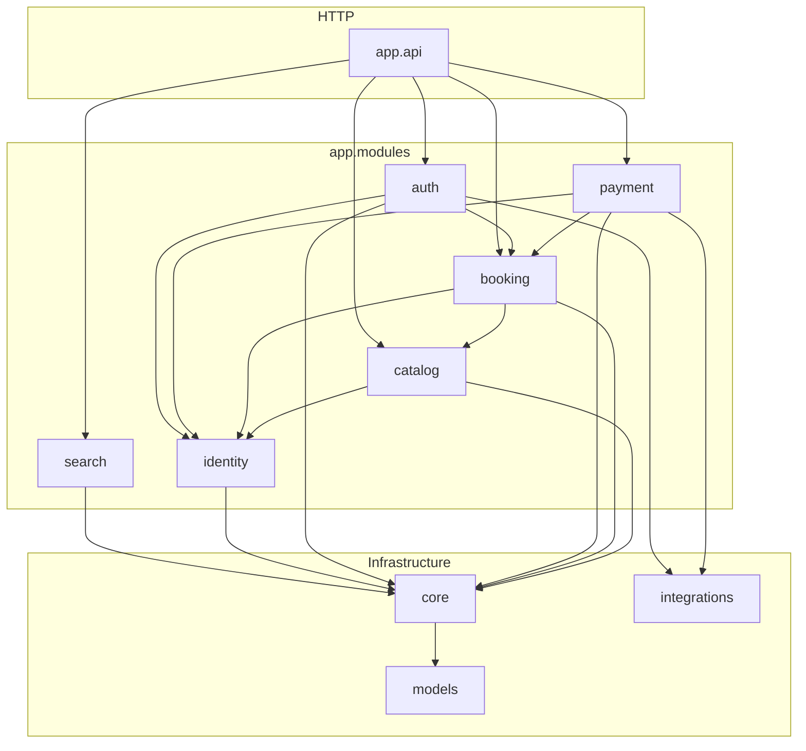

# ZeeFrame Backend — Modular Monolith Architecture

Decision record: [ADR-003](./adr/003-modular-monolith.md).

## Historical note

Pre-modular-monolith improvement notes lived in `backend/docs/ARCHITECTURE_IMPROVEMENTS_PLAN.md`
(superseded by ADR-003, 2026-06).

## Package layout

```
backend/app/
├── api/                    # HTTP aggregation (router.py, health) — top layer
├── core/                   # Infrastructure: config, security, UoW, deps, database
├── integrations/           # External adapters (stripe, email)
├── models/                 # Shared SQLAlchemy ORM (central persistence graph)
└── modules/
    ├── auth/
    ├── identity/
    ├── payment/
    ├── search/
    ├── booking/ (+ order/)
    └── catalog/
        ├── studio/
        ├── service/
        ├── occurrence/
        ├── schedule/
        └── public/
```

Each domain module exposes its **published interface** via `app/modules/<domain>/__init__.py`.
Other modules import from that package root — never from internal paths like `.service` or `.repository`.

## Layer rule (within a module)

```
router → service → repository → core / models
```

- **Routers** — HTTP only: parsing, status codes, `Depends`.
- **Services** — business logic; receive `UnitOfWork`, never open sessions directly.
- **Repositories** — SQLAlchemy queries only; must not import `service`, `router`, or `policies`.
- **Models** — ORM mapping; no imports from `app.modules` or `app.api`.

Shared request dependencies (`get_uow`, `get_current_user`) live in `app.core.deps`.
`UnitOfWork` type is in `app.core.uow`; repository wiring is in `app.core.uow_factory`.

## Allowed cross-domain edges

| Caller | May import (public API only) |
|--------|------------------------------|
| `booking` | `catalog`, `identity`, `core`, `models`, `integrations` |
| `payment` | `booking`, `identity`, `core`, `models`, `integrations` |
| `auth` | `booking`, `identity`, `core`, `models`, `integrations` |
| `catalog` | `identity`, `core`, `models` (not `booking`, `payment`, `auth`) |
| `identity` | `core`, `models` only (leaf) |
| `search` | `core`, `models` only (read-only leaf) |
| Any module | `integrations`, `core`, `models` |
| `core.uow_factory` | all repository classes (UoW wiring — see ADR-003 §3) |

Private names (`_foo`) are domain-internal and must not be imported across domains.

## Module dependency graph



## Boundary enforcement

| Tool | Command | What it checks |
|------|---------|----------------|
| import-linter | `uv run lint-imports` | Forbidden import directions (see `pyproject.toml`) |
| AST tests | `pytest tests/architecture/` | Repositories don't import upper layers; no `_` cross-domain imports |
| Ruff | `uv run ruff check .` | Style and import order |

`import-linter` ignores transitive imports through `core.deps` → `core.uow_factory` for leaf
modules — the monolithic UoW intentionally wires every repository in one factory (ADR-003 §3).

## Running checks locally

From `backend/`:

```bash
uv run ruff check .
uv run lint-imports
uv run pytest -q
```

Or from the repo root: `make lint` / `make test`.
