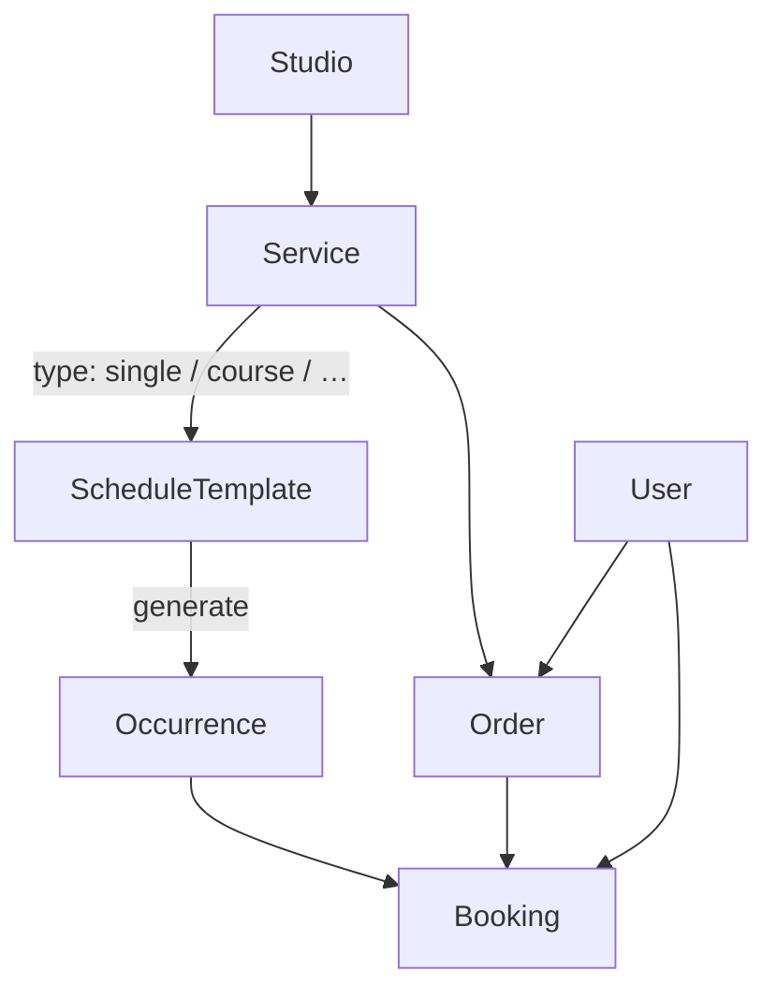

# ADR-002: Domain Vocabulary — Occurrence, ScheduleTemplate, API Perspectives

**Status:** Accepted  
**Date:** 2026-06-15  
**Supersedes:** Informal naming in models/schemas (pre-refactor)  
**Related:** [ADR-001 — Date/Time Policy](../../backend/docs/adr/001-datetime-and-studio-timezone.md)

## Context

The domain model has outgrown its original names:

- **`Slot`** was a Python workaround (`class` is reserved) but does not express “a concrete session instance in time”.
- **`Schedule`** collides with the everyday meaning of “schedule” and with endpoints like `generate-schedule`, which actually materialize **occurrences**, not templates.
- **`schemas/service.py`** accumulated ~19 unrelated Pydantic models (Service CRUD, Schedule, Order, catalog, course booking).
- API response types use four different words for the same idea — **whose view** the payload represents: `Self`, `Owner`, `Client`, `Public`.

`Service` is intentionally **kept** as the sellable container (future candidate for `Product` when membership/merch ship). This ADR does not rename `Service`.

Development is pre-production; API changes ship as **big-bang** (no `/api/v2` shim).

## Decision

### 1. Core entity names

| Concept | ORM class | Table | Description |
|---------|-----------|-------|-------------|
| Sellable offering | `Service` | `services` | Abstract parent for anything that can be purchased (`type` enum) |
| Recurrence rule | `ScheduleTemplate` | `schedule_templates` | Day-of-week + wall-clock + validity window |
| Concrete session | `Occurrence` | `occurrences` | One bookable event in time (was `Slot`) |
| Reservation | `Booking` | `bookings` | Seat hold on an `Occurrence` |
| Payment bundle | `Order` | `orders` | Especially for course purchases |

#### Domain graph



### 2. `Service.type` enum

Align with existing `BookingType` (`single` / `course`):

| Old value | New value | Notes |
|-----------|-----------|-------|
| `single_class` | `single` | Drop-in: one occurrence |
| `course` | `course` | Unchanged |
| — | `membership` | Reserved — Phase 2 |
| — | `merch` | Reserved — Phase 2 |

```python
class ServiceType:
    SINGLE = "single"   # was SINGLE_CLASS = "single_class"
    COURSE = "course"
```

`Booking.booking_type` already uses `single` / `course` — no change needed there.

### 3. Foreign keys and columns

| Old | New |
|-----|-----|
| `bookings.slot_id` | `bookings.occurrence_id` |
| `occurrences.schedule_id` | `occurrences.schedule_template_id` |
| `occurrences.studio_id` | unchanged |
| `occurrences.service_id` | unchanged |

Unique indexes on active bookings must be recreated with new column names (see migration phase).

### 4. API routes (big-bang)

| Old | New |
|-----|-----|
| `GET/POST /api/v1/slots` | `GET/POST /api/v1/occurrences` |
| `GET/PATCH/DELETE /api/v1/slots/{slot_id}` | `…/occurrences/{occurrence_id}` |
| `GET /api/v1/slots/{slot_id}/bookings` | `…/occurrences/{occurrence_id}/bookings` |
| `GET /api/v1/studios/{id}/slots` | `GET /api/v1/studios/{id}/occurrences` |
| `POST /api/v1/studios/{id}/generate-schedule` | `POST …/generate-occurrences` |
| `/api/v1/services/*` | **unchanged** |

Path parameters, request bodies, and response fields use `occurrence_id` instead of `slot_id`.

### 5. Schema file layout

Split the monolithic `schemas/service.py`:

```
schemas/
  service.py       # ServiceBase/Create/Update/Response, ServiceAvailability*
  schedule.py      # ScheduleTemplate* + ScheduleGenerateRequest (all schedule schemas here)
  occurrence.py    # Occurrence* (was slot.py)
  order.py         # Order*, CourseBooking*
  catalog.py       # PublicService, PublicOccurrence, StudioPublicResponse
  booking.py       # Booking* (perspective renames below)
  search.py          # unchanged structure
```

**Rule:** no Schedule-related schemas outside `schedule.py`.

### 6. API perspective vocabulary

Three terms only — do not introduce new perspective prefixes (`Client`, `Dashboard`, etc.).

| Term | Audience | Naming pattern | Examples |
|------|----------|----------------|----------|
| **Public** | Anonymous storefront | `Public{X}` or `{Entity}PublicResponse` | `PublicOccurrence`, `StudioPublicResponse`, `PublicService` |
| **Owner** | Studio owner / staff | `{Entity}OwnerResponse` | `BookingOwnerResponse` |
| **Self** | End-user account (“my …”) | `{Entity}SelfResponse`, `{Entity}SelfListItem` | `BookingSelfResponse`, `BookingSelfListItem` |

**Shared response base (not a perspective):**

| Old | New |
|-----|-----|
| `BookingClientBase` | `BookingResponseBase` |

### 7. Selected schema renames

| Old | New |
|-----|-----|
| `SlotBase/Create/Update/Response` | `OccurrenceBase/Create/Update/Response` |
| `SlotWithBookings` | `OccurrenceWithBookings` |
| `ScheduleBase/Create/Response` | `ScheduleTemplateBase/Create/Response` |
| `ScheduleGenerateRequest` | `OccurrenceGenerateRequest` (optional; keep old name if preferred — must live in `schedule.py`) |
| `PublicServiceOccurrence` | `PublicOccurrence` |
| `BookingListItem` | `BookingSelfListItem` |

`PublicService` and `StudioPublicResponse` stay — consistent with the `Service` model name.

### 8. Python layer renames (mirror ORM)

| Old | New |
|-----|-----|
| `models/slot.py` | `models/occurrence.py` |
| `models/schedule.py` | `models/schedule_template.py` |
| `repositories/slot_repo.py` | `repositories/occurrence_repo.py` |
| `repositories/schedule_repo.py` | `repositories/schedule_template_repo.py` |
| `services/slot.py` | `services/occurrence.py` |
| `api/v1/slots.py` | `api/v1/occurrences.py` |
| `schemas/slot.py` | `schemas/occurrence.py` |
| `SlotRepository` | `OccurrenceRepository` |
| `ScheduleRepository` | `ScheduleTemplateRepository` |
| `UnitOfWork.slots` | `UnitOfWork.occurrences` |
| `UnitOfWork.schedules` | `UnitOfWork.schedule_templates` |

DTO field `CourseBookingPreviewItemDTO.slot_id` → `occurrence_id`.

### 9. What does NOT change

- `Service` model, `services` table, `/api/v1/services` routes
- `User`, `Order`, `Booking` table names (only `occurrence_id` FK rename)
- `BookingType.SINGLE` / `COURSE` string values
- Auth, payment webhook, search endpoint paths

### 10. Migration strategy

One new Alembic revision (do not edit applied migrations `001`–`003`):

1. Rename tables: `slots` → `occurrences`, `schedules` → `schedule_templates`
2. Rename columns and FK constraints per §3
3. Recreate partial unique indexes on `bookings` (`occurrence_id` + `guest_email` / `user_id`)
4. Update `services.type`: `single_class` → `single` (enum alter if PostgreSQL native enum is used)
5. Verify downgrade path or document irreversibility if full rebuild is acceptable

Per [ADR-001](../../backend/docs/adr/001-datetime-and-studio-timezone.md): greenfield rebuild remains an acceptable alternative to downgrade.

## Consequences

### Positive

- Domain language matches product mental model: Service → template → occurrence → booking
- `single` / `course` aligned across `Service.type` and `Booking.booking_type`
- Schema modules map 1:1 to bounded contexts
- Perspective naming is teachable in one sentence

### Negative / risks

- Large coordinated change across backend, frontend, tests, seeds
- No API compatibility layer — all clients must update in the same release
- Documentation and ADR-001 text still mention “slots” until updated

### Follow-up (out of scope)

- `Service` → `Product` when first non-schedulable type ships
- `membership` / `merch` enum values and checkout flows
- OpenAPI client codegen from committed spec

## Implementation

See [domain-vocabulary-checklist.md](./domain-vocabulary-checklist.md) for the file-by-file execution plan and phase order.
